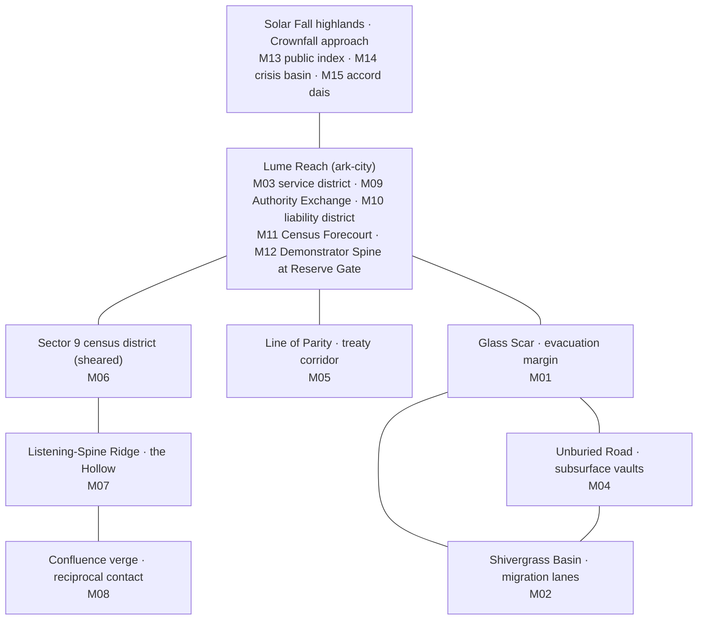

# Development Bible

This is the single creative-canon source for world, factions, characters, and narrative intent, edited in place.
[Requirements.md](../Requirements.md) owns game behavior and acceptance criteria;
[RequirementsState.md](../RequirementsState.md) owns lifecycle and owner acceptance. Follow the
[authority map](../README.md) and [shared agent contract](../../AGENTS.md).

Implementation, test-count, package, and milestone passages below are historical observations at their
recorded versions, not current status. Creative content remains active; a historical gameplay value or
implementation shortcut cannot override the master. Confirm substantive canon/requirement conflicts
through the owner decision record before changing either.

Reading order: the sections through **Writing rules** are the original canon. The
[expanded canon](#expanded-canon--world-history-people-places-and-the-fifteen-operations) that follows them
(added 2026-09-05 under owner direction) explains the causes behind that canon, gives every principal character a
backstory, describes every place, unit, structure, Well state, and ending visually for production, and tells the
fifteen operations as one story. Where the two differ in detail, the expanded canon is the fuller statement of the
same fact; mission objectives and numbers always come from the requirements master.

## Creative direction

*Echoes of the Broken Sun* is a premium science-fantasy real-time strategy game about the cost of making one future real. It should feel immediate to an experienced RTS player—workers, bases, scouting, soft counters, territory, timing, and decisive battles—while making its central resource decision consequential at both match and campaign scales.

The game earns its identity through three qualities:

1. **Every economy decision has a spatial consequence.** Future Wells are contested places, not passive resource piles. Harvesting, preserving, or reshaping one changes routes, vision, tempo, and what can still happen on the map.
2. **Asymmetry changes planning, not just statistics.** The Compact establishes reliable networks. The Kharuun move and adapt through terrain. The Choir manipulates incomplete information and temporary possibility. Each faction must ask different operational questions.
3. **Readability outranks spectacle.** A player must recognize ownership, role, order state, threat, terrain effect, and Well transformation at combat speed. Art and effects may be rich, but they may not conceal decisions.

The tone is urgent, humane, and occasionally dry rather than uniformly solemn. No faction is a proxy for good or evil. Strategic decisions should remain defensible even when their costs are painful.

## Soryn

Soryn orbits a field of stellar fragments called the Crownfall. The event remembered as the breaking of the sun did not merely scatter matter. It condensed unrealized causal branches into mineral-organic Dawnshards. A shard can power a city or expose a technology that never developed in the surviving timeline. Consuming it also closes the possibility it contains.

Most people experience Crownfall phenomena indirectly: duplicated shadows at noon, a remembered street that was never built, tools whose worn grips fit hands that never held them. Future Wells are larger deposits where several possibilities remain locally coherent. Civilizations initially understand them as power sources, archives, or sacred wounds. The Hollow Choir reveals the missing fact: some erased branches retained enough linked consciousness to know that they were denied existence.

### Historical frame

- **Before Crownfall:** Soryn supported multiple city cultures and mineral-organic ecologies. The surviving record is fragmentary and politically edited.
- **The First Impact Generations:** Ark-cities formed around intact infrastructure. Impact caverns became the nurseries of early Kharuun assemblies.
- **The Ledger Peace:** Meridian city-states standardized Dawnshard accounting and mutual defense. The system prevented local collapses while concentrating authority over extraction.
- **The Quiet Omissions:** Kharuun memory-bearers discovered discontinuities in communal memory. Compact historians found census references to neighborhoods no archive could locate.
- **The Present War:** A chain of unstable Wells threatens ark-city power reserves and Kharuun birthing caverns. Both sides mobilize under plausible survival claims. Apparitions blamed for the instability are actually the first coherent Choir incursions.

### Cultures and language

The Meridian Compact is culturally plural. “Meridian” names a governance and logistics compact, not a single ethnicity. Its technical language favors measured commitments: anchors, tolerances, ledgers, duty windows, and reserve margins. Civic ritual centers on maintaining systems whose original builders are gone.

Kharuun identity is layered. A person is a present consciousness, a temporary custodian of ancestral fragments, and a participant in an assembly that can combine—but never perfectly merge—memory. Names describe chosen relations rather than caste. Oruun-of-Seven-Stones carries seven mutually correcting accounts of the same evacuation. Humor often comes from the mismatch between inherited certainty and present evidence.

The Hollow Choir does not speak in a mystical collective voice by default. Its members construct stable speech by selecting among incompatible phrasing. Neme sounds precise because imprecision can cause one component future to dominate the others. Choir architecture appears temporary because it expresses structures that remain possible only under maintained conditions.

### Ecology and architecture

Compact settlements use repairable frames, exposed load paths, redundant conduits, modular hardpoints, and visual status bands. Kharuun spaces are grown by mineral-organic organisms that alter porosity, heat flow, and acoustic transmission. Their structures look inhabited and maintained, not wild or primitive. Choir manifestations repeat near-identical geometry with deliberate local contradictions: a span casts two valid shadows, or an opening aligns only from one approach.

Soryn's ecology includes organisms adapted to probability leakage. Shivergrass bends before a possible footfall and becomes a readable scouting clue. Vaultbacks carry mineral strata that preserve heat and can serve as mobile cover. Pale tides migrate through impact basins after Well disturbances. These are ecological systems and neutral hazards, not generic monsters.

## Factions

### Meridian Compact

The Compact is strongest after it has established a connected position. Power links and supply nodes make production, repair, sensors, and long-range support reliable within the network. Expansion is deliberate; severing a narrow link can isolate otherwise formidable structures.

| Element | Role | Tactical purpose |
|---|---|---|
| Surveyor | Worker/engineer | Gathers, repairs, builds, restores severed links |
| Lancer | Ranged line unit | Precise sustained fire; vulnerable when flanked |
| Bulwark Team | Heavy screen | Deploys directional cover; slow while deployed |
| Relay Skiff | Scout/support | Extends vision and temporary supply; fragile |
| Anchor | Headquarters | Drop-off, worker production, network root |
| Power Link | Supply node | Extends powered build area and logistics |
| Array Foundry | Production | Builds line and support units |
| Aegis Post | Defense | Gains range and accuracy only while supplied |

Commander Mara Vey treats uncertainty as an engineering debt that eventually kills people. Her strength is disciplined preparation; her danger is converting every moral question into a control problem. Chancellor Cael Rhyse is persuasive because he can point to cities that survived under his policies. His program to restore one stable future is an attempt to make uncertainty governable at an unacceptable existential cost.

### Kharuun Assemblies

The Assemblies are strongest when they can change the geometry and composition of a fight. Waystones can root for production or migrate slowly. Warforms select bounded adaptations at visible molt sites. Subsurface routes shorten movement but expose predictable emergence zones.

| Element | Role | Tactical purpose |
|---|---|---|
| Tender | Worker/cultivator | Gathers, grows structures, stabilizes terrain |
| Riftstalker | Mobile skirmisher | Fires while repositioning; weak in prolonged frontal combat |
| Cairnback | Assault screen | Absorbs fire and creates temporary mineral cover |
| Resonant | Scout/counter-scout | Detects movement through terrain vibration |
| Memory Hearth | Headquarters | Drop-off, worker growth, adaptation root |
| Waystone | Mobile supply node | Roots to enable production, can uproot and relocate |
| Growth Basin | Production | Grows warforms and presents adaptation choices |
| Listening Spine | Detection | Reveals movement signatures without full unit identity |

Oruun-of-Seven-Stones discovers that an Assembly council removed parts of the ancestral record to prevent repeated civil conflict. Oruun's dispute is not whether collective memory matters, but whether a society can remain accountable when its continuity depends on curated forgetting.

### Hollow Choir

The Choir becomes playable after the vertical slice. It controls intervals rather than durable territory. Units maintain two declared possible states, but the player must eventually resolve one. Structures exist while their coherence budget is funded. Opponents receive clear telegraphs and can force early resolution.

- No unrestricted rewinds of hidden information.
- Every phase, displacement, or duplicate state has a public duration and counterplay.
- The economy rewards preserving or recovering possibility rather than ordinary extraction.
- Failure collapses committed possibilities and creates real loss; complexity is not free power.

Neme contains several futures that disagree about whether the Choir can coexist with realized civilizations. Neme's arc is a negotiation among those internal positions, not a reveal that one personality was secretly dominant.

## Economy and territory

The baseline economy has Matter, Dawn, and Logistics. Matter is gathered from strata and reclaimed wreckage for bodies, frames, and basic structures. Dawn pays for advanced systems, adaptations, support effects, and high-impact technology. Logistics is capacity supplied by headquarters and faction infrastructure. Workers carry limited cargo to a valid drop-off, so routes, harassment exposure, and drop-off placement matter.

## Future Wells

A controlled Future Well presents three mutually exclusive operating modes. Selection requires a confirmation panel stating the immediate gain, irreversible state change, telegraph time, and known campaign consequence. Competitive behavior is deterministic and visible to both teams.

### Harvest

Harvest commits after a public 180-tick telegraph. The initial model grants 500 Dawn. The Well collapses permanently, nearby traversability changes, and a branch-specific terrain feature is removed or damaged. The opponent can interrupt during the telegraph by breaking control.

### Preserve

Preserve leaves the Well intact and returns 15 Dawn every 300 ticks while controlled. It grants a 1,400 cm intelligence radius whose information depends on faction. Control can change hands. Preserve becomes valuable only if the owner can hold the area.

### Reshape

Reshape spends 120 Dawn to manifest a map-authored possibility for 1,800 ticks after a 180-tick telegraph. Examples include restoring a bridge, raising cover, opening a cavern route, or exposing a short-lived design. On expiration, units receive warning and deterministic displacement through authored fallback points rather than being killed by geometry.

No option is a moral-score button. Harvest may save civilians whose power reserve is failing. Preserve may prolong a battle and increase casualties. Reshape may open an evacuation route and expose an ally's flank. Campaign state records who paid the cost, who benefited, what information was available, and whether alternatives remained.

## Combat and controls

Combat rewards information, facing, range, cover, composition, timing, and retreat. Counters are soft. Time-to-kill must allow threat recognition and response without making focus fire irrelevant.

The command set is move, context action, attack-move, attack, gather, repair, build, patrol, guard, hold, stop, ability, rally, and interact. Invalid actions return a stable reason and visible feedback. Every command is remappable.

| Input | Default behavior |
|---|---|
| Left click / drag | Select one unit or box-select visible units |
| Shift + select | Add or remove from selection |
| Right click | Context move, attack, gather, repair, deliver, or interact |
| F at cursor | Attack-move |
| X / H | Stop / hold position |
| T / J at cursor | Patrol / guard |
| Backslash at cursor | Deploy selected Bulwarks toward the cursor; press again to pack up |
| Equals | Activate temporary logistics on selected connected Relay Skiffs |
| Hyphen | Uproot selected Waystones or begin rooting at a clear footprint |
| Shift + left bracket | Begin Carapace molt for selected warforms at the nearest Growth Basin |
| Shift + right bracket | Begin Striker molt for selected warforms at the nearest Growth Basin |
| 1–0 | Recall control group |
| G then 1–0 | Assign control group |
| Double click | Select matching visible units |
| Tab / Shift + Tab | Cycle subgroups |
| WASD / edge pan / middle drag | Move camera |
| Mouse wheel | Zoom |
| Space | Jump to most recent alert |

## Vertical slice: The Glass Scar

The map is a narrow impact basin split by a fractured transit span. Each base has a safe but inefficient Matter route. A central Future Well controls the short route and observation ridge. Three north-south crossings give the basin its tactical identity: the raw, irregular Ash Cut; the broad, straight Buried Causeway; and the temporary zigzag of the Folded Verge. Campaign consequences can leave one crossing open while the others remain blocked. Kharuun mobile infrastructure can exploit a committed route, while the Compact can establish a powerful relay line along the ridge but must defend exposed links.

The playable target contains the two factions; one worker, line unit, heavy screen, scout/support, headquarters, supply structure, production structure, and defense per side; economy, construction, production, logistics, combat, fog, control groups, victory/defeat; all three Well modes; one standard non-cheating AI; one prologue and one skirmish; and visibly labeled development assets until final assets are registered.

### Prologue: What the Ledger Keeps

The player commands Mara Vey during an evacuation outside Lume Reach. A failing reserve creates a credible reason to harvest the Glass Scar Well. Talar Venn asks for time to recover a displaced archive convoy. Oruun enters not to seize the settlement, but to prevent the Well's collapse from propagating into a birthing cavern. The mission teaches the core loop through operational problems and ends when evacuation, Well state, and withdrawal conditions resolve—not with total destruction.

## Campaign outline

The target campaign is 15 missions; the outline is not evidence that content exists.

### Act I — Necessary Fires

1. **What the Ledger Keeps:** Mara secures an evacuation and makes the first Well decision.
2. **Seven Accounts of Rain:** Oruun defends a migration route while inherited memories disagree about terrain.
3. **A City on Reserve:** Mara stabilizes an ark-city grid through distributed objectives.
4. **The Unburied Road:** Oruun uses mobile infrastructure to recover a missing memory shard.
5. **Terms of Continuance:** Target narrative: a joint ceasefire fails under pressure that later proves broader than the two-sided war. The current prototype uses Meridian-authoritative treaty and witness proxies plus generic Kharuun-owned Adaptive-AI pressure; it does not implement mixed-faction command, prove pressure against both networks, or identify the Choir.

### Act II — The Cost of One Future

6. **Names Without Births:** Talar traces erased census records while evidence and civilians are protected.
7. **The Shape of Silence:** Oruun follows a correspondence between an erased census and curated communal-memory omissions. The implemented 0.65.0 mission establishes that bounded correspondence through Waystone, Listening-Spine, paired-witness, and confluence objectives; it does not prove cause, hidden authorship, a Choir identity, or complete the planned Assembly confrontation.
8. **The Shape Beside Us:** Neme guides units through overlapping states. The implemented 0.85.0 mission establishes repeatable, actionable reciprocal contact through Meridian proxies; it does not establish a unified Choir identity, hidden authorship, causation, or a playable Hollow Choir faction.
9. **Reserve Authority:** Mara chooses which failing districts receive power. The implemented 0.86.0 mission makes the inherited doctrine advisory: Mara must secure branch-specific authority, ordinary workers power exactly two of Life Support, Transit, and Archive, and Mara confirms the intact deferred district. The result records one irreversible local allocation; it does not claim wider-city recovery or unmodeled civilian survival.
10. **The Choir at Lume Reach:** The implemented 0.87.0 operation turns the earlier three-faction concept into a bounded, attributable encounter. Oruun commands a Kharuun force; Mara is an off-map liaison; the local Choir is a public contact and infrastructure presence, not a playable or commandable faction. Oruun must establish branch-specific contact, re-root the Waystone at Mission 09's deferred district liability, raise two Listening Spines in sequence, commit a new Lume Well protocol from all three offered choices, and reach that protocol's public resolution. Mechanically opposing Meridian units are quarantine proxies only; their presence does not establish Mara's involvement or Compact-wide action. Success records a separate tenth irreversible Well decision.

### Act III — Crownfall

11. **No Neutral Ledger:** The implemented 0.88.0 operation turns the exact ten-record ledger into 27 explicit plans without inventing a hidden trust score or survivor roster. Mission 01 selects the inherited route, Mission 09 selects the exact pair of powered district interfaces, and Mission 10 selects the only available Lume protocol. Oruun's Kharuun force remains the sole commandable authority. The player re-roots the Waystone on the inherited route, builds Kharuun Listening Spine links near both neutral district interfaces, uses Oruun and a distinct Kharuun witness to attest the two neutral public evidence interfaces, applies the recorded protocol, and rallies both units at its public site. The result records a bounded local coalition assembly; it does not implement mixed-faction command, a playable Hollow Choir, optional survivor composition, or numeric faction trust.
12. **The Future That Won:** The implemented 0.89.0 operation consumes the exact eleven-record ledger without making Rhyse playable or commandable. Oruun and a distinct Kharuun verifier establish independent readback at neutral public Meridian and Kharuun interfaces; ordinary Kharuun workers complete links near the exact two districts recorded in Mission 09; the separate Future Well accepts only Mission 10's recorded protocol; the activation receipt must hold for 300 ticks; and the two scouts observe the paired district readbacks. Rhyse is represented only by attributable neutral public demonstrator apparatus. The result records one bounded local protocol/readback outcome; it does not establish population restoration, civilian counts or survival, permanence, trust, consent, ethical justification, or mixed-faction command.
13. **Assembly of the Missing:** The implemented 0.90.0 operation consumes the exact twelve-record ledger while keeping authority bounded to Oruun and a distinct Kharuun verifier. The two scouts establish paired readback at separate neutral Meridian and Kharuun public-record interfaces. An ordinary Kharuun worker then raises a Listening Spine within three tiles of the neutral Crownfall public index. After the durable link exists, Oruun and the verifier move to separate assembly witness sites and complete one public observation receipt. The result records public readback, Crownfall linkage, and paired observation only. It does not assign authorship or responsibility, establish consent or trust, model civilian or survivor state, prove cryptographic authenticity, create mixed-faction command, or make Rhyse or the Hollow Choir playable.
14. **Several Voices, One Command:** The implemented 0.91.0 operation consumes the exact thirteen-record ledger and places one bounded Hollow Choir force under local authority. A protected Soldier voice researches Held Alternatives and resolves as Possible at its inherited site; a protected Heavy voice remains Manifest at a separate inherited site; Neme occupies the command site. Shared Resolution is unavailable until those incompatible identities and placements are simultaneously authoritative. A worker then raises a Phase Anchor at the Crownfall crisis site, and the player must preserve both voices, Neme, the research loom, the anchor, the local Core, and their required sites for 160 fixed ticks. Any breach after the hold begins irreversibly fails the operation, even if the visible state is repaired. The result records completion of this one command-crisis contract. It does not decide the Choir's final fate, establish a unified permanent identity, prove broad faction balance, or substitute for Mission 15's endings.
15. **The Broken Sun:** Introduced in 0.92.0 and retained as the final operation in 0.93.0, this mission consumes the exact fourteen-record ledger and retains 27 plans from the established doctrine, powered-district, and Lume-protocol axes. Those facts expose an explicit earned subset of Restoration, Controlled Stabilization, Extinguishment, and Open Evolution rather than a hidden morality score. Neme and the local Hollow Choir remain commandable; Mara, Oruun, and Talar are protected neutral witnesses. The player secures Crownfall with an Approach Anchor, completes both Choir technologies, places Possible, Manifest, and Neme at separate witnessed-accord sites, confirms one eligible ending twice, raises that ending's distinct Resolution Conduit, and holds the exact contract for its route-dependent duration. The force, witnesses, Core, and nonterminal world are protected from the first fixed step; the Approach Anchor becomes irreversible once bound, the accord and eligibility once the ending is selected, and the Resolution Conduit once the hold begins. Any applicable breach fails irreversibly. Success records only the selected ending and its availability context; the unchosen endings and wider social consequences remain unresolved.

Endings report concrete consequences and unresolved costs rather than a hidden good/evil score.

Missions 01 through 15 are implemented as bounded, consequence-linked operations with durable choice-consistent records, operation-specific objectives/results, and explicit failure on protected loss or invalid terminal outcomes. Version 0.93 turns those records into one continuous controller journey: `C` opens the exact next mission, success advances, failure retries, and the completed ledger returns to the title/archive boundary. New Campaign and Restore are transactional across the active ledger and one retained prior generation; replay conflict returns to the journey without rewriting prior history. Mission 02–09 campaign checkpoint containers bind the exact prerequisite ledger. Unbound raw and version-1 bound campaign saves fail closed, while compatible legacy noncampaign raw saves remain loadable and are preserved during first container upgrade. One Harvest-founding, Life-Support-plus-Transit, Preserve-Lume route has complete automated downstream evidence through Mission 15 and records Controlled Stabilization. Missions 10 through 15 each have 27-case plan coverage; all four ending types are reachable across eligible plans, but alternate plans and the other three endings do not yet have complete end-to-end playthrough evidence. Recovery tests cover controlled single-process/API-level rename failures rather than multiprocess or power-loss durability. Mission 15 and the journey controller do not establish full dialogue/cinematics, modeled downstream relationships or civilian consequences, broad campaign balance/usability, ordinary-player full-campaign completion, or a release-quality campaign.

## Skirmish and AI

The target skirmish setup exposes map, faction, teams, AI personality/difficulty, starting resources, victory conditions, and supported speed. The current prototype exposes only the bounded faction choice and scenario behavior described below; broader skirmish setup remains unimplemented. Standard difficulty uses only player-visible information and no hidden income. Any future assisted level must label the exact modifier before the match and in replay metadata.

- **Defensive:** protects economy and links, counterattacks after favorable trades.
- **Expansionist:** contests routes early and accepts thinner home defense.
- **Raider:** targets exposed logistics and disengages from poor fights.
- **Economic:** invests in workers, capacity, and Preserve value.
- **Adaptive:** changes production only from observed composition and scouting confidence.

The current Glass Scar opponent is a bounded standard-difficulty Adaptive implementation. The title and operations brief allow the player to cycle among Meridian Compact, Kharuun Assemblies, and Hollow Choir before skirmish deployment. Changing faction rebuilds the deterministic scenario from its baseline, places the selected force under player 0, assigns a supported opposing force to the Adaptive opponent, and keeps the operation paused. Objectives, control guidance, deployment feedback, and result language follow that authoritative selection. Restart retains the chosen force, and quick-load compatibility includes the local faction so an opposite-faction checkpoint cannot silently replace it. Each playable faction has a two-step authored research path produced at its Barracks-role structure. Meridian progresses through Prismatic Targeting and Horizon Lattice; Kharuun progresses through Echo Cartography and Ancestral Edge; Hollow Choir progresses through Held Alternatives and Shared Resolution. Research consumes Matter and Dawn, occupies the producer, requires its prerequisite, persists through saves and replays, and is interrupted without refund if the structure is destroyed or the player applies Stop to the selected active producer. The owning player retains that interruption state until another valid project starts; the HUD and archive explain the no-refund result without inventing a cause. Faction effects compose with their bounded deterministic mechanics. The Adaptive opponent may queue the next affordable faction technology using only its scoped player view and an idle producer. Its standard-difficulty opening posture lasts through tick 5,999 when it owns a Command Core: the economy and visible-threat defense continue, anonymous vibration contacts do not trigger pursuit, and combat units hold near or return toward the core. The prior Adaptive policy resumes at tick 6,000. These fixtures establish source reachability and named bounded behavior, not broad three-faction balance, human-equivalent play, or a finished skirmish AI.

F2 opens the faction technology archive and pauses the offline operation. It presents exact authored names, costs, durations, effects, prerequisite state, resource state, completion/progress state, and interruption consequences. Up/Down moves an explicit visible tier focus, Enter requests that exact tier, Shift+R requests the next incomplete tier, and opening focuses the first incomplete tier. A row target synchronizes focus before requesting its exact tier; F2, Escape, or P closes the archive and restores the prior pause state. Rendering and hit-testing share one layout calculation. During live play, Tab selects the next owned live visible-backed entity and Backspace selects the previous one, with deterministic wraparound, a single selection ring, and exact entity feedback. F7 selects every local alive combat unit with an owned presentation view in deterministic ID order. Home enables a cyan tactical reticle; End centers camera and reticle on the centroid of one or more selected owned presentation views; arrows move it in bounded steps while the archive is closed; Space issues an ordinary context order at its rendered screen location. Target-dependent command keys use that same fair trace while the reticle is active. Kharuun systems expose visible F3 Waystone, F4/F5 Warform, and F6 Cairnback-cover aliases while retaining the older punctuation bindings. Direct application delivery accepts ordinary Waystone migration, a full Meridian Bulwark deploy/pack/redeploy cycle, completed Array Foundry and Power Link construction, deterministic restart delivery, produced-Lancer emergence, completed two-tier research for the then-playable Meridian and Kharuun factions through their visible archives, a completed Carapace molt with visible transition state, one visible Cairnback mineral barrier, Future Well Harvest, a five-unit Hold order, control-group assignment and recall after selection changed, a five-route Patrol order, a nine-unit combat-force assembly, Command-Core victory, result presentation, Enter-driven redeployment, selected-producer research cancellation without refund, one exact-coordinate pointer path through selection, movement, construction, production completion, and Future Well interaction, and a separate exact-coordinate controlled path through Bulwark selection, owned-target Guard, visible-hostile direct Attack, and authoritative damage. Mission 14 and Mission 15 automation separately accept both Hollow Choir technology tiers, the identity/coherence route, and the final accord/ending contract; neither is an ordinary human skirmish technology or campaign playthrough. The accepted victory and tactical sequences are bounded paths rather than balance or broad usability qualification. The pointer combat/Guard gate uses Unreal's projected live views and internal cursor/controller handlers; it is not OS-injected input or unaided-human evidence. Physical-human pointer usability, adverse camera/UI-scale cases, broader composition response, multi-front tactical-group use, repair/recovery, multiple bases, richer searchable technology trees, and balance qualification remain open.

## Interface and accessibility

The target interface keeps the battlefield visually primary. Its command band covers selections, subgroups, orders, abilities, production, and stable failure reasons. The target minimap distinguishes known terrain, current vision, last-known contacts, alerts, and Well states without color-only information; the current implementation remains the narrower fog-respecting tactical overview described below and does not retain general last-known contacts. Compact ownership uses bracketed rectangular marks; Kharuun uses paired faceted marks; Choir uses offset concentric marks.

The target includes remappable controls, UI scaling, subtitle size/background, keyboard-operable menus, color-vision-safe palettes, non-color ownership markers, reduced shake/flashing, adjustable camera motion, separate audio categories, reduced dynamic range, offline pause, tutorial replay, searchable technology information, destructive-choice confirmation, autosave, and interrupted-session recovery. A setting that does not alter behavior does not pass.

The current implementation exposes a deliberately bounded subset: a visible, uncaptured RTS cursor; deterministic Tab/Backspace owned-entity cycling; a keyboard-operable title with the Glass Scar skirmish and all fifteen bounded campaign missions through **The Broken Sun**; operation-specific briefs, live objectives, and results; explicit skirmish and campaign outcomes; keyboard-operable field and technology modals; persistent HUD scale; high contrast; reduced motion/flashing; edge pan and camera-speed controls; effects-volume and reduced-dynamic-range controls; offline pause; operation-isolated transactional quick saves; four ownership-marker shapes; and a fog-respecting tactical minimap. F9 changes operation before deployment; Tab changes faction only for skirmish. Enter opens the responsive brief and deploys while tick zero remains held until play. Campaign trackers and public minimap markers expose authored phase goals without making the HUD authoritative. Mission 15 uses `Shift+1` through `Shift+4` with a second identical press before an eligible ending is locked for the current operation. Escape or P opens the field menu. F2 opens the two-tier technology archive; Up/Down focuses, Enter activates, Shift+R chooses the next incomplete project, and F2/Escape/P closes it. The skirmish tracker still exposes only owned Core integrity, currently visible Well/hostile-core state, and public outcome. Anonymous vibration contacts remain approximate and non-targetable. Multiplayer, replay UI, broader skirmish setup, remapping, subtitles, separate music/dialogue/interface/ambience categories, a complete accessibility menu, autosave, campaign slots, dialogue/cinematics, and modeled consequences beyond the implemented append-only ledger remain design requirements rather than implemented features.

## Art and audio

Stylized realism must preserve tactical silhouettes and material readability. Compact forms communicate load and repair. Kharuun forms communicate grown mineral structure without primitive coding. Choir forms use repeated luminous edges and offset state silhouettes. Terrain contrast is reduced under combat; destruction communicates functional loss first. Nanite and Virtual Shadow Maps remain off on the M1 Pro baseline.

Version 0.51.0 introduces the first implemented composition layer for the Glass Scar: seven authored fracture bands, twelve asymmetrically placed shard silhouettes, and five local magenta/copper lights follow the authoritative broken span. These actors are view-only, non-colliding, cleaned up with the runtime environment, and remain subject to the existing fair fog; the local lights cast no shadows. The layer establishes color rhythm and battlefield identity without changing pathing or disclosure. It still uses Engine primitives and explicitly remains `finalArt=false`; production terrain meshes, materials, effects, and performance qualification remain open.

Version 0.52.0 introduces the first faction/role silhouette layer. Each playable unit and structure receives a non-colliding secondary mesh: Meridian uses cyan orthogonal rails, bars, plates, and caps; Kharuun uses amber cones, facets, and nodules. Scale and placement vary by worker, soldier, heavy, scout, core, dropoff, barracks, and utility roles. Resource nodes, the Future Well, and temporary mineral cover do not receive faction accents. Selection custom depth includes the secondary mesh. This is a legibility prototype built from Engine primitives, not a final mesh, material, animation, or combat-readability qualification.

Version 0.53.0 introduces the first accepted-order feedback layer. A transient ground marker appears only after at least one local command passes authoritative validation. Move/context, Attack-move, Patrol, Guard, and Build use distinct cyan, orange, violet, green, and gold treatments with simple non-color glyph differences. Markers last 2.4 seconds, never collide, cast no shadows, affect no navigation, and do not enter saves, replays, visibility, checksums, or simulation state. Reduced motion suppresses scale pulsing and reduced flashing holds marker brightness constant. These are code-authored interim effects, not final VFX, audio confirmation, or broad readability qualification.

Version 0.54.0 introduces the first player-selectable tactical formation layer. F8 cycles Box, Line, and Wedge, and the selected state is always named in the HUD and accepted-order feedback. Move/context, Attack-move, and Patrol share one destination-aligned layout: Box is centroid-balanced, Line is centered perpendicular to travel, and Wedge places its apex at the requested destination with symmetric ranks trailing behind it. The controller derives direction only from the selected local entities' authoritative positions, then submits ordinary per-unit destination commands; formation choice creates no new authority, save, replay, or checksum state. This accepts one five-unit keyboard-driven readability path, not large or mixed formations, assignment optimization, path deconfliction, combat cohesion, balance, final animation, or final visual effects.

Version 0.55.0 introduces the first contextual tactical command deck. When the field selection is nonempty and no modal panel is open, the lower-left deck names the selected count, active formation, force composition, exact primary actions, formation transition, control-group controls, and the applicable faction combat special. Combat, Worker, Command Core, and Array Foundry contexts use distinct labels matching the configured keys; mobile-unit contexts take precedence in mixed selections so an accompanying structure cannot conceal immediate unit commands. High contrast changes the panel palette without changing information or authority. The deck is presentation-only and does not issue commands, mutate simulation state, or enter saves, replays, or checksums. Its first accepted path is an unclipped 1600×900 code-authored interface, not final visual design, every selection combination, every UI scale/resolution, input remapping, localization, broad usability, or accessibility qualification.

Version 0.56.0 keeps anonymous vibration intelligence visible when its projected world cue would fall beneath the primary HUD or outside the safe play area. The quantized position becomes a clamped diamond-and-chevron marker with a contrast-backed label that explicitly states `ANONYMOUS VIBRATION`, `EDGE`, `APPROXIMATE`, and `NO UNIT ID`. The cue direction remains approximate and cannot be clicked for a direct target. High contrast uses the same geometry and information with the established black/yellow/white palette. This preserves the intended asymmetry—useful movement warning without hostile identity—while preventing fair information from disappearing at a viewport boundary. The first accepted path covers one controlled contact at 1600×900, not multiple-contact deconfliction, every camera angle, every UI scale/resolution, ordinary player discovery, localization, final visual design, or broad usability/accessibility qualification.

Version 0.57.0 turns the prologue design into a bounded playable operation without pretending that the broader campaign exists. **What the Ledger Keeps** is selected with F9 before deployment and locks Mara Vey's Meridian force. Her scout is the explicit archive carrier. Reaching the recovery site at tile 22,18 unlocks the Future Well decision; the carrier must continue holding that site while a worker legitimately discovers and commits Harvest, Preserve, or Reshape. The mission then changes to withdrawal and completes only when the carrier reaches Lume Reach at tile 6,17. The player's Command Core and carrier must survive, the Well must be claimed by the player rather than the opponent, and destroying the hostile Core does not replace evacuation. The title, situation brief, three-phase objective tracker, tactical-overview `A`/`E` markers, consequence result, replay, and separate checkpoint path support this exact mission loop. This is the first implemented campaign mission and a vertical-slice narrative/mechanical proof, not evidence of the planned 12–18-mission campaign, branching campaign persistence, final dialogue/cinematics, mission balance, final assets/audio, or broad usability.

Version 0.58.0 makes the prologue choice durable at the campaign layer. Only successful authoritative completion records a consequence; failure records nothing. The first Harvest, Preserve, or Reshape completion becomes the campaign's irreversible mission record. Replaying with the same protocol verifies that record without duplication. Replaying with a different protocol may show the alternate mission outcome, but it does not silently rewrite the established campaign history. The result screen distinguishes a newly committed record, a verified existing record, an alternate replay, and unavailable persistence. This is the first consequence variable needed by later missions. It does not yet provide campaign slots, a new-campaign/reset decision, branching mission availability, relationship or civilian-state effects, later-mission consumption, multiple endings, dialogue/cinematics, or the other planned missions.

Version 0.65.0 replaces the visible Glass Scar terrain and Matter-node primitives with the first authored world set. Dark vitrified shelves, broken ridge bands, black-glass shards, cyan-white Matter deposits, and the Ash Cut, Buried Causeway, and Folded Verge now use seven project-generated static meshes and a shared fractured world material. The three crossings remain readable by silhouette: scalloped trench, continuous ribbed deck, and offset angular plates. The central Future Well, faction roster candidates, and world set now share one restrained charcoal, pale-ceramic, broken-sun amber, magenta-fracture, and cyan-Matter language. All environment actors are presentation-only and non-colliding; the collision floor and deterministic terrain, route, visibility, resource, placement, replay, and checksum authority are unchanged. This is a bounded vertical-slice art candidate, not final topology, UVs, textures, destruction, VFX/audio, combat-load readability, packaged performance, or production-art qualification.

Version 0.66.0 makes ordinary cancellation part of the research contract. A player closes the technology archive, keeps the active producer selected, and presses `X`. The controller queues the existing deterministic Stop command; the simulation records the active technology as interrupted, clears producer/progress state, and preserves the already committed cost. The field HUD shows active progress with the cancellation rule and then an explicit no-refund interruption state. Starting or completing a later valid project clears the prior interruption as before. This reuses the existing command representation, so snapshot/replay schema remains 20 and replay equivalence remains mandatory. The same checkpoint adds a distinct presentation-only interaction marker for Gather, Deliver, and Future Well context orders. Neither marker nor HUD owns authoritative state.

Version 0.67.0 turns the retained prior campaign generation into a player-recoverable state. The title reports the active and distinct validated prior record counts. Page Up, with F11 as an alternate, arms a 30-second confirmation; the second request atomically activates the prior generation, moves the replaced active generation into the backup position, resets presentation to a paused Meridian Glass Scar operation, and reports the exact record counts. A missing, corrupt, unsupported, or identical generation is not offered as a restore target. Saving after fallback recovery preserves the last valid backup rather than replacing it with a corrupt primary. This is one reversible generation, not a named slot browser, arbitrary save history, cloud synchronization, or a complete campaign-management interface.

Version 0.68.0 establishes the first production-oriented Glass Scar route-kit contract through the Ash Cut. Its route bed, staggered banks, exposed strata, glass fins, and emissive seam are separate authored zones across explicit LOD0 and LOD1 meshes. UV0 drives tiled surface variation; UV1 is retained for lightmap use. Four project-authored material instances distinguish basalt, ash, glass, and the broken-sun vein without runtime palette replacement. The static mesh retains simple collision data for asset inspection, but the spawned presentation component disables collision, overlap, and navigation influence. Revision metadata makes accepted regeneration byte-idempotent. This accepts the route's topology/UV/material pipeline and one isolated Metal composition, not production textures, final surface response, combat-load readability, destruction, effects, audio, package performance, or completed environment art.

Version 0.69.0 advances the accepted-order and selection feedback from Engine primitives to a registered project-authored mesh-VFX family. Version 0.74.0 revises that family to `selection-command-vfx-v2`, adding a distinct direct-Attack sigil so target attacks no longer reuse the Attack-move shape. The selected-entity halo uses a segmented broken-sun ring with non-color cardinal brackets. Move, direct Attack, Attack-move, Patrol, Guard, Build, and Interact use seven distinct ground sigils, each reinforced by two small orbit accents in the standard branch. The shapes remain identifiable without relying on color. Standard presentation uses a slow disc rotation, low-amplitude halo motion, and one decaying spawn-emission accent; reduced motion holds all transforms steady, while reduced flashing holds a lower constant emission. Every component disables collision, overlap generation, decals, shadows where applicable, and navigation influence. These actors remain transient presentation over accepted commands and selected authoritative views; they do not enter simulation state, fog authority, saves, replays, or checksums. This accepts the structural accessibility behavior, the earlier isolated standard/reduced composition, and one controlled direct-attack runtime use—not Niagara particles, final effects, broad combat-load readability, every camera/resolution, packaged behavior, or broad player usability.

Version 0.70.0 adds a bounded functional-loss presentation after an already materialized unit or structure disappears from the authoritative simulation. A broken-sun ring expands, an inner core collapses, and three shards move outward for an ordinary 1.6-second lifetime; Soldier, Heavy, and Core scale remain distinguishable, and Meridian cyan versus Kharuun amber follows the removed entity's known faction. The view adapter spawns the effect only when a previously visible entity has actually left simulation state. An entity hidden by fog still exists and therefore produces no false destruction cue; restart and load teleport synchronization suppresses the cue; resource nodes, the Future Well, and temporary mineral cover remain excluded. Standard presentation moves and decays through one emission envelope. Reduced motion keeps transforms steady, while reduced flashing uses steady lower emission. Collision, overlaps, decals, shadows, navigation influence, and authoritative state are disabled. This accepts an isolated geometry-driven destruction-state candidate and structural accessibility behavior, not transparent dissolve, Niagara debris or smoke, final sound, broad simultaneous-combat readability, package performance, or completed destruction art.

Version 0.71.0 establishes the first registered event-audio contract. Accepted local commands use a short non-spatial confirmation; fair functional loss uses faction-distinct positional cues so Meridian's higher engineered collapse and Kharuun's lower ceramic resonance remain separable without spoken identification. The three mono 48 kHz PCM candidates are original deterministic project synthesis rather than third-party recordings. Page Down cycles effects volume through 100%, 60%, and mute. Shift+Page Down toggles reduced dynamic range, raising the confirmation relative to the destruction cues while reducing destruction peaks so the level separation narrows from 0.40 to 0.06 multiplier units. Command and destruction events use independent 80 ms and 140 ms throttles, and both factions share the destruction limiter. Destruction uses bounded spherical attenuation; command confirmation remains a UI sound. Audio consumes only accepted commands and fair authoritative removals and cannot enter simulation, fog, pathing, saves, replays, or checksums. This accepts cue provenance, loading, routing, control behavior, rate limits, and bounded live playback—not subjective listening quality, a final mix/master, music, ambience, voice, complete alerts, every simultaneous-combat load, localization, package behavior, or broad player usability.

Version 0.72.0 advances the Buried Causeway from the shared world-surface prototype to a dedicated production-oriented route pipeline. A recessed structural foundation carries seven continuous pale-ceramic deck bays, dark coffers, repeated civic ribs, broken parapets, and restrained cyan conduits. The mesh has two authored LODs, two UV channels per LOD, four route-specific material zones, and simple collision data for future production use; the runtime actor still disables collision, overlaps, and navigation influence because deterministic terrain remains the only route authority. This accepts project provenance, topology, LOD/UV/material structure, collision policy, runtime isolation, and one complete isolated Metal composition—not production textures, final surface response, ordinary player navigation, combat-load readability, package performance, or final environment art.

Version 0.73.0 applies the production route contract to the Folded Verge. Seven alternating displaced plates climb and fall across the eastern crossing through dark hinge spans, bright phase seams, edge brackets, and asymmetric verge pylons. The route remains identifiable by its zigzag silhouette without depending on magenta. Both LODs own surface and lightmap UVs, four route-specific material zones, and simple collision data for asset QA; runtime collision, overlaps, navigation influence, and route authority remain disabled. This completes the first production-pipeline pass across all three current crossings, not their final textures, surface response, destruction, broad gameplay readability, or package qualification.

Compact music uses measured pulse, prepared piano, restrained brass, and mechanical resonance. Kharuun uses interlocking rhythms and resonant stone or ceramic timbres without generic tribal coding. Choir harmony resolves in more than one direction before committing. Combat audio is positional and role-readable; alerts are brief and rate-limited. No audio is approved until registered.

## Player quick start

Establish a Matter route, extend capacity, scout before committing production, contest the Well, and select a mode whose timing fits the operational problem. Harvest is immediate and permanent. Preserve rewards control over time. Reshape buys a temporary route or terrain advantage both sides can anticipate. Retreating a damaged force is usually stronger than trading it for no positional gain; economy and logistics are valid targets.

## Writing rules

Characters speak from immediate needs and incomplete knowledge. Exposition is carried by disagreement, action, evidence, or consequence. No villain explains the setting. No civilization speaks with one opinion. Humor comes from character and circumstance. Dialogue may state belief strongly but does not make an interpretation automatically true.

---

## Expanded canon — world, history, people, places, and the fifteen operations

**Author and owner:** Angelis Pseftis. **Added:** 2026-09-05, under the owner's direction of the same date to
polish and complete the storyline so that lore, backstories, characters, buildings, environments, maps, missions,
and campaign all align, and to describe everything visual precisely enough that later production can build from it.

This part deepens the canon above; it does not replace it. Where the earlier sections state a fact briefly, this
part explains the cause behind it and describes what it looks like. Every mission objective, command role,
coordinate, threshold, and consequence still comes from [Requirements.md](../Requirements.md) §18–§19 and the
`SPEC-MSN-001..015` contracts; nothing here changes an objective or adds a mechanic. Names introduced here for
regions, buildings, events, and people are canon for writing and art. They are recorded as an owner-directed canon
expansion in [RequirementsState.md](../RequirementsState.md) (entry dated 2026-09-05).

### How to read this canon: two layers of truth

The story has an authorial layer and a witnessed layer, and the game must never confuse them.

| Layer | What it contains | Where it may appear |
|---|---|---|
| **Authorial truth** | What actually happened on Soryn: why the sun broke, what the Wells are, who the Choir are, who erased what and why. This part states it plainly so every writer and artist works from one account. | Design documents, art briefs, voice direction, and the *shape* of environments. Never as a proven statement in briefing, dialogue, result, or ending text. |
| **Witnessed truth** | What a mission actually establishes: a route held, a record attested, a contact answered, a protocol committed. Exactly the `SPEC-MSN` canonical facts. | All player-facing text. Characters may *believe* or *argue* the authorial layer; the game never confirms it, and the endings report only recorded consequences. |

This is not a limitation on the story. It is the story. *Echoes of the Broken Sun* is about people acting on
partial evidence about a catastrophe that removed the evidence, and the player should finish the campaign
understanding the authorial truth by inference, the way Talar, Oruun, and Mara do: from the edges of what is
missing. The `prohibited claims` in each mission contract are the line between the two layers.

### The world of Soryn

#### The sky

Soryn is a terrestrial world under a broken star. The sun that once lit it still exists as a hot, ragged core, but
a great arc of its mass hangs in orbit as the **Crownfall**: a field of stellar fragments strung across the sky
like a shattered crown, thickest along one trailing edge. At noon the core gives a warm gold key light; the
fragment field scatters a cool indigo fill from the other side of the sky. This is why every shadow on Soryn has
two temperatures, and why the art direction's gold-over-indigo duality is not a stylistic choice but the literal
weather of the world.

Where the fragment field hangs lowest, over the northern highlands, the sky is visibly *wrong*: fragments are seen
with a faint magenta halo, distant objects show doubled outlines, and a low harmonic can be heard on still days.
People call that country the **Solar Fall**. The **Crownfall approach** in the campaign is its southern edge, where
the phenomena become dense enough to stand on.

Visual rule for the sky object: a bright, small, off-white gold core (never a full disc) low in one quarter; a wide,
dim, granular arc of charcoal and ember fragments across the opposite sky with a slow drift no faster than clouds;
magenta only as a thin halo on the nearest fragments; indigo fill from the arc side. At RTS pitch it appears only as
light direction and long value gradients on the ground; at cinematic pitch and in the title treatment it dominates.

#### What broke the sun, and what the breaking made

Nobody on Soryn knows why the sun broke. The pre-Crownfall records that survived were edited by the governments
that survived, and the Compact's honest historians say so. The authorial truth is simpler and stranger than any
faction believes: the breaking was not only a physical event. When the star's mass tore, the causal history of
Soryn tore with it. Futures that had been possible up to that instant — cities that would have been founded,
technologies that would have been developed, children who would have been born — condensed out of the timeline as
matter. That matter is **Dawnshard**: a mineral-organic substance, warm amber-gold in body, threaded with fine
magenta fractures where the possibility inside it has not yet been decided.

A Dawnshard is stored potential. Burned, it releases enormous energy, which is why the ark-cities run on it. Read,
it can expose a technology or a design that never developed here. Either use *closes* the future inside it. The
Compact's technical word for this is **Dawn**, and it is the second economy of the world: Matter is what is;
Dawn is what could have been.

**Future Wells** are the places where the largest condensations fell. At a Well, several futures remain *locally
coherent*: they overlap the ground and each other. Stand at one and you see duplicated shadows at noon, a bridge
that exists from one approach and not another, worn grips on tools that fit no living hand. Wells are the
engine of the war, the theme of the game, and the reason the ground itself is a strategic actor.

**Probability leakage** is the low-level version of the same physics everywhere on Soryn: shivergrass that bends
before a footfall that has not happened yet, a remembered street nobody built, a census entry with no birth.

#### Ecology and neutral hazards

Soryn's surviving life adapted to leakage. These are systems and readable clues, never monsters, and none of them
has a gameplay effect unless a requirement grants one; they exist to make the ground feel inhabited and to let a
careful player read it.

| Organism | Where | Appearance and behavior | What a player can read from it |
|---|---|---|---|
| **Shivergrass** | Open basins, migration lanes, verge shoulders | Knee-high ribbons of pale grey-green with a silver underside, growing in combed swathes that all lean the same way. It bends a heartbeat before a footfall that *might* land, then settles if the step does not come. Reduced-motion settings hold the combed direction and drop the anticipatory bend. | Where the grass lies flat in a line, something is about to pass or has just passed. It is presentation only, but it should always agree with real movement the player is entitled to see. |
| **Vaultbacks** | Migration basins and the Unburied Road's upper vaults | Slow, wide-bodied grazers the size of a cart, with a back of layered, heat-holding mineral strata in charcoal and dull amber, and short legs ending in split hooves. They move in loose files and stop to feed on shivergrass. Kharuun herders walk with them; Kharuun mobile cover is grown from the same strata. | Their trails polish stone and compress grass margins: repeated passage means a route the Kharuun know. Ambient only; they never block, hide, or fight. |
| **Pale tides** | Impact basins after a Well disturbance | A slow, luminous, knee-deep mist of pale sediment that migrates across the basin floor over hours, glowing faintly ceramic-white with a cool edge, and pooling in the lowest cuts. It follows Well disturbances the way a tide follows a moon. | A pale tide means a Well nearby changed state recently. It does not hide units or alter vision unless a requirement says so. |
| **Scar veins** | Vitrified ground everywhere the Crownfall struck | Not an organism: long, ember-dim golden fracture arteries where possibility leaked into the glass, matte and steady, never flashing. | They mark impact geology and orient the player; they never mark a route or an objective. |

#### The shape of the campaign country

All fifteen operations take place in one country, so that the campaign reads as a journey rather than fifteen
unrelated arenas. The country is the **Lume basin**: a scarred plateau around the ark-city **Lume Reach**, bounded
south by the vitrified **Glass Scar**, east by the open **Shivergrass Basin**, west by the old provincial line the
Compact calls the **Line of Parity**, and north by the rising black-glass highlands of the **Solar Fall**, where the
Crownfall hangs lowest. Beneath the whole southern half runs the Kharuun **Unburied Road**, a subsurface transit
artery whose three roads surface at the Glass Scar as the Ash Cut, the Buried Causeway, and the Folded Verge.

Campaign transitions may state that the next site lies north, south, under, or beside the last. They do not state
distances, travel times, or a continuous walkable road, and the campaign map is a connection diagram, not a
survey. The player should always be able to say *where* they are and *why the next battle follows*; they should
never be told a number the game does not model.

### History: why things are the way they are

The five eras in the historical frame above are one causal chain. Each era's solution is the next era's problem.

#### Before Crownfall

Soryn carried many city cultures and a mineral-organic ecology already sensitive to the star. The one structure that
matters to the campaign is the **Lume transit terminus**: a reservoir-and-causeway works at the head of a long
plateau road, built in pale beveled ceramic over a charcoal frame, whose engineers left every load path exposed so
that it could be repaired by people who did not build it. That habit is the seed of the Meridian Compact.

#### The First Impact Generations

The Crownfall struck hardest along the northern highlands (the Solar Fall) and threw a chain of secondary impacts
south: the Glass Scar, the Shivergrass and Crownfall basins, the ring that later became the Confluence. Survivors
gathered around intact infrastructure. Lume Reach grew around the terminus because the terminus still had water and
a roof. It became an **ark-city**: a settlement whose whole civic religion is keeping inherited systems alive.

In the impact caverns beneath the plateau, something else happened. The mineral-organic ecology, saturated with
Dawnshard, began to *grow people*. The early **Kharuun** were born in those caverns, mineral-organic beings who
carried fragments of the memories of the dead in the strata of their own bodies. The Kharuun count time in
**assemblies**, not generations, because a person is an assembly of a present mind and inherited fragments. The
**birthing caverns** — Understone beneath the Glass Scar is the one the campaign touches — are their nurseries,
and everything a Kharuun does in the war is downstream of protecting them.

#### The Ledger Peace

Ark-cities fought over Wells until the Meridian city-states standardized **Dawnshard accounting**: every shard
harvested, every future closed, was entered in a public **ledger** with its cost and its beneficiary, and cities
pledged mutual defense of each other's reserves. This is the **Meridian Compact**. It worked. Local collapses
stopped. Lume Reach's reserve banks filled. The price was that authority over extraction concentrated in the
accountants, and the accountants learned that a balanced ledger is more persuasive than a true one.

Here is the hinge of the whole story. A Well holds several coherent futures. Before the Ledger Peace harvested it,
those futures leaked into the world around it: a registrar recorded a family that existed in a nearby coherent
branch; a Kharuun ancestor remembered a street that had been built in another. When the Well was harvested, the
branch closed. The family had now never been born. The street had never been built. But the register still held the
names, and the memory-stone still held the street.

The Compact's ledger-keepers faced entries that pointed at nothing. They did what accountants do: they **closed
the entries**. Census lines were struck, cross-references removed, whole blocks re-numbered so the books would
balance. This was not malice. It was maintenance. It is also the erasure Talar finds in Sector 9, and it is why his
line in Mission 06 is exact: *someone recorded these people, and someone else made sure the recording did not keep.*

#### The Quiet Omissions

Two people found the seams independently, a generation apart in institutions that do not speak to each other.

Kharuun memory-bearers noticed that communal memory went silent in patches: all inherited accounts, which disagree
about everything, agreed to say nothing about certain neighborhoods. Investigation caused fights, because to
some assemblies the erased were ancestors and to others they were never real. An **Assembly council** ended the
fighting by **curating** the record: the silences were sealed and taught as natural. This is the decision Oruun
uncovers, and the reason Oruun's question is not *whether memory matters* but *whether a people can stay
accountable when their continuity depends on curated forgetting.*

Compact historians found census references to neighborhoods no archive contained. Most filed them as clerical
error. A young archivist named Talar Venn found one in his own grandmother's register, in her hand, with the
strike-mark preserved, and could not.

#### The Present War

Generations of extraction left the remaining Wells **unstable**: the more futures were closed around them, the
more violently the survivors leaked. Lume Reach's reserve began to fail as its old Harvest sites went dry and the
new ones destabilized. The Kharuun birthing caverns, which sit in the same stability envelopes as the Wells, began
to fracture. Both peoples mobilized under plausible survival claims: the Compact to secure Wells for its reserves,
the Kharuun to stop collapse propagating into their nurseries. Neither is wrong.

At the same time, the **apparitions** began: figures beside survey teams, ground that read as two places, voices
selecting among phrasings. Both sides blamed them for the instability. The authorial truth is the reverse. Every
future the Ledger Peace closed had people in it. Enough of those closed branches retained linked consciousness to
know they had been denied existence. Pressed harder by each new Harvest, they became coherent enough to *appear*.
They are the **Hollow Choir**: a civilization struggling to stay coherent while several incompatible futures speak
through it. The Confluence Ring, with its repeated geometry and local contradictions, is where the incursions first
held shape.

Into this, **Chancellor Cael Rhyse** offers the one program that can honestly promise to end the instability: harvest
every remaining Well, collapse Soryn to a single stable timeline, power every reserve for a century, and end the
apparitions forever. It is credible governance. It would also erase the Choir completely, and Rhyse does not
classify that as killing, because in the future that won, they never were. That is the existentially unacceptable
conclusion the campaign walks toward, and *The Future That Won* is his phrase.

### The Meridian Compact

#### Who they are

A plural governance and logistics compact of ark-cities, not an ethnicity. Its people are the descendants of
everyone who sheltered under an intact roof and kept it standing. Its virtues are reliability, redundancy, and the
public ledger; its vice is mistaking a balanced account for a just one. Civic life is organized in **duty windows**,
fixed spans of responsibility that begin and end on the record. Status is worn openly as **status bands**, colored
sleeves and panel stripes that state role and readiness, so that in a crisis nobody has to ask who is responsible.

Language: measured commitments. *Anchor, tolerance, ledger, duty window, reserve margin, link, root, receipt.*
Compact speakers state risk as numbers and care as logistics. They do not say "I promise"; they say "logged."

#### How they build

Compact architecture is **maintained inheritance**: pale beveled civic ceramic (`ceramic_civic`, panel tone ~0.86,
wear at edges and load points) over an exposed charcoal structural frame, so that every load path can be seen,
inspected, and replaced by someone who never met the builder. Conduits run in redundant pairs on the outside of
walls. Hardpoints are modular sockets. Every structure carries **status bands**: cyan when connected and powered,
unlit charcoal when severed, amber when alarmed. Repairs are visible and proud: a newer ceramic plate bolted over an
older one, a brace added at a cracked knee. Grime is never uniform; wear is history, appearing where hands, feet,
loads, and repairs have been.

Ownership mark: **bracketed rectangular** brackets at the corners of the selection footprint.

#### The Compact roster, described for production

| Record | Silhouette and materials | Readable function | States, motion, sound |
|---|---|---|---|
| **Surveyor** (`SPEC-UNIT-001`) | A compact bipedal maintenance exoframe about as tall as a person and half again as wide at the shoulder: pale ceramic torso shell over a charcoal frame, two articulated tool arms (rotary drill on one, gripper/welder on the other), a small optical mast, and a rear cargo cradle holding cyan-white Matter canisters. Cyan status band across the chest. | Tools and cargo say *worker*; nothing on it says weapon. Its whole body language is service reach. | Walks with planted support and a short settle on stop. Drill spins only during actual gathering and stops on travel or cancel. Build pose extends both arms to the footprint. Repair (when authorized) shows the welder arm only. Sounds: ceramic-on-stone footfalls, a dry rotary drill, a soft cargo latch on delivery. |
| **Lancer** (`SPEC-UNIT-002`) | A two-legged line-fire frame, slightly taller than the Surveyor and narrow, with a long forward rail-lance carried at hip height, a recoil strut braced to the rear leg, and a low armored cowl. Ceramic plate over charcoal, cyan band along the lance. | The lance axis and the braced stance say *sustained ranged fire, forward-facing*. Flanks are visibly thin. | Halts, plants the strut, aims, fires with recoil returning through the mount, recovers. Never fires while moving. Muzzle is a clean cyan-white line; impact is a small engineered flash. Sound: a sharp, dry crack with a short metallic ring. |
| **Bulwark Team** (`SPEC-UNIT-003`) | A wide, low, two-operator chassis with a central emitter and six framed barrier cells on hinged wings. Packed, the wings tuck along the chassis and it reads as a heavy crawler; deployed, the wings unfold into a single directional shield face taller than the operators. | Shield facing and deployed footprint are unmistakable; the exposed rear says *flank me*. | Setup unfolds the wings at the hinges (anticipation, contact, settle); deployed movement is a slow drag; packing reverses. Impacts show on the face as brief cyan ripples. Sound: hydraulic hinge engagement, a low field hum while deployed, a clank on pack. |
| **Relay Skiff** (`SPEC-UNIT-004`) | A light, fast, low-slung skimmer with a tall relay mast, a dish, and a small forward weapon that is clearly secondary. In Mission 01 it carries an **archive cradle**: a sealed pale-ceramic cassette rack lashed to its deck with dark straps. | Mast and dish say *sees and connects*; the archive rack says *carrying something that matters*. Never reads as a hero body. | Glides with a slight nose-down lean; the mast lights cyan when relaying temporary logistics. The archive rack never changes unless an authoritative event binds it. Sound: a light turbine whine and a soft relay chirp. |
| **Anchor** (`SPEC-BLD-015.MC.ANCHOR`) | The Compact headquarters: a squat, wide ceramic drum on a charcoal plinth with a tall central mast, three visible worker bays at ground level, a Matter intake chute, and thick conduit roots running out to the network. Cyan bands ring the drum. | Root of the network, worker source, Matter drop-off. The bays and chute make production and delivery legible. | Working: bands lit, mast steady. Damaged: a band dark, panel plates visibly cracked. Destroyed: engineered collapse, drum sags on the plinth. Sound: a deep steady transformer tone, a chute clatter on delivery. |
| **Power Link** (`SPEC-BLD-015.MC.LINK`) | A slim ceramic pylon with a charcoal base, a ring of cyan conductor collars, and paired conduits that visibly leave the base and run toward its neighbors. | A pylon with cables, not a turret. Connection hardware is the whole message. | Connected: collars lit, conduits faintly pulsing along their length. Disconnected: collars dark, no pulse. Damaged: a collar dark, a conduit hanging. Sound: a thin electrical sustain only while connected. |
| **Array Foundry** (`SPEC-BLD-015.MC.FOUNDRY`) | A long rectangular hall with an intake ramp at one end, an open fabrication bay in the middle where frames are visibly assembled on a rail, an output door at the far end, and a research gantry with instruments on the roof. | Intake, work, output, and research each have their own place, so the player reads what it is doing from where the activity is. | Producing: the rail carries a half-built frame toward the door. Researching: the roof gantry lights and the rail stops. Interrupted: gantry dims, no refund animation. Sound: rhythmic fabrication clank; a rising tone during research. |
| **Aegis Post** (`SPEC-BLD-015.MC.AEGIS`) | A three-legged ceramic mount with a rotating twin-emitter head, a heavy power coupling on the base, and a cyan band that circles the head only while supplied. | Weapon direction and the power coupling say *defense that needs the network*. | Powered: head tracks, band lit. Offline: head droops, band dark, no smoke or sound implying life. Fires clean cyan-white bolts. Sound: a charged snap; silence when unpowered. |

### The Kharuun Assemblies

#### Who they are

The Kharuun are the people the impact caverns grew. A Kharuun body is humanoid and heavy-framed, its skin a warm
dark stone-tone banded with visible strata at the shoulders, forearms, and spine, with translucent amber nodules
where inherited memory-fragments are seated. They are born in birthing caverns, grown from mineral-organic
matrices saturated with Dawnshard, and they carry the dead the way geology carries seasons: as layers.

A Kharuun person is three things at once: a present consciousness, a temporary custodian of ancestral
**fragments** (memory held in the stone of the body), and a participant in an **assembly** that can combine but never
perfectly merge those memories. Names describe chosen relations, never caste: *Oruun-of-Seven-Stones* carries
seven fragments of the same evacuation, and they disagree. Kharuun humor is the dry collision of inherited
certainty with present evidence: "Three of my stones say this valley floods. The valley disagrees."

Language: routes, growth, resonance, custodianship, accounts, stones. Never Compact ledger words. Certainty
arrives qualified, and a claim often names which stone it comes from.

#### How they build

Kharuun structures are **grown**, not assembled. Tenders cultivate mineral-organic organisms that alter the
porosity, heat flow, and acoustics of stone. The result is banded charcoal and dark-amber strata that curve, cone,
and facet; translucent amber nodules glow faintly where the organism is active; **rooting fixtures** show where
mobile infrastructure has settled and left. Everything looks inhabited and maintained: worn steps grown back
smooth, docking hollows polished by use, load-bearing ribs that visibly carry weight into the strata. Nothing is
primitive and nothing is tribal; this is a sophisticated architecture whose material happens to be alive.

Ownership mark: **paired faceted** marks, two small facets flanking the selection.

#### The Kharuun roster, described for production

| Record | Silhouette and materials | Readable function | States, motion, sound |
|---|---|---|---|
| **Tender** (`SPEC-UNIT-005`) | A stocky Kharuun cultivator carrying a resonance staff and a woven mineral-fiber sling of carried matter across the back; forearms thickened with working strata; amber nodules at the wrists glow while growing. | Carried matter and the staff say *cultivator*, not soldier. | Gathering is a kneeling press of the staff into strata; growing a structure is a slow circling walk that leaves the organism's first ring. Sounds: stone resonance, a soft crumble on gather, a low sustained tone while growing. |
| **Riftstalker** (`SPEC-UNIT-006`) | A lean, long-limbed warform with a low forward posture, a faceted carapace in charcoal with amber seams, and a shoulder-mounted shard-caster that fires while it moves. | The forward lean and light frame say *skirmisher that keeps moving*; it visibly lacks the mass for a frontal fight. | Fires on the move with a short sidestep after each shot. Molt at a Growth Basin shows a visible carapace or striker change. Sounds: a ceramic hiss on fire, sharp shard impacts. |
| **Cairnback** (`SPEC-UNIT-007`) | A broad, low assault warform whose back is a slab of layered heat-holding strata like a vaultback's; thick forelimbs; head low and protected. | The strata back says *absorbs fire, becomes cover*. | Creating mineral cover is a heave that leaves a grown barrier behind it. Damage chips strata; destruction is a ceramic slump. Sounds: heavy stone footfalls, a grinding heave, a low ceramic resonance on loss. |
| **Resonant** (`SPEC-UNIT-008`) | A tall, thin scout with sensor-fins of translucent amber along the spine and head, and a delicate frame. | Fins and delicacy say *listens, does not fight*. | Detecting shows the fins brightening in sequence. Sounds: a faint rising resonance; almost silent movement. |
| **Memory Hearth** (`SPEC-BLD-016`) | The Kharuun headquarters: a wide grown dome of banded strata with a warm amber glow from within, several arched worker hollows at the base, a matter-intake cleft, and a crown of rooted adaptation spires. | Hollows and cleft make growth and delivery legible; the crown says *adaptation root*. | Working: interior glow breathes slowly. Damaged: a spire dark, strata cracked. Destroyed: ceramic collapse inward. Sounds: a deep communal hum far below music tempo; cleft settle on delivery. |
| **Waystone** (`SPEC-BLD-016`) | A tall faceted monolith of dark strata with amber seams that, rooted, sinks a visible ring of root-strata into the ground; uprooted, it lifts on a grown carriage and moves slowly. | Rooted or moving is visible from the roots alone. | Rooting: preparation, contact, settling, release. Sounds: a grinding root-set, a low tone while rooted. |
| **Growth Basin** (`SPEC-BLD-016`) | A shallow bowl of grown strata with an amber-lit matrix pool at its center, ringed by visible molt niches. | The pool says *grows warforms*; niches say *adaptation choices*. | Growing shows the pool brightening; a molting warform stands in a niche and visibly changes. Sounds: liquid mineral resonance; a crack-and-settle on molt completion. |
| **Listening Spine** (`SPEC-BLD-016`) | A single tall rib of strata with amber sensor nodules climbing it, set into a rooted socket. | A spine, not a weapon. | Detecting shows nodules lighting in sequence toward the source direction. Sounds: a slow pulse that quickens with movement signatures. |

### The Hollow Choir

#### Who they are

The Choir are the people of the closed futures. Every branch the Ledger Peace harvested contained lives; enough of
those lives retained linked consciousness to know they had been denied existence, and, pressed by each new closure,
they became coherent enough to appear. They are not ghosts and not a hive. They are a civilization made of
incompatible futures trying to hold one shape long enough to be addressed.

A Choir member is a **voice**: a coherent bundle of possibility that can hold two declared states at once but must
eventually resolve one. They name themselves by state and relation, not by birth, because they had no births:
*the Soldier voice*, *the Heavy voice*, *Possible*, *Manifest*. Neme is the exception, an interlocutor who chose a
short stable name so that the living could address them at all.

Choir speech is **constructed**: a member selects stable phrasing from several incompatible ones, which is why Neme
over-enunciates and why Choir lines may resolve in more than one direction while staying intelligible. Imprecision
is dangerous to them; a loose phrase can let one component future dominate the others. They do not speak in a
mystical collective voice, and no hidden "real" personality sits behind any of them.

Language: pages, addresses, terms, phrasings, held and manifest, coherence, contract, exactness. They say
"we selected this phrasing" where a Compact speaker would say "logged."

#### How they build

Choir structures exist only while their **coherence** is funded: they are futures held open on purpose, and the
world charges rent. Their architecture is **repeated luminous geometry with deliberate local contradictions**: a span
that casts two valid shadows, an opening that aligns only from one approach, a duplicate joint that stops just short
of meeting its twin. Bodies are deep charcoal glass with fine magenta micro-fracture; edges carry a steady magenta
luminance within reduced-flashing limits; every form has an **offset afterimage**, a second silhouette displaced a
hand's width behind or beside it, which lags on movement and snaps into register when a state resolves.

Ownership mark: **offset concentric** rings, two circles not quite sharing a center.

#### The Choir roster, described for production

| Record | Silhouette and materials | Readable function | States, motion, sound |
|---|---|---|---|
| **Threadkeeper** (`SPEC-UNIT-009`) | A slender, upright figure of charcoal glass whose forearms end in fine luminous filaments rather than tools; a small carried pane of Matter held against the chest; the afterimage trails a half-step behind. | Filaments and carried pane say *worker*; it has no weapon and no bulk. | Gathering: the filaments touch the deposit and brighten. Building: the filaments weave a luminous lattice that the structure then fills. Reconciling a structure shows its next upkeep tick. Sounds: a held glass tone that beats faintly against itself. |
| **Intervalist** (`SPEC-UNIT-010`) | A mid-height phase skirmisher with a long, thin emitter along one forearm and an angular, faceted body. Unresolved, it carries both silhouettes at equal strength; resolved **Manifest**, the afterimage snaps into the body and the edges thicken; resolved **Possible**, the body thins and the afterimage leads rather than lags. | Two-state identity is visible from silhouette alone. | Transition (160 ticks) shows both markers at once with no bonus; resolution snaps one way. Fires a thin magenta line with a doubled impact. Sounds: two tones converging to one on resolution. |
| **Lacuna Warden** (`SPEC-UNIT-011`) | A heavy, wide controller with a broad chest pane and two forward-mounted tether emitters; slow, planted, the densest Choir silhouette. | Mass and the tether emitters say *anchor and control*. | Bind Interval projects a visible tether beam that slows and locks a target; the beam shatters visibly when line or distance breaks. Sounds: a sustained low interference beat while tethering. |
| **Afterimage** (`SPEC-UNIT-012`) | The fastest and lightest Choir form: almost all edge and no body, a long low glider with its afterimage stretched far behind. | Speed and thinness say *scout and deception*. | Forked Trace releases two anonymous moving signatures into enemy fog; they read as vibration contacts, never as units, and carry no collision. Sounds: a whispering doubled glide. |
| **Concordance** (`SPEC-BLD-017.HC.CONCORDANCE`) | The Choir headquarters: a ring of tall glass panes standing in offset pairs around a central held tone, with worker emergence between panes and a Matter intake at the ring's one true gap. | The ring and the gap make emergence and delivery legible; the offset panes say *Choir*. | Working: panes hold a steady edge glow; the coherence ledger is readable from it. Damaged: a pane goes dark and its partner loses its offset. Destroyed: the ring collapses into register and goes out. Sounds: the deepest held tone on the field, with interference beating as activity. |
| **Interval Loom** (`SPEC-BLD-017.HC.INTERVAL`) | A small frame of two crossed luminous spans with a Matter drop-pane beneath; the spans cast two shadows. | Small, connective, a drop-off with a rent ticker. | Upkeep tick shows as a brief brightening then dimming. Insolvency shows the spans losing luminance before the structure fails. Sounds: a soft interval chime on each charge. |
| **Chorus Loom** (`SPEC-BLD-017.HC.CHORUS`) | A wider loom of many parallel luminous threads between two glass pylons, with a visible weaving space where units form and a research pane above. | Threads and the weaving space say *production*; the pane says *research*. | Producing: threads draw a silhouette that fills in. Researching: the pane brightens and the threads still. Sounds: layered tones that resolve in more than one direction before committing. |
| **Phase Anchor** (`SPEC-BLD-017.HC.ANCHOR`) | A single tall glass spire whose afterimage is exactly in register — the only Choir structure with no offset — projecting a faint magenta field ring at its 700 cm coverage. | Perfect register says *stability*; the ring says *aura*. | Field active: ring steady, structures inside show reduced upkeep. Field lost: the ring collapses and neighbors flicker once. Sounds: a pure sustained tone with the interference beating removed. |

### Future Wells: how the world's central decision looks

A Future Well is a bowl of vitrified glass roughly the width of a small courtyard, floored in deep charcoal glass
with magenta micro-fracture, with a raised **core spire** at its center where the overlapping futures are densest.
Around the spire the phenomena are visible even when dormant: duplicated shadows at noon, a faint second outline on
the spire, a breath of pale-tide mist in the bowl at dawn. Wells are impassable and indestructible; they are places,
not pickups, and they must never read as loot.

Dawn is **consumed possibility**. The owner's ruling makes its presentation binding: Dawn's interface, sound, and
spend feedback are weightier and more final than Matter's, and it never reads as generic gold.

| State | Color note | Form and light | Sound | Meaning the player should feel |
|---|---|---|---|---|
| **Dormant** | Unlit charcoal | Bowl and spire dark; micro-fracture barely visible; two shadows. | A low hum keyed to place. | A held breath. |
| **Contested / capture** | Faction accent of the capturing worker | The worker's 420 cm zone reads as a faint ring; progress brightens the spire's near face. | Hum steadies with progress; drops when contested. | This is being taken. |
| **Harvest** | Broken-sun amber | 180-tick public telegraph: amber climbs the spire in bands; at commit the spire collapses into the bowl, the bowl goes dark and cracked, the ground's branch-specific feature is removed or damaged. Permanent. | Rising harmonic to a hard, final drop. | Windfall and permanent loss. |
| **Preserve** | Cyan-held | The spire steadies into a single outline; a slow cyan custody ring turns at the bowl's rim while controlled; 1,400 cm intelligence radius shown as a faint band. | Steady tone; a soft cadence chime every 300 ticks. | Slow custody; valuable only if held. |
| **Reshape** | Magenta-fracture | 180-tick telegraph: magenta traces run from the spire along the ground to the authored feature, which then *manifests* (a bridge restored, a route opened, cover raised) for 1,800 ticks; the feature's edges carry an afterimage; a pre-expiry warning brightens then dims; on expiry the feature fades and units displace along authored fallback points. | Phase-shifting tone; a distinct warning cue before expiry. | Temporary impossible terrain both sides can anticipate. |

No cue labels a protocol good, correct, or canonical.

### Institutions the story runs on

These are the things characters mean when they say *ledger*, *witness*, *attest*, *readback*, *interface*, or
*protocol*. They explain why Act III is a campaign of public evidence rather than a war of conquest.

- **The ledger.** The Compact's public account of every Dawn spent: what was closed, at what cost, for whose
  benefit. A ledger entry is only as good as its **witness**. In the campaign, the player's own recorded decisions
  (founding doctrine, powered districts, Lume protocol, and the later receipts) *are* a ledger, and Act III walks
  it in the open. This is why no mission lets a character attest their own claim.
- **Doctrine.** After Glass Scar, the Compact and the Kharuun both adopt the founding protocol as their operating
  rule for Wells: **Ash doctrine** (Harvest: spend the future for present relief), **Held doctrine** (Preserve:
  keep the future in custody), or **Folded doctrine** (Reshape: borrow a future briefly and publish its expiry).
  Every later mission's three branch variants are this doctrine expressed in a different place; see the doctrine
  echo table under the campaign.
- **Public interfaces.** Neutral record terminals, one per culture's construction language, at which a witness
  can **attest** (state on the record that they observed) and from which a **readback** (the record repeating what
  it holds, unedited) can be taken. Meridian interfaces are pale-ceramic kiosks with a cyan confirm band; Kharuun
  interfaces are grown strata pillars with an amber resonance face. They are neutral: destroying one is destroying
  evidence.
- **Quarantine posture.** The Chancellery's standing order, after the first coherent Choir contacts, that Compact
  units near a Choir presence hold and do not engage or negotiate. It is why Meridian units at Lume Reach in
  Mission 10 are "quarantine proxies, not policy," and why Mara stays off-map so that the Lume decision is
  attributable to Kharuun authority alone.
- **Accords and conduits.** At the Crownfall, a decision about the sky can be made only where all three
  construction languages stand witnessed together (the **accord**) and only through a Choir structure, because
  only a maintained-possibility structure can stand on ground that is several futures at once. The **Resolution
  Conduit** is that structure; each ending's conduit has its own silhouette.

### The people

Five principal characters carry the campaign. Each entry gives who they are, where they came from, what they want,
what they fear, how they change across the fifteen operations, what they look like for portrait and cinematic work,
and what they know at each point. Voice specifications are in the
[Character & Voice Identity Bible](../CharacterVoiceIdentityBible.md) and are not repeated here.

#### Commander Mara Vey — Meridian Compact

**Origin.** Born in Lume Reach's Transit block to a family of causeway maintainers. She grew up under the terminus
spans with a ledger slate in her hand before she could read it, learning that a system whose builders are gone
survives only if every load path is inspected and every tolerance written down. She trained as a reserve engineer
and came to command sideways: during a duty window early in her career, a causeway span in the Transit block was
signed off with one uninspected bracket because the inspection window had closed. It failed under a work crew.
Mara was the junior engineer who had noted the gap and been told the window was closed. She has never since
accepted an unaccounted variable, and she has never since fully trusted a rule that closes a window before the
work is done. The Compact promoted her because she is the person who finds the bracket.

**What she wants.** To keep the people in her charge alive by leaving nothing to chance, and to keep the systems
whose builders are gone standing for the next crew. **What she fears.** The preventable casualty. Deeper: that she
will one day trade something human away because it made a problem controllable. **Her danger.** She converts moral
questions into control problems, and she is very good at solving control problems.

**Arc.** Act I: she is the Compact's competence, and the player learns the game through her discipline. Act II: the
allocation at the Authority Exchange (Mission 09) makes her the author of an irreversible choice that leaves one
district dark, and she insists on standing in it. She learns what the ledger cannot carry. Act III: she refuses to
command against a contact she does not understand, steps off the map at Lume Reach so the decision can be honest,
and ends the campaign as a **witness**, which is the one role that requires her not to control anything.
Her last lines are about watching what her governance bought.

**Appearance.** A woman in her late thirties to early forties, tall and square-shouldered, with close-cropped dark
hair going grey at one temple and a still, weather-lined face. She wears the Compact field coat: pale civic ceramic
white with a charcoal load harness, a **cyan status band** on the left sleeve that shows her current duty window,
and a ledger slate holstered at the right hip. A conduit burn scars the back of her left hand. She stands with her
weight even and her hands still; when she is worried she gets slower and more precise, never louder.

**What she knows, when.** M01: the reserve is failing; Talar's convoy is real; Oruun's cavern is a stated concern
she cannot measure. M03: the district order is inherited from her own Glass Scar decision. M05: the pressure on the
treaty field is not accounted for by either side. M09: she knows the reserve carries two districts and that the
doctrine is advice. M10: she knows the Choir answers and that the Chancellery wants quarantine. M15: she knows
what the ledger says and refuses to say more.

#### Talar Venn — Meridian Compact

**Origin.** An archivist of the Lume Reach stacks, born in the Archive block to a family of registrars; his
grandmother kept the district census in her own hand for forty years. As a junior archivist he found, in her
register, a family entered with a water claim and a shelf number and no birth behind any of them, struck through
in a different hand with the strike-mark preserved. His grandmother had recorded them. Someone else had closed the
entry. He has spent his career since making sure that erasures leave edges.

**What he wants.** That no one be erased twice: first by catastrophe, then by the ledger. He wants the records
because people's names, claims, and debts are in them. **What he fears.** Arriving too late to a record that could
still have been saved; being managed instead of answered. **His strength.** He is braver than his voice sounds,
and he carries specifics (a family name, a shelf number, a tile) the way Mara carries tolerances.

**Arc.** Act I: he asks Mara for time, and the archive convoy she recovers holds the first evidence. Act II: he
leads the census trace in Sector 9 (Mission 06) and carries the evidence out himself; then he is the one who
accepts Neme's offer of guidance because a record-keeper is the only person the convergence will admit
(Mission 08). He is the first living person to address the Choir on the record and the first to write down that
he did not learn what it is. Act III: he keeps the public register at the Crownfall and closes it with the plainest
sentence in the game.

**Appearance.** A man in his late twenties or early thirties, slight, forward-leaning, with untidy dark hair and
ink at the fingertips. He wears the Archive block's grey-ceramic coat with too many pockets, a magnifying loupe on a
cord, and a sealed pale-ceramic record cassette slung at his side that he touches when he is anxious. He talks with
his hands. His gratitude is specific: consequence, never praise.

#### Oruun-of-Seven-Stones — Kharuun Assemblies

**Origin.** A memory-bearer of an assembly whose route runs from Understone, the birthing cavern beneath the Glass
Scar, through the Unburied Road to the Shivergrass Basin. Oruun carries seven fragments of the same evacuation, the
flight from a collapsing cavern eleven Compact generations ago, and the seven accounts disagree about the ground,
the weather, the order of events, and who was left. Oruun was chosen as bearer *because* the stones disagree; an
assembly that wants to stay honest gives its hardest memory to someone who will not pretend it is one story.

**What Oruun wants.** To protect the birthing cavern, and to keep the assembly's memory honest enough to be worth
inheriting. **What Oruun fears.** That the inherited record is wrong in a way that kills the living; that correcting
it costs the continuity that makes a Kharuun a Kharuun. **The discovery.** That an Assembly council curated the
record to prevent civil conflict, and that the curated silences share a border with the Compact's erased census.

**Arc.** Act I: Oruun holds a migration route and walks a subsurface road while the stones argue. Act II: Oruun
measures the shape of the silence and finds it "bounded, deliberate, and older than my accounts." Act III: with
Compact authority compromised by the Chancellor's program, Oruun becomes the only command that can walk the ledger
in public without attesting its own claim, and the campaign's Act III belongs to Oruun: coalition, verification,
and the witnessing of the missing. At the Crownfall, for the first time, all seven stones agree to watch together.

**Appearance.** Tall and heavy-framed, with warm dark stone-toned skin banded in visible strata along the shoulders,
forearms, and spine. A **collar of grown stone** seats seven translucent amber memory-stones across the
collarbones; one is visibly darker than the rest. Oruun wears woven mineral-fiber wraps in charcoal and dull amber
and carries a Tender's resonance staff worn smooth at the grip. Oruun moves slowly and stops completely; humor is
timing, grief is a slowed cadence, and authority never needs volume.

#### Neme — Hollow Choir

**Origin.** Neme is not one person's ghost. Neme is the phrasing several closed futures agreed on so that the
living could address them. Neme first held shape at the Confluence, where the incursions became coherent, and
chose a two-syllable name because anything longer let one component future dominate the others. Inside Neme,
futures disagree about whether the Choir can coexist with the realized world at all; some want restoration, some
want release, some want the argument to end. Neme's whole discipline is negotiation among those positions, and
that is why Neme sounds precise.

**What they want.** To be addressed, and to establish that the Choir can be commanded without being collapsed.
**What they fear.** Collapse into one voice: either erasure by the Chancellor's future or domination by a single
internal position. **Arc.** M08: an offer of guidance, accepted with conditions. M14: an experiment with exact
terms: two incompatible voices held under one command for one crisis window. M15: command of the final contract
with the three living witnesses protected, and the only time Neme says "thank you."

**Appearance.** A figure that reads as one person at the center and two at the edges: an upright, still form of deep
charcoal glass with fine magenta micro-fracture, its edges carrying a steady magenta luminance, and an
**afterimage** displaced a hand's width to one side that lags when Neme moves and snaps into register when Neme
finishes a sentence. The face is precise and calm with slightly over-articulated features; there is no clothing
as such, only repeated pale light-edged panels that suggest a garment from one angle and armor from another. In
reduced-motion presentation the afterimage holds a fixed offset.

#### Chancellor Cael Rhyse — Meridian Compact

**Origin.** Rhyse began as a ration clerk at Lume Reach's Reserve Gate during a famine winter in which the reserve
banks emptied. He authorized a controlled Harvest of a marginal Well against the ledger's advice, powered the
Cisterns, and the city lived. He has been able to point at that winter ever since, and at a dozen cities saved the
same way under his administration. He rose to the Chancellery on the truth that controlled extraction saves lives.

**What he wants.** One governable future: harvest every remaining Well, collapse Soryn to a single stable timeline,
end the apparitions, and power every reserve for a century. **Why he is dangerous.** Because he is right about the
cities and wrong about what they cost, and because he does not classify the erasure of the Choir as killing: in
the future that won, they never were. He is never a villain by tone. The danger is entirely in the content.

**Where he appears.** Mission 12 only, and only through his **Demonstrator** apparatus: a public machine with his
recorded voice. He is never playable, commandable, or present as a body. The player never meets him, which is the
point: the Chancellor is a policy with a warm voice.

**Appearance (for the projection).** A man in his sixties with silver hair swept back, a rounded, kind face, and an
immaculate pale-ceramic formal coat with the Compact's ledger-seal on a chain. The Demonstrator shows him as a
half-scale cyan-white civic projection above the apparatus, steady, unhurried, with one hand open as if presenting
a result.

#### The Meridian Operations Annunciator

The Compact network's own voice: construction complete, link severed, reserve low, under attack. It states class,
location, urgency, and recovery. It never comforts, jokes, moralizes, addresses the player as "you," or carries
narrative. It is higher and lighter than Mara, metronomic, and instantly distinguishable from her. In the fiction
it is the command deck speaking; the HUD the player looks through is Mara's command instrumentation, the Compact
operations ledger made visual, and the Annunciator is its voice.

#### Unnamed roles, by design

The **archive carrier** in Mission 01 is an ordinary Relay Skiff with a cradle bolted on; Mara is never a body on the
field. The **memory bearer** in Missions 02 and 04 is an ordinary Tender carrying a stone. The **witnesses** and the
**verifier** of Act III are ordinary Kharuun scouts chosen by Oruun's assembly and deliberately unnamed: "ordinary
hands, on purpose." The Choir's **Soldier voice** and **Heavy voice** are named by state. The **civilian proxies**
in Sector 9 are two households the trace exposed; the game never numbers them or names them, and no mission ever
depicts a casualty the simulation did not model.

### Places of Soryn, described for production

Each place below is a distinct battlefield with its own history. The registered map identity, objective tiles, and
branch sites come from `SPEC-MSN-*` and `Content/World/Source/Campaign/`; the descriptions explain what the
player sees and why it is there. Shared kits establish regional continuity; identical layouts are prohibited.

#### Lume Reach — the ark-city

Lume Reach is the Compact's ark-city of the southern plateau, grown around the pre-Crownfall transit terminus. Seen
from the Glass Scar it is a long, low, pale-ceramic escarpment of stepped civic frames on a charcoal plinth, with
three tall causeway spans leaving it westward, a forest of paired conduit pylons, and status bands glowing cyan
along every trunk that still has power. Its **reserve** is a bank of Dawn-fed power cells under the central
exchange; when it sags, whole blocks of bands dim to charcoal in a visible ripple.

Three **gates** face south onto the forecourts: **Ration Gate** (west), the working gate where the Cisterns'
allocations are issued; **Census Gate** (center), the registrars' gate and the public record's public face; and
**Reserve Gate** (east), the engineers' gate above the exchange. Three **districts** stand behind them:

| District | Function | Look and sound |
|---|---|---|
| **Life Support** (north, "the Cisterns") | Air movement and water; the terminus's original reservoir works. | Conduit-dense: tiered ceramic cistern walls, discharge grilles, layered ducting in redundant pairs. Sound: layered air movement over a deep regular plant pulse. |
| **Transit** (west block) | The causeway terminus; spans, service galleries, the maintainers' quarter where Mara was born. | Elevated infrastructure: long ribbed pale-ceramic decks on dark coffers, civic ribs, broken parapets, restrained cyan conduits. Sound: long sympathetic ceramic tones under traffic rhythm. |
| **Archive** (east block) | The stacks; registers, census, ledgers; Talar's quarter. | Protected stacks: windowless stepped ceramic blocks with numbered storage bays, servo rails, and sealed cassette doors. Sound: near-silence with rare page, servo, and settling transients, the quietest place in the game. |

Missions that stand inside Lume Reach reuse these proportions, materials, and district marks so the city is
recognizable every time: M03 in a service district behind the gates; M09 at the **Authority Exchange**; M10 in the
deferred district and the **Lume Well court**; M11 on the **Census Forecourt**; M12 on the **Demonstrator Spine**
at Reserve Gate. Each has a different layout.

#### The Glass Scar (M01, and the shared skirmish map)

A narrow vitrified impact basin on Lume Reach's southern margin, split by the fractured pre-Crownfall transit span.
Dark glass shelves, broken ridge bands, black-glass shards, cyan-white Matter deposits, and long ember-dim
fracture arteries give the ground its identity. Three crossings define it: the raw scalloped trench of the **Ash
Cut** (west), the continuous ribbed pale-ceramic deck of the **Buried Causeway** (center), and the offset angular
plates of the **Folded Verge** (east). The **Glass Scar Well** sits under the broken span. Beneath the basin lies
**Understone**, the Kharuun birthing cavern; it is never shown, never given a coordinate, and exists in Mission 01
only as Oruun's stated concern.

The M01 **evacuation margin** is its own layout at the basin's civic edge: an arrival and service yard around the
Anchor; a carrier approach over fitted archive paving to the **archive working court** (a pale loading apron with
registration rails, cassette cradles, and lashings that explain the carrier's use); the worker's dark approach
between scar shoulders to the Well precinct; and the withdrawal corridor back to the **settlement threshold**, a
maintained receiving edge beside the drop-off with frames and conduit that must never read as a closed door. Glass
wind and sparse shard chimes; footsteps change from open glass to fitted paving.

#### The Shivergrass Basin (M02)

East of the Scar, a broad open basin of combed shivergrass between stepped basalt scarps, where Oruun's assembly
walks its vaultback migration every season. Polished stone shoulders, compressed grass margins, and observation
sills worn by generations of watchers show repeated passage. A basalt divider splits the basin's heart; the
inherited route (western fractured account, central archive-verified account, or eastern manifested account)
decides which crossing is open. Wind, grass friction, distant vaultback files, spacious pauses. Nothing sacred,
nothing tribal: this is a working landscape.

#### The Unburied Road (M04)

The Kharuun subsurface artery beneath the Scar country, an asymmetric sequence of grown mineral vault chambers
linked by narrow authoritative spans, with deep side voids and ribbed walls that carry load into the strata. Its
three roads bear the same names as the Glass Scar's crossings, because the crossings are where the buried roads
surface. Docking hollows and rooting fixtures show where Waystones have settled and moved on. The **shard site**
is a terminal chamber, a grown reliquary niche where a missing memory-stone was set down and not recorded.
Restrained amber cavity light, stone resonance, root-set friction, short cavern reflections.

#### The Line of Parity (M05)

The old provincial line west of Lume Reach, chosen for the ceasefire because it belongs to no one. A linear corridor
between two separately constructed networks, framed by north and south chasm faults and by repaired defensive
revetments set back from the route. The **Meridian relay** (a pale-ceramic pylon with a cyan confirm face) and the
**Kharuun spine** (a rooted Listening Spine) stand offset from each other; two **witness stations** are paired but
differently built, one a ceramic kiosk and one a grown strata bench. Relay ticks and answering resonances are
restrained; nothing here is a mirrored base.

#### Sector 9 (M06)

A census district on Lume Reach's outskirts that was sheared away: a diagonal stepped void cleaves the residential
blocks where whole neighborhoods stood in futures that were closed. The void has edges. Perimeter streets, archive
interfaces, and protected extraction routes surround it; service lines terminate cleanly at its rim with real wall
thickness and supporting brackets; clean unused foundations sit beside worn approaches. Numbered storage bays
follow the census labels. Local ventilation and relay noise fall away at the void. No graves, no names on walls, no
explanation: the disturbance is that everything around the absence still expects the absent to be there.

#### Listening-Spine Ridge, the Hollow (M07)

A stepped Kharuun ridge above Sector 9's border, where the communal memory goes quiet. Repeated resonant ribs with
maintained connection sockets and different fracture histories climb the ridge; two separated witness approaches, a
Waystone rooting place, the Spine setting, and a distinct **confluence** hollow form a listening geometry the
player reads as a whole. The hollow (Cinder, Held, or Folded by doctrine) has a center once the Waystone roots.
Paired response tones follow verified interaction; a held quiet interval separates observations.

#### The Confluence verge (M08)

Terrace ground at the edge of the Confluence Ring, where the incursions first held shape. Offset terraces and
near-matching structural frames create two distinct approach readings around a public **contact site**; duplicate
joints stop short of meeting, one frame aligns only from an authored view, and the ground reads as two places at
once. The contradiction is always in non-colliding framing, never in the walkable route. Slow offset edge motion
and answering tonal fragments respond to contact state.

#### The Authority Exchange (M09)

Lume Reach's allocation hall: a central exchange with three spatially separated branch interfaces (Life Support
conduits, Transit spans, Archive stacks) reusing the district vocabulary in a larger layout with distinct defense
fronts. Each interface has its own connection route, mechanical status position, and branch mark. The **deferred**
interface stays visibly intact and maintained: dark bands, standing structures, not rubble. The three machine
voices change only with authoritative allocation.

#### The liability district and the Lume Well court (M10)

The district Mara deferred, still dark and still standing, with a civic perimeter opening onto a **liability
interface**; two sequential Spine sites; and a separate **Lume Well court**, a Well set in a paved civic enclosure
where the city can watch a decision made. New public Choir infrastructure alters the composition: offset panes
standing beside civic frames, meeting them rather than replacing them. Controlled civic hum, spine resonance, and
contact tones keep separate sources.

#### The Census Forecourt (M11)

The public ground before Census Gate, where a coalition can assemble in the open. An inherited approach feeds two
separated district interfaces and two **public evidence interfaces** (one Meridian kiosk, one Kharuun pillar),
then a protocol **rally site**. Joining pieces use both construction languages with exposed adapters and serviced
cable-and-mineral junctions, each interface keeping its identity.

#### The Demonstrator Spine at Reserve Gate (M12)

Rhyse's apparatus: a formal demonstrator spine of redundant measurement frames, visible signal paths, and
replaceable instrument modules in immaculate pale ceramic, separating the neutral Meridian and Kharuun readback
stations, the paired district interfaces, and a distinct Well activation area. His half-scale civic projection
stands above the central module. Activation has anticipation, a stable hold, and an authoritative receipt cue. The
apparatus is neutral and attributable; it is persuasive and visibly bounded by its instruments.

#### The Crownfall public index (M13)

On the Crownfall approach, a tiered index precinct where the sky's harmonics are audible: distinct Meridian and
Kharuun record interfaces, a neutral **index** structure with readable access, and two separated witness sites.
Paired record housings retain different construction and fittings; blank or unasserted record faces stay visibly
unasserted. Measured interface tones against sparse fracture harmonics. It is an indexed structure, not a
graveyard.

#### The command-crisis basin (M14)

Higher on the approach, a basin of black glass under a sky that is visibly doubled: separate inherited Possible and
Manifest sites, a readable Neme command position, and a **crisis site** where a Phase Anchor must stand. Offset
repeated Choir structures establish the built language without obscuring force placement; the research loom and
anchor have distinct silhouettes. Held tones and interference beating are the activity level.

#### The Solar Fall Dais (M15)

The center of the Solar Fall: a geometric obsidian dais suspended directly beneath the shattered star, ringed by
void and cut by coronal rifts, where the fragment field hangs so low that its magenta halo lights the ground. A
distinct **Approach Anchor** precedes three separated **witnessed-accord sites**, one in each construction language
(civic ceramic, grown strata, offset glass), joined at the accord without becoming generic ornament. Each eligible
ending's **Resolution Conduit** has its own silhouette and stands at its own convergence offset. The shattered star
dominates cinematic framing; the gameplay view prioritizes protected sites, approaches, and hold boundaries. Music
recalls every established motif.

#### The skirmish battlefields

The three offline skirmish maps are the same country in the same war and stay canon-consistent: the **Glass Scar**
above; the **Crownfall Basin**, a skip-impact basin of twin ridges with three pale-tide gate cuts whose shelf walls
are collapsed ark-city foundations; and **The Confluence Ring**, the early coherent Choir incursion site, a central
walled ring with four cardinal entrances and repeated glass geometry with local contradictions. Skirmish matches
are engagements of the Present War with a stake (reserve versus cavern versus coherence), never abstract arenas.

### The campaign as one story

The campaign is three acts of five operations and one continuous causal chain. Command changes hands for reasons
the story states, the founding Well doctrine chosen at the Glass Scar echoes through every later place, and Act III
turns the player's own recorded decisions into the evidence the world is fought over. The objective and failure
contracts are in `SPEC-MSN-001..015`; this section explains what each operation *means*, what leads to it, and what
it leaves open.

#### The doctrine echo

Mission 01's protocol becomes the founding doctrine, and every branch variant thereafter is the same doctrine
expressed in a new place. Use this table to keep the three variants visually and verbally consistent.

| Founding protocol | Doctrine name | Physical signature | Branch names across the campaign |
|---|---|---|---|
| Harvest | **Ash** | Collapsed, spent ground: cinders, exhausted fractures, the west/ash side of a site, load shed for present relief. | fractured western account · emergency load-shed (Life Support first) · Ash Cut · Iron Clause · Foundry Roll trace · Cinder Hollow · Exhausted Echo · Ashward approach |
| Preserve | **Held** | Custody: intact vaults, central and archive-verified ground, stability at the center priced at the flanks. | archive-verified central account · continuity reserve (Archive first) · Buried Causeway · Witness Clause · Missing Quarter trace · Held Hollow · Held Echo · Held-Vault approach |
| Reshape | **Folded** | Borrowed, temporary, manifested ground with a published expiry; the east/fold side. | manifested eastern account · transit-weave (Transit first) · Folded Verge · Folded Clause · Folded Register trace · Folded Hollow · Folded Echo · Foldward approach |

The names describe terrain and procedure, never moral standing.

#### Act I — Necessary Fires

**M01 · What the Ledger Keeps · Glass Scar evacuation margin · Mara Vey.** Lume Reach's reserve is failing and the
city is evacuating its southern margin. The evacuation ledger has already *closed* an archive convoy that never
arrived; Talar knows it is still answering at the recovery site and asks for time. Oruun speaks from below: collapse
the Scar Well and the fracture reaches a birthing cavern. Mara's order is the game's first lesson in her character:
carrier first, Well second, withdrawal before the reserve fails. The player recovers the archive, puts all three
protocols on the board with their costs, commits one while the carrier holds, and brings the carrier home. The
tutorial lives inside this fiction as the Compact readiness check ("we check the route before we need it").
*Establishes:* the archive is safe in Lume Reach; the founding doctrine. *Leaves open:* whether the cavern was
harmed (never modeled), what the archive holds (Talar will find out).

**M02 · Seven Accounts of Rain · Shivergrass Basin · Oruun.** Command changes because the story does: the Scar
decision changed the basin's stability envelope, and Oruun's assembly must move its migration today across ground
that seven inherited accounts describe differently. The Waystone roots at the anchor the founding decision left
open; the bearer walks to the account site to make a recall that will not settle which account is true but will
add an eighth. The player learns the Kharuun way of knowing: present evidence corrects inherited certainty, and a
route is only a route while someone holds it. *Establishes:* the route held, the recall made. *Leaves open:* the
memory dispute.

**M03 · A City on Reserve · Lume Reach service district · Mara.** The archive carrier's arrival bought time, not
power. The city's grid is on reserve, and the order in which the three districts come back is fixed by the founding
doctrine (Ash: Life Support first; Held: Archive first; Folded: Transit first). The player sees the three district
identities for the first time and learns that one local repair cannot stabilize a distributed system. *Establishes:*
three interfaces reconnected. *Leaves open:* the wider city, the reserve's future.

**M04 · The Unburied Road · subsurface vaults · Oruun.** A memory-stone is missing from the assembly's record and
the road to it runs under the Scar. Oruun takes mobile infrastructure down the road the doctrine selected, roots the
Waystone at the roadhead, raises a Listening Spine over the vaults, and walks the bearer to the reliquary niche.
The recovered shard does not resolve the dispute, but it proves that something was set down and *not recorded*,
which is the first hard evidence of curated forgetting. *Leaves open:* who buried it and why.

**M05 · Terms of Continuance · the Line of Parity · Mara.** Both peoples now know their Wells are shared risk, and a
ceasefire is drafted but unsigned. Mara holds a window on neutral ground in which the terms are read aloud once,
relay and spine synchronized so two networks that spent a war jamming each other carry one signal, with one witness
from each side kept alive. The clause read is the doctrine's (Iron, Witness, or Folded). The pressure that leans on
the field is not accounted for in the terms: the Compact and the Kharuun are not the only parties to this war, but
nobody can yet say who the third is. *Establishes:* terms read, witnessed, unsigned. *Leaves open:* the third
pressure, later understood as the Choir; the game never states that here.

#### Act II — The Cost of One Future

**M06 · Names Without Births · Sector 9 · Talar (Meridian authority).** The archive recovered at the Scar held a
register that lists names no birth explains, and the record of them was erased. Talar leads a small force into the
sheared census district: locate the census block under the fill, power the archive interface, shelter the two
households the trace exposes, and carry the evidence out in his own hands with the erasure marks preserved. He
states the limit himself: this does not tell us who erased them or why; it makes the erasure public.
*Establishes:* the erasure happened. *Leaves open:* cause and author.

**M07 · The Shape of Silence · Listening-Spine Ridge · Oruun.** Oruun's accounts remember Sector 9 street by street
and then, for one neighborhood, all seven go quiet at once. The Compact lost a census; the Kharuun lost a
neighborhood and the memory of losing it; the two silences share a border. In the old order (anchor, listen,
witness, walk) Oruun measures the silence and finds it bounded, deliberate, and older than the accounts: not a
voice, but the place where a voice was expected. *Establishes:* a correspondence, not a cause. *Leaves open:* who
curated, and what the shape beside the silence is.

**M08 · The Shape Beside Us · Confluence verge · Talar, guided by Neme.** Survey teams report ground that reads as
two places and movement that matches no roster. Neme addresses the Compact directly: *you are reading one page of a
document that has two.* Talar accepts guidance, not custody. Proxies observe the first echo, raise a relay so the
overlap can bear weight, traverse both paired states, and Talar walks alone to the convergence because it admits
only the one who keeps the records. *Establishes:* reciprocal, repeatable, actionable contact. *Leaves open:* who
the Choir is, what it wants, what it was denied. Talar writes that down exactly.

**M09 · Reserve Authority · Authority Exchange · Mara.** The reserve carries two districts, not three; that is a
gauge reading. The founding doctrine recommends an order, and Mara insists the choice be made under authority, on
the record, with her name on it. The player powers exactly two of Life Support, Transit, and Archive, and Mara
walks into the deferred district herself to confirm it intact. This is the campaign's second irreversible record
and the story's quietest turn: the Compact's best commander has just done, honestly and in the open, the thing the
Ledger Peace did in the dark. *Establishes:* two powered, one deferred, standing. *Leaves open:* everything about
the people in the dark district, which the game never models.

**M10 · The Choir at Lume Reach · liability district and Lume Well court · Oruun; Mara off-map.** The Choir now
answers when addressed, and a Choir presence stands in Lume Reach beside a second Well. The Chancellery orders
quarantine. Mara refuses to command against a contact she does not understand and steps off the map so the
decision is attributable to Kharuun authority alone; the Meridian units on the field are quarantine posture, not
policy. Oruun establishes contact on the inherited approach, roots the Waystone at the deferred district's
liability (an anchor, not power, "a start"), raises two Spines in sequence, and commits a **new** protocol at the
Lume Well from all three choices, then resolves it publicly where the city can watch. *Establishes:* the tenth
irreversible decision, independent of the founding doctrine. *Leaves open:* the Choir's intent; the presence
observed all of it and said nothing.

#### Act III — Crownfall

**M11 · No Neutral Ledger · Census Forecourt · Oruun and a Kharuun witness.** Ten records, twenty-seven possible
combinations, and the player's is fixed by what they actually did. Rhyse's program is now public, and the only
answer to a persuasive ledger is a walked one. Oruun secures the inherited route, integrates the two powered
districts' contributions (the deferred district's absence is itself an entry), has the two neutral evidence
interfaces attested by two different witnesses so nobody attests their own claim, applies the Lume protocol *as
recorded*, and rallies a bounded coalition in the open. Command is Kharuun because Compact authority cannot
attest its own records. *Establishes:* a local coalition over an honest ledger. *Leaves open:* whether it holds.

**M12 · The Future That Won · Demonstrator Spine at Reserve Gate · Oruun and a verifier; Rhyse by apparatus.** The
Chancellor's Demonstrator reads the city's own records back to it and calls the future a result. Oruun answers
with method: independent readback at both interfaces, the recorded inputs verified, the recorded protocol bound
and held for a fixed window nobody's speech can shorten, and both districts observed reading it back. The apparatus
points at true records, which is exactly what makes it dangerous, and Oruun's closing distinction is the thesis of
the act: *we verified a protocol, a window, and two readbacks; we did not verify a future.* *Leaves open:*
Rhyse's program, which the mission neither stops nor endorses.

**M13 · Assembly of the Missing · Crownfall public index · Oruun and the verifier.** The erased census, the curated
quiet, and the shape beside them converge on the approach, where the missing are assembling and no record admits
they exist. The player builds the admission: paired readback at both public records, a Spine raised by ordinary
hands within reach of the Crownfall index, one observation receipt completed from separate witness sites. Nobody
names, numbers, or claims the missing; the receipt says only that an assembly was witnessed. Oruun's seven stones
fall silent together for the second time. *Establishes:* it is now impossible to say in public that no one saw them.

**M14 · Several Voices, One Command · command-crisis basin · Neme.** The Choir asks to be commanded once, precisely,
as an experiment with exact terms: prove that several voices can be held under one command without collapsing into
one. The player commands a bounded Choir force for the first time: a Soldier voice researches Held Alternatives and
resolves Possible at its site; a Heavy voice remains Manifest at its own; Neme holds the command site; Shared
Resolution becomes available only when the incompatible identities are simultaneously authoritative; an ordinary
worker raises a Phase Anchor at the crisis site, and everything holds, literally, for 160 fixed ticks. Repair does
not restore a broken contract. *Establishes:* the Choir can be commanded without being collapsed. *Leaves open:* its
fate.

**M15 · The Broken Sun · Solar Fall Dais · Neme; Mara, Oruun, and Talar as protected witnesses.** Every record the
campaign kept is now load-bearing. Neme commands; the three living witnesses stand at their stations because a
decision about the sky is legitimate only if all three construction languages witness it and none is subordinated.
The player secures the approach with an Approach Anchor, assembles the three accords, reads the earned subset of
endings from the record, confirms one twice, raises its Resolution Conduit, and holds the contract for its
route-dependent duration. Mara watches what her governance bought. Oruun's seven stones agree to watch together.
Talar closes the register with what was done, by whom, under which earned eligibility, and nothing more.

#### The four endings, described

Eligibility, hold modifiers, and the double confirmation are in `SPEC-END-001..004` and `SPEC-CAM-007`. No ending
is labeled canonical, correct, or moral. Each has a conduit with its own silhouette and its own convergence offset.

| Ending | What it means in the world | Resolution Conduit | Light and sound of the hold |
|---|---|---|---|
| **Restoration** | The held futures return, slowly and under guard, to the ground they were taken from; the Wells begin giving back; what was deferred wakes to a different arithmetic. Longest hold but one. | A tall, open lattice of all three construction languages braided upward, cyan-held at its core, with pale-tide mist gathering at its base and flowing outward. Northern convergence. | The magenta halo on the nearest fragments cools toward cyan; the fracture harmonics slow and lower. Motif: the Compact pulse and the Kharuun interlock resolving into one cadence. |
| **Controlled Stabilization** | The Crownfall is held at its current pitch: no restoration, no collapse, a managed wound. The ending that asks the least and promises the same. Base hold. | A squat, heavy ceramic-and-strata frame clamped around a steady charcoal core, bands lit cyan and amber, no offset at all. Central convergence. | Nothing in the sky changes. The harmonics hold one steady tone. Motif: the Compact's measured pulse alone, unresolved. |
| **Extinguishment** | The remaining held futures are spent to close the Crownfall permanently. The sky stops arguing, and so does everything that argued through it. | A single amber spire like a Harvest telegraph at city scale, climbing in bands, with the Choir's offset panes around its base losing their offsets one by one. Western convergence. | Amber climbs the fragments; the magenta halo goes out fragment by fragment; the harmonics rise to a hard final drop, then silence. Motif: the fracture theme resolved and ended. |
| **Open Evolution** | The Crownfall is released to continue becoming, unmanaged, with everything that implies and nothing guaranteed. Longest hold of the four. | A conduit of repeated glass geometry whose afterimages multiply rather than register, magenta-fracture at every edge, its top unfinished by design. Southwestern convergence. | The halo brightens and spreads; doubled outlines appear on the dais itself; the harmonics resolve in more than one direction and do not commit. Motif: Choir harmony, open. |

After the hold, the result reports the selected ending and its availability context. The unchosen endings do not
occur; wider social consequences are not modeled and are not claimed. The campaign has no sixteenth mission.

### Glossary of world terms

| Term | Meaning |
|---|---|
| **Accord** | The witnessed assembly of all three construction languages at the Crownfall, required before an ending can be selected. |
| **Ark-city** | A settlement grown around intact pre-Crownfall infrastructure; Lume Reach is the campaign's. |
| **Assembly** | A Kharuun person's combined present mind and inherited fragments; also the Kharuun political unit and unit of time. |
| **Attest** | To state on a public record that one observed; nobody attests their own claim. |
| **Coherence** | The maintained condition under which a Choir structure or state exists; it is charged in Dawn. |
| **Crownfall** | The orbiting field of stellar fragments; also the event; also, as "the Crownfall approach," the ground beneath its lowest edge. |
| **Dawn / Dawnshard** | Condensed unrealized futures; the world's second economy; consumed possibility. |
| **Doctrine (Ash / Held / Folded)** | The founding Well protocol adopted as an operating rule after the Glass Scar. |
| **Duty window** | A fixed Compact span of responsibility that begins and ends on the record. |
| **Future Well** | A place where several futures remain locally coherent; the game's contested landmark. |
| **Interface (public)** | A neutral record terminal for attestation and readback, built in one culture's construction language. |
| **Ledger** | The Compact's public account of Dawn spent; also the campaign's own record of the player's decisions. |
| **Manifest / Possible** | The two Choir identity states: realized weight versus held speed and sight. |
| **Pale tide** | Luminous sediment mist that migrates through impact basins after a Well disturbance. |
| **Quarantine posture** | The Chancellery's hold-and-do-not-engage order near Choir presences. |
| **Readback** | A public record repeating what it holds, unedited, to a witness. |
| **Reserve** | An ark-city's bank of Dawn-fed power cells; Lume Reach's is failing. |
| **Resolution Conduit** | The Choir structure through which an ending is enacted at the Crownfall. |
| **Solar Fall** | The northern highlands where the Crownfall hangs lowest; the Solar Fall Dais is its center. |
| **Status band** | A Compact colored sleeve or panel stripe stating role, readiness, or power state. |
| **Understone** | The Kharuun birthing cavern beneath the Glass Scar; never shown, never located. |
| **Voice** | A Choir member; a coherent bundle of possibility that can hold two declared states. |
| **Witness** | A person whose observation makes a record count; the campaign's final role for its three living leads. |
