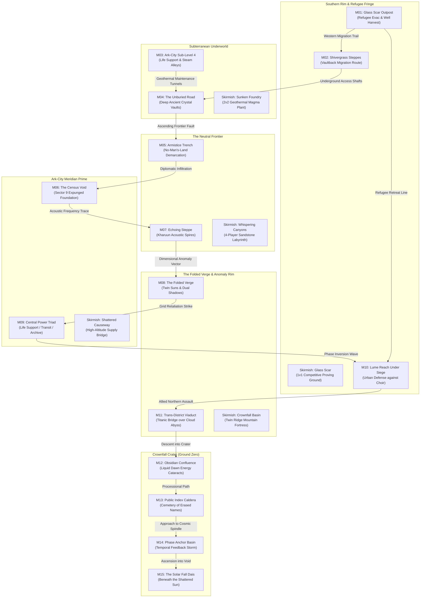

# Map Concepts, Narrative Lore & Environmental Architecture — Echoes of the Broken Sun

**Author and owner:** Angelis Pseftis  
**Standing:** Tier 4 Operational Design Reference (`Docs/README.md`). Directly operationalizes the universe canon from `Docs/Archive/DevelopmentBible.md`, `Docs/ArtDirection.md` (A4 Environment Completion), `Docs/AudioDirection.md` (B3 Ambience Site Families), and `Docs/Requirements.md`.  
**Applies to:** Every session authoring map geometry, terrain source JSONs (`Content/World/Source/`), dressing packs (`Content/World/Generated/Dressing/`), lighting rigs, environmental VFX, and site audio beds.  

---

## 1. The Macro World: Soryn and the Geographic Journey

### Soryn's Planetary Geography & The March to the Sun
In *Echoes of the Broken Sun*, the campaign is a physical and metaphysical pilgrimage across the scarred surface of Soryn, moving from the fragile outer shelters of civilization toward the cosmic wound at the world's heart:

```
[ACT I: NECESSARY FIRES]
Lume Reach Outskirts (M01) ──► Shivergrass Steppes (M02) ──► Ark-City Sub-Level 4 (M03) ──► Deep Mineral Vaults (M04) ──► Armistice Trench (M05)
                                                                                                                          │
[ACT II: THE COST OF ONE FUTURE]                                                                                         ▼
Lume Reach Siege (M10) ◄── Central Power Triad (M09) ◄── Folded Verge Anomaly (M08) ◄── Echoing Steppe (M07) ◄── Ark-City Census Void (M06)
   │
   ▼
[ACT III: CROWNFALL]
Trans-District Viaduct (M11) ──► Obsidian Confluence (M12) ──► Public Index Caldera (M13) ──► Phase Anchor Basin (M14) ──► Solar Fall Dais (M15)
```



### The Sensory Progression Arc
As the player journeys through the fifteen operations, the sensory envelope of the game transforms systematically:
1. **The Sky & The Broken Sun:**
   - *Act I:* The Broken Sun is a distant, pale amber fracture on the horizon, casting long, melancholy shadows across a world trying to survive.
   - *Act II:* As the causal anomalies intensify, the sun fractures visibly into twin light sources casting dual, contradictory shadows; sky tones cycle between amber and bruised violet.
   - *Act III:* The Broken Sun dominates 50% of the upper screen—a colossal, blinding white-gold core surrounded by jagged black coronal plates, bleeding violent magenta solar flares directly into the atmosphere.
2. **The Acoustic Evolution:**
   - *Act I:* Grounded, material, tactile. The creak of ceramic plates, the scrape of boots on vitrified glass, the steady metronome of emergency power generators.
   - *Act II:* Subtle temporal dissonance. Missing harmonic partials, reverse reverbs, whispers carried on stratospheric winds, eerie silence where bustling districts should be.
   - *Act III:* Pure cosmic resonance. The "Sun’s Voice"—the missing-harmonic fracture motif ringing through the submix, deep sub-bass temporal rumbles, and the glass-like ringing of reality bending under pressure.
3. **The Material Degradation:**
   - Terrain transitions from solid, recognizable volcanic rock and industrial ceramic into impossible, shimmering light lattices, floating fractured stone islands, and finally the cosmic void at Ground Zero.

---

## 2. Universal Technical & Artistic Gating Standards

Every map built in this repository must satisfy the following technical and sensory gating invariants:

1. **64 × 64 Tile Simulation Grid:**
   - Exactly 4,096 discrete cells.
   - 1 simulation tile = 100 cm (1 m); presentation tile = 200 World Units (uu).
2. **Deterministic Height Bands:**
   - `Band -1 (Chasm / Depth):` -128 uu. Impassable to ground units without bridges or causeways.
   - `Band 0 (Baseline Plains):` 0 uu. Standard movement plane.
   - `Band +1 (Tactical Shelf):` +128 uu. Raised plateaus; requires ramps to traverse. Units on high ground enjoy fog-of-war vision elevation advantages.
   - `Band +2 (Impassable Ridges / Tower Facades):` +256 uu. Strict line-of-sight and movement blockers.
3. **The Five-Note Palette (`ArtDirection.md`):**
   - **Charcoal Basalt:** Primary terrain base, vitrified soil, deep shadow foundations.
   - **Pale Ceramic:** Meridian infrastructure, civic walls, road decks, high-reflection architectural faces.
   - **Broken-Sun Amber:** Kharuun grown spires, fissure heat, active power lines, glowing minerals.
   - **Magenta-Fracture:** Crownfall scars, Choir manifestation zones, reality fractures, sky bleed.
   - **Cyan Glass:** Matter crystal deposits, high-tier energy conduits, pristine future tech.
4. **Lighting & Surface Rules:**
   - Ground roughness $\ge 0.85$ (no giant specular highlights that distract from unit combat).
   - Emissive surface area $\le 15\%$ per tile.
   - Key light motivated by the Crownfall sky; fill light balanced with cool indigo/slate.
5. **Acoustic Engineering (`AudioDirection.md`):**
   - Master loudness integrated at **-16 LUFS ± 1**, true peak **$\le -1.0$ dBTP**.
   - Site ambience beds sit in the Ambience Submix, never masking unit movement, weapon fire, or alert cues.

---

## 3. Act I: Necessary Fires — Detailed Map Profiles

---

### Mission 01: What the Ledger Keeps (*The Glass Scar Outpost*)
- **Map Identifier:** `map_m01_glass_scar_outpost`
- **Location:** Southern Rim of the Glass Scar, abutting the outskirts of Lume Reach.
- **Story & Mission Context:**
  Mara Vey commands an emergency evacuation of displaced archive units while the Glass Scar Future Well destabilizes. Nearby Lume Reach's power grid is failing; without energy from the Well, thousands will freeze. But Oruun’s Kharuun forces intercept the operation: the Well taps directly into an ancestral birthing cavern below. To harvest the Well saves the city above, but boils the nursery below.
- **Scenery & Visual Architecture:**
  - *Macro Silhouette:* A vast impact basin cleaved by a jagged 10-meter-deep fissure. 
  - *Landmarks:* The **Buried Causeway**—a colossal pre-fall ceramic bridge half-submerged in black glass; the **Refugee Staging Gate** at `(6,17)`; and the central **Well Dais** elevated on vitrified piers above the chasm bed.
  - *Props:* Broken ceramic barricades, overturned cargo skiffs, discarded emergency ration crates, sulfurous steam vents.
- **Lighting & Atmospheric Rig:**
  - *Celestial Motivation:* Broken Sun at low morning elevation (22° angle), casting sharp, elongated shadows across the chasm.
  - *Key Light:* Warm amber dawn (4200K, 65,000 lux).
  - *Fill Light:* Deep indigo atmospheric wash (8500K, 12,000 lux).
  - *Atmosphere:* Fine volcanic ash suspended in the air, catching golden glints.
- **Visual Effects (VFX):**
  - Rising heat distortion and sulfur steam ribbons over the central chasm.
  - Amber electrical sparks arcing along destabilizing power conduits.
  - Subtle micro-fracture glow in vitrified glass tiles when units step over them.
- **Soundscape & Acoustic Identity:**
  - *Ambience Bed (`AMB_GlassScar`):* Desolate wind howling across brittle obsidian glass, punctuated by sparse crystal shard chimes playing the *fracture motif*.
  - *Foley:* Crisp, crunching gravel footsteps; hollow metallic groans from the strained causeway piers.
  - *Music:* Meridian pulse—subdued, metronomic prepared piano and muted French horn expressing disciplined anxiety under load.
- **Human Sensory Anchors:**
  - The visceral contrast between the warm, glowing amber refugee fires in the southwest and the pitch-black, freezing glass chasm yawning in front of them.
- **Core Concept Mechanics:**
  - Future Well at `(32,32)`: Choosing *Harvest* collapses the causeway piers and opens a southern retreat ramp; *Preserve* keeps the causeway bridge intact for heavy armor; *Reshape* opens a zig-zag crossing through the chasm bed.
- **AI Technical Contract:**
  - Grid: 64×64. Blocked tiles: 384. Height bands: -1 (chasm), 0 (basin), +1 (rim).
  - Test: `Echoes.Runtime.Map.GlassScar`. Dressing Rev: `glass-scar-shelf-vitrified-v2`.

---

### Mission 02: Seven Accounts of Rain (*The Shivergrass Basin*)
- **Map Identifier:** `map_m02_shivergrass_basin`
- **Location:** The Western Steppes of the Folded Verge.
- **Story & Mission Context:**
  Oruun-of-Seven-Stones leads a sacred herd of massive Vaultback beasts across an ancestral migration route. His seven inherited memories contradict each other regarding the geography: one remembers a roaring river, one a dry canyon, one a city. As supernatural "temporal rain" begins to fall, Oruun must navigate narrow stone sills while fending off Compact prospectors who view the sacred herd merely as raw matter for extraction.
- **Scenery & Visual Architecture:**
  - *Macro Silhouette:* An expansive, undulating steppe flanked by stepped basalt terraces.
  - *Landmarks:* The **First Account Sill** (X=22) and **Fourth Account Sill** (X=42)—massive natural stone ribs arching over the valley; the **Ancient Migration Cairns** stacked with riverstones.
  - *Props:* Enormous petrified Vaultback molting shells embedded in cliffs; carved stone prayer pillars; herds of neutral, living Vaultbacks grazing in the distance.
- **Lighting & Atmospheric Rig:**
  - *Celestial Motivation:* Heavy, bruised ash-clouds rolling across the sky, pierced by dramatic god-rays of amber sunlight.
  - *Key Light:* Piercing sunlight shafts (3800K, 50,000 lux).
  - *Fill Light:* Bruised slate-blue storm ambiance (9000K, 15,000 lux).
  - *Atmosphere:* Wet, reflective mist banks drifting through the central depression.
- **Visual Effects (VFX):**
  - **Dynamic Shivergrass Shader:** Pale violet and silver grass meshes that physically ripple and part in waves before approaching units.
  - "Temporal Rain": Drops of rain that briefly illuminate glowing cyan rings where they touch the earth, occasionally reversing upward.
- **Soundscape & Acoustic Identity:**
  - *Ambience Bed (`AMB_MigrationRoute`):* Low whistling steppe wind, wet grass rustling, distant subterranean bellowing of migrating Vaultbacks.
  - *Foley:* Muffled mud footfalls, the heavy rhythmic thud of Vaultback hooves shaking the camera.
  - *Music:* Kharuun acoustic palette—interlocking ceramic flute melodies and deep resonant stone percussion phasing in irregular polyrhythms.
- **Human Sensory Anchors:**
  - Seeing the shivergrass ripple in the fog 50 meters ahead of your scouts, signaling incoming enemy movement before radar detects them.
- **Core Concept Mechanics:**
  - Shivergrass fields provide stealth concealment for light scouts but trigger visible parting waves that observant players can track visually.
- **AI Technical Contract:**
  - Grid: 64×64. Blocked tiles: 412. Height bands: 0 (depression), +1 (steppes).
  - Test: `Echoes.Runtime.Map.ShivergrassBasin`. Dressing Rev: `shivergrass-basin-v1`.

---

### Mission 03: A City on Reserve (*Ark-City: Life Support Conduits*)
- **Map Identifier:** `map_m03_arkcity_lifesupport`
- **Location:** Lower Sub-Level 4, Ark-City Meridian Prime.
- **Story & Mission Context:**
  Ark-City houses four million civilians inside a shielded tectonic fissure. In Sub-Level 4, primary reserves have dropped below 12%. Mara Vey must advance through narrow industrial utility corridors to manually bypass failed breaker stations amidst civilian riots over life-support rationing.
- **Scenery & Visual Architecture:**
  - *Macro Silhouette:* An oppressive, claustrophobic industrial canyon enclosed by a ceiling of massive hanging pipes and ventilation drums.
  - *Landmarks:* The **Atmosphere Scrubber Hub** (North), the **Hydraulic Junction** (Center), and the **Thermal Dissipation Radiators** (South).
  - *Props:* High-pressure ceramic steam pipes, heavy steel blast gates, leaking coolant pools, civilian protest graffiti (*"WHO DECIDED OUR AIR?"*).
- **Lighting & Atmospheric Rig:**
  - *Celestial Motivation:* Enclosed subterranean cavern; zero sunlight.
  - *Key Light:* Sodium-vapor industrial lamps and spinning amber emergency strobes (2200K, 30,000 lux).
  - *Fill Light:* Coolant pool cyan glow (6500K, 8,000 lux).
  - *Atmosphere:* Dense industrial steam vents and condensation haze.
- **Visual Effects (VFX):**
  - High-pressure steam jets bursting periodically from damaged pipes (obscuring sightlines).
  - Cyan electrical ionization arcing across flooded floor grates.
- **Soundscape & Acoustic Identity:**
  - *Ambience Bed (`AMB_ArkCity_LifeSupport`):* Deep, rhythmic mechanical thrumming of giant air scrubbers; dripping water; distant echoes of sirens and muffled civilian shouts.
  - *Foley:* Metal catwalk clanking, pneumatic valve hisses, electrical hums.
  - *Music:* Industrial Meridian cue—syncopated clockwork percussion with strained cello suspensions.
- **Human Sensory Anchors:**
  - The sensory claustrophobia: steam hissing across the screen, red strobe lights flashing against steel bulkheads, and the visible temperature gauges on the walls dropping toward zero.
- **Core Concept Mechanics:**
  - Narrow 5-tile choke alleys force tight unit formations; high catwalks allow line units to fire down onto flanking corridors.
- **AI Technical Contract:**
  - Grid: 64×64. Blocked tiles: 620. Height bands: 0 (floors), +2 (catwalks/walls).
  - Test: `Echoes.Runtime.Map.ArkCityConduits`. Dressing Rev: `arkcity-conduit-v1`.

---

### Mission 04: The Unburied Road (*The Deep Mineral Vaults*)
- **Map Identifier:** `map_m04_unburied_road`
- **Location:** Subterranean strata beneath Southern Rim.
- **Story & Mission Context:**
  Deep below the crust lies an ancient highway grown from living crystal stone. Within it rests the *Memory Shard of Kael-Tor*, holding 500 years of pre-fall history. Oruun deploys mobile Waystones into the dark cavern to harmonize with the crystal before Compact industrial drilling rigs breach the ceiling to quarry the shard by brute force.
- **Scenery & Visual Architecture:**
  - *Macro Silhouette:* A colossal underground vaulted cavern with a massive sunken stone highway.
  - *Landmarks:* The **Avenue of Kael-Tor** (Center), the towering **Cyan Memory Shard** (East), and the **Compact Drill Shafts** (North).
  - *Props:* Giant grown crystal stalagmites, pre-collapse road slabs tilted at violent angles, bioluminescent amber fungus clusters, crushed drilling machinery.
- **Lighting & Atmospheric Rig:**
  - *Celestial Motivation:* Pitch-black cavern; illumination provided entirely by bioluminescent mineral deposits and crystal formations.
  - *Key Light:* Amber bioluminescent ceiling nodules (2800K, 25,000 lux).
  - *Fill Light:* Pale cyan crystal radiosity (7000K, 14,000 lux).
  - *Atmosphere:* Drifting subterranean spore motes glowing softly in the dark.
- **Visual Effects (VFX):**
  - Falling rock dust and debris plumes beneath active Compact drill holes.
  - Warm amber pulses coursing through the floor veins when Waystones root.
- **Soundscape & Acoustic Identity:**
  - *Ambience Bed (`AMB_KharuunInteriors`):* Deep subterranean tectonic groaning, crystal resonance ringing like struck glass, mineral warmth.
  - *Foley:* Stone scraping against stone, hollow crystal chimes, distant industrial drill vibration.
  - *Music:* Sacred Kharuun resonance—low throat-singing overtones, resonant ceramic lithophones, deep bass drones.
- **Human Sensory Anchors:**
  - The eerie majesty of illuminating a pitch-black cavern with your units' torches, watching colossal amber crystals emerge from the shadows.
- **Core Concept Mechanics:**
  - Kharuun Waystones can root directly into mineral fissures to accelerate unit growth, while Compact drill breaches drop impassable rubble onto the road.
- **AI Technical Contract:**
  - Grid: 64×64. Blocked tiles: 530. Height bands: 0 (highway), -1 (magma chasm).
  - Test: `Echoes.Runtime.Map.UnburiedRoad`. Dressing Rev: `unburied-road-vaults-v1`.

---

### Mission 05: Terms of Continuance (*The Armistice Trench*)
- **Map Identifier:** `map_m05_terms_of_continuance`
- **Location:** Neutral Border Zone • Trench 4.
- **Story & Mission Context:**
  Mara Vey and Oruun meet in the Demilitarized Trench to ratify an emergency armistice. But as the summit begins, automated sentries detonate and open fire on both delegations. Unbeknownst to them, the sabotage was executed by the first physical apparitions of the Hollow Choir, desperate to keep the war burning to prevent timeline collapse.
- **Scenery & Visual Architecture:**
  - *Macro Silhouette:* A muddy, fortified battlefield split east-to-west by a titanic 4-tile-wide trench.
  - *Landmarks:* The **Summit Pavilion** at `(32,32)` over the central bridge; the **Meridian Northern Fortress**; and the **Kharuun Southern Redoubt**.
  - *Props:* Razor wire coils, shattered ceasefire heraldry banners, smoldering craters, abandoned diplomatic inspection skiffs.
- **Lighting & Atmospheric Rig:**
  - *Celestial Motivation:* Late twilight sunset; Broken Sun sitting directly on the horizon, casting a bloody amber glow beneath an indigo sky cut by an angry magenta scar.
  - *Key Light:* Low-angle raking sunset amber (3200K, 45,000 lux).
  - *Fill Light:* Deep violet-indigo dusk (9500K, 10,000 lux).
  - *Atmosphere:* Dense ground fog clinging to the bottom of the trench.
- **Visual Effects (VFX):**
  - Muzzle flashes reflecting off wet mud and razor wire.
  - Strange magenta temporal smoke rising from exploded sabotage mines.
- **Soundscape & Acoustic Identity:**
  - *Ambience Bed (`AMB_ArmisticeTrench`):* Cold wind whistling through barbed wire, distant thunder, wet mud sucking at boots, the occasional crack of an automated sniper shot.
  - *Foley:* Muddy splashing, barbed wire twangs, spent shell casings hitting wet earth.
  - *Music:* Tragic hybrid score—Meridian brass and Kharuun percussion clashing in dissonant counterpoint.
- **Human Sensory Anchors:**
  - The gut-wrenching feeling of entering a peace conference only to watch white surrender banners get shredded by automated machine-gun crossfire in the mud.
- **Core Concept Mechanics:**
  - The trench (-128 uu) offers heavy defense against ranged fire but slows movement; holding the three bridges is the key to victory.
- **AI Technical Contract:**
  - Grid: 64×64. Blocked tiles: 360. Height bands: -1 (trench), 0 (no-man's-land), +1 (bunkers).
  - Test: `Echoes.Runtime.Map.TermsOfContinuance`. Dressing Rev: `armistice-trench-v1`.

---

## 4. Act II: The Cost of One Future — Detailed Map Profiles

---

### Mission 06: Names Without Births (*Ark-City: The Census Void*)
- **Map Identifier:** `map_m06_census_void`
- **Location:** Ark-City Residential Ward 9 (Expunged).
- **Story & Mission Context:**
  Archivist Talar Venn discovers that in Year 42 post-Crownfall, 80,000 citizens from Sector 9 vanished from all records. Arriving at Sector 9, he finds an expunged void: an entire district cleanly sheared off at the foundation level like glass. As he sets up scanners to recover buried ledgers, spectral apparitions of erased citizens begin manifesting around him.
- **Scenery & Visual Architecture:**
  - *Macro Silhouette:* A vast, unnatural flat plaza framed by towering, intact monolithic administrative towers.
  - *Landmarks:* The **Sheared Plaza** (Center), the **Data Bunker Vault 9** (East), and the **North Quarantine Gate**.
  - *Props:* Mirror-smooth foundation cuts where buildings stood, dead data terminals flickering with missing-record errors, windblown ledger parchment, spectral child toys on bare concrete.
- **Lighting & Atmospheric Rig:**
  - *Celestial Motivation:* Overcast daylight filtering through a fractured dome skylight.
  - *Key Light:* Sterile, clinical grey-white daylight (5800K, 40,000 lux).
  - *Fill Light:* Cool cyan data glow from terminals (7500K, 12,000 lux).
  - *Atmosphere:* Supernatural, chilling stillness; faint geometric static haze floating in the air.
- **Visual Effects (VFX):**
  - Holographic glitches where walls and furniture briefly flicker into existence for a split second, then vanish.
  - Faint, semi-transparent phantom figures walking along street lines that no longer exist.
- **Soundscape & Acoustic Identity:**
  - *Ambience Bed (`AMB_ArkCity_Archive`):* The quietest bed in the game—near-dead silence, subtle electrical hum, faint page-turning sounds echoing from nowhere.
  - *Foley:* Footsteps on unnervingly smooth concrete, flickering capacitor buzzes.
  - *Music:* Melancholic solo prepared piano playing sparse, hollow minor intervals.
- **Human Sensory Anchors:**
  - The eerie silence. After five missions of roaring gunfire and heavy industrial noise, stepping into a completely silent, expunged city district creates immense psychological tension.
- **Core Concept Mechanics:**
  - Wide open line-of-sight across the plaza; defense must be established using deployable Bulwarks and mobile Waystones.
- **AI Technical Contract:**
  - Grid: 64×64. Blocked tiles: 490. Height bands: 0 (plaza), +2 (monolith towers).
  - Test: `Echoes.Runtime.Map.CensusVoid`. Dressing Rev: `census-void-v1`.

---

### Mission 07: The Shape of Silence (*The Echoing Steppe*)
- **Map Identifier:** `map_m07_echoing_steppe`
- **Location:** The Resonant Spires of Kharuun High Ridge.
- **Story & Mission Context:**
  Oruun travels to the highest geological ridge on Soryn to tune ancient acoustic *Listening Spines*—porous stone towers that catch stratospheric winds and preserve communal memory songs. He discovers that the Assembly Council deliberately expunged four generations of memories to hide their own illegal timeline harvesting. Council loyalists attack to silence the spires.
- **Scenery & Visual Architecture:**
  - *Macro Silhouette:* Three concentric stepped terraces rising to high promontories overlooking deep wind-chasms.
  - *Landmarks:* The **Four Grand Listening Spines**; the **Resonant Arch of Oruun**; and the deep **Abyss of Echoes** below.
  - *Props:* Giant monolithic stone tuning pillars, fluttering prayer ribbons, hollow resonant geodes, fallen tuning pillars cracked open to reveal amber cores.
- **Lighting & Atmospheric Rig:**
  - *Celestial Motivation:* High-altitude azure sky streaked with cirrus clouds; intense, sharp amber sun casting dramatic, long shadows.
  - *Key Light:* High-noon mountain amber (4500K, 85,000 lux).
  - *Fill Light:* Pure alpine sky blue (10,000K, 18,000 lux).
  - *Atmosphere:* Crystal-clear thin air; heat shimmer rising from black basalt crags.
- **Visual Effects (VFX):**
  - Visible acoustic shockwaves rippling through the air when the Listening Spines are tuned.
  - Prayer ribbons tearing and fluttering violently in the mountain gale.
- **Soundscape & Acoustic Identity:**
  - *Ambience Bed (`AMB_EchoingSteppe`):* Screaming high-altitude winds, harmonic acoustic whistling from hollow stone pillars, echoing rockslides.
  - *Foley:* Cracking stone, wind whipping against cloth, sharp acoustic echos.
  - *Music:* Complex layered percussion and soaring ceramic overtone flutes.
- **Human Sensory Anchors:**
  - Hearing the wind whistle through the stone spires change pitch as you capture each node, harmonizing the soundscape.
- **Core Concept Mechanics:**
  - Capturing and holding the four Spines provides map-wide radar visibility of enemy troop movements through acoustic ground vibration.
- **AI Technical Contract:**
  - Grid: 64×64. Blocked tiles: 450. Height bands: 0 (base), +1 (middle shelf), +2 (high ridge).
  - Test: `Echoes.Runtime.Map.EchoingSteppe`. Dressing Rev: `echoing-steppe-v1`.

---

### Mission 08: The Shape Beside Us (*The Folded Verge*)
- **Map Identifier:** `map_m08_folded_verge`
- **Location:** Dimensional Anomaly Corridor outside Crownfall.
- **Story & Mission Context:**
  The first direct encounter with the Hollow Choir. Space ceases to be Euclidean. Led by Neme—an entity holding multiple unlived futures—the Choir makes contact. Buildings cast two shadows in different directions. Footpaths loop back on themselves unless viewed through high-energy sensors. Mara and Oruun must survive while establishing communication.
- **Scenery & Visual Architecture:**
  - *Macro Silhouette:* A shattered canyon where floating islands hover in mid-air connected by translucent crystal bridges.
  - *Landmarks:* The **Twin Sun Spires**; the **Phase Bridge of Neme**; and the **Folded Confluence**.
  - *Props:* Floating stone slabs hovering motionless, translucent magenta geometry overlapping solid rock, arches revealing empty sky when walked through.
- **Lighting & Atmospheric Rig:**
  - *Celestial Motivation:* The Broken Sun appears doubled: **two suns** casting intersecting shadows in different directions.
  - *Key Light 1:* Amber Sun (4000K, 50,000 lux from East).
  - *Key Light 2:* Violet Sun (6500K, 50,000 lux from West).
  - *Fill Light:* Shimmering iridescent phase-radiance.
  - *Atmosphere:* Refractive phase-fog that bends light around unit silhouettes.
- **Visual Effects (VFX):**
  - Units casting two distinct shadows pointing in opposite directions.
  - Ground tiles flickering between solid basalt and translucent magenta wireframes.
- **Soundscape & Acoustic Identity:**
  - *Ambience Bed (`AMB_ChoirSites`):* Eerie held vocal drones, glass harmonics, subtle binaural beating that makes the ear search for a rhythm.
  - *Foley:* Reverse footstep echoes, phase-shift whooshes with onsets offset by ±80 ms from visuals.
  - *Music:* Hollow Choir sonic language—detuned glass pads, mysterious non-cadential chord progressions.
- **Human Sensory Anchors:**
  - The surreal visual shock of dual shadows and walking across a bridge that looks completely invisible until your unit steps onto it.
- **Core Concept Mechanics:**
  - Phase bridges cycle between passable and impassable every 60 seconds; planning army crossings around phase windows is crucial.
- **AI Technical Contract:**
  - Grid: 64×64. Blocked tiles: 580. Height bands: -1 (void), 0 (floating plateaus).
  - Test: `Echoes.Runtime.Map.FoldedVerge`. Dressing Rev: `folded-verge-anomaly-v1`.

---

### Mission 09: Reserve Authority (*Ark-City: The Central Power Triad*)
- **Map Identifier:** `map_m09_power_triad`
- **Location:** The Central Utility Core of Ark-City Meridian Prime.
- **Story & Mission Context:**
  Total power grid failure is imminent. Chancellor Rhyse triggers the Reserve Authority Protocol. The power station commands three indispensable arteries: *Life Support*, *Transit*, and *Archive*. The grid can only sustain **two**; one must be permanently dark-cycled. Mara Vey is placed in command as civil war breaks out at the gates over which district lives and which dies.
- **Scenery & Visual Architecture:**
  - *Macro Silhouette:* A titanic circular rotunda dome connecting three massive industrial wings arranged in a triangle.
  - *Landmarks:* The **Central Generator Hex** at `(32,32)`; the **Life Support Turbine Wing** (North); the **Transit Mag-Rail Yard** (Southeast); and the **Archive Silo Wing** (Southwest).
  - *Props:* Massive capacitor arrays arcing with electricity, civilian furniture barricades, shattered ceramic insulation rings, emergency lockdown blast doors.
- **Lighting & Atmospheric Rig:**
  - *Celestial Motivation:* Enclosed dome; emergency rotating red sirens and amber high-voltage arcs.
  - *Key Light:* Spinning red emergency beacons (1800K, 35,000 lux).
  - *Fill Light:* Cold steel blue ambient (8000K, 6,000 lux).
  - *Atmosphere:* Heavy electrical ozone smoke and drifting sparks.
- **Visual Effects (VFX):**
  - Giant lightning arcs flashing between capacitor banks.
  - Blast doors grinding shut and throwing shower plumes of welding sparks.
- **Soundscape & Acoustic Identity:**
  - *Ambience Bed (`AMB_ArkCity_Transit`):* Heavy electrical hum, screaming emergency sirens, the roar of crowds banging on blast doors outside.
  - *Foley:* Heavy pneumatic clanks, electrical buzzing, shattering ceramic insulators.
  - *Music:* Fast, driving, urgent metronomic Meridian battle score.
- **Human Sensory Anchors:**
  - Hearing the public address system calmly announce: *"Grid capacity at 8%. Power failure in Ward 4 in 120 seconds."*
- **Core Concept Mechanics:**
  - The player must physically hold and power exactly two of the three terminals; the third district's power dies, changing the campaign ledger forever.
- **AI Technical Contract:**
  - Grid: 64×64. Blocked tiles: 520. Height bands: 0 (floors), +1 (generator hex).
  - Test: `Echoes.Runtime.Map.PowerTriad`. Dressing Rev: `arkcity-power-triad-v1`.

---

### Mission 10: The Choir at Lume Reach (*Lume Reach Under Phase Siege*)
- **Map Identifier:** `map_m10_lume_reach_siege`
- **Location:** The Settlement of Lume Reach.
- **Story & Mission Context:**
  Desperate to avoid permanent erasure, the Hollow Choir launches a full-scale assault on Lume Reach. They seek to invert the settlement's Future Well, pulling the city out of physical reality and replacing its living citizens with the phantom lives of those who were never born. Mara and Oruun unite along the outer walls in a desperate urban defense.
- **Scenery & Visual Architecture:**
  - *Macro Silhouette:* A burning ceramic settlement surrounded by a fortified perimeter wall breached in the center.
  - *Landmarks:* The **Great Breach** (X=28–36, Y=20); the **Evacuation Plaza**; and the **Civic Bell Tower**.
  - *Props:* Burning ceramic apartments, collapsed transit arches, emergency medical triage tents, Choir phase tendrils wrapping around streetlamps.
- **Lighting & Atmospheric Rig:**
  - *Celestial Motivation:* Violent magenta storm clouds swirling around a shattered sky vortex directly above the city.
  - *Key Light:* Blinding electrical lightning flashes (15,000K, 100,000 lux bursts).
  - *Fill Light:* Burning building amber firelight (2000K, 15,000 lux).
  - *Atmosphere:* Thick black fire smoke mixed with glowing magenta phase plasma.
- **Visual Effects (VFX):**
  - Rain of glowing magenta embers falling from the vortex.
  - Civic buildings flickering and turning translucent as the Choir's inversion field spreads.
- **Soundscape & Acoustic Identity:**
  - *Ambience Bed (`AMB_LumeReachSiege`):* Howling tempest, burning fires crackling, civilian evacuation sirens, the terrifying resonant wail of the Choir.
  - *Foley:* Collapsing masonry, screaming metal, thunderclaps.
  - *Music:* Epic apocalyptic battle score—full choir chanting in competing dissonant harmonies over crushing percussion.
- **Human Sensory Anchors:**
  - Watching the buildings behind your defensive line literally begin to fade into ghost-like wireframes as the enemy pushes forward.
- **Core Concept Mechanics:**
  - Defending the wall breach is an intense multi-front tactical siege; losing perimeter wall sectors allows Choir infiltrators into civilian evacuation routes.
- **AI Technical Contract:**
  - Grid: 64×64. Blocked tiles: 640. Height bands: 0 (city), +1 (perimeter walls).
  - Test: `Echoes.Runtime.Map.LumeReachSiege`. Dressing Rev: `lume-reach-siege-v1`.

---

## 5. Act III: Crownfall — Detailed Map Profiles

---

### Mission 11: No Neutral Ledger (*The Trans-District Viaduct*)
- **Map Identifier:** `map_m11_trans_district_viaduct`
- **Location:** The Great Viaduct spanning the chasm between Ark-City and Crownfall.
- **Story & Mission Context:**
  Allied forces march on Crownfall to stop Chancellor Rhyse, who plans to use the world's primary anomaly engine to forcefully erase all alternative timelines and cement a single, totalitarian future. The only route is the Trans-District Viaduct: a titanic suspension bridge stretching across an abyss so deep that clouds drift thousands of meters below. Rhyse's elite guard fortifies the bridge, preparing to blast the central spans into the void.
- **Scenery & Visual Architecture:**
  - *Macro Silhouette:* A long, narrow bridge corridor (20 tiles wide, 64 tiles long) floating above a bottomless cloud abyss.
  - *Landmarks:* The **Three Bridge Toll Plazas** (South, Center, North); the **Massive Suspension Cables**; and the **Severed Deck Span**.
  - *Props:* Stalled evacuation convoys, military barricades, severed suspension cables thrashing in the wind, abyss warning beacons.
- **Lighting & Atmospheric Rig:**
  - *Celestial Motivation:* High-altitude storm tempest; gale-force winds pushing dark clouds across the bridge deck.
  - *Key Light:* Pale, diffuse stormy sunlight (5200K, 35,000 lux).
  - *Fill Light:* Deep chasm void blue (9000K, 12,000 lux).
  - *Atmosphere:* Vertigo-inducing abyss fog boiling up from beneath the deck.
- **Visual Effects (VFX):**
  - Violent wind blowing rain horizontally across the screen.
  - Sparks flying as artillery strikes slice through structural suspension cables.
- **Soundscape & Acoustic Identity:**
  - *Ambience Bed (`AMB_ViaductAbyss`):* Deafening roar of high-altitude gale winds, humming suspension cables vibrating like giant cello strings, distant thunder.
  - *Foley:* Metal expansion joints groaning, wind howling through bridge grates.
  - *Music:* Driving military march with heavy brass and unrelenting snare cadences.
- **Human Sensory Anchors:**
  - The intense vertigo: looking over the edge of the bridge deck and seeing lightning storm clouds drifting kilometers *below* your soldiers' feet.
- **Core Concept Mechanics:**
  - Fatal terrain boundaries on the east and west edges (Band -1); knockback attacks or blast weapons can throw units off the bridge to instant destruction.
- **AI Technical Contract:**
  - Grid: 64×64. Blocked tiles: 2,750 (Abyss void). Height bands: -1 (abyss), 0 (bridge deck), +1 (toll towers).
  - Test: `Echoes.Runtime.Map.TransDistrictViaduct`. Dressing Rev: `trans-district-viaduct-v1`.

---

### Mission 12: The Future That Won (*The Obsidian Confluence*)
- **Map Identifier:** `map_m12_obsidian_confluence`
- **Location:** The Convergence of the Three Well-Beds.
- **Story & Mission Context:**
  At the foot of the Crownfall crater, liquid Dawn energy flows like water along ancient vitrified channels, cascading over colossal energy cataracts. Rhyse's heavy siphon stations drain raw possibility into his war machine, causing localized reality ripples that briefly resurrect destroyed combat walkers from centuries past.
- **Scenery & Visual Architecture:**
  - *Macro Silhouette:* Three raised land-bridges meeting at a central triangular arena surrounded by liquid energy waterfalls.
  - *Landmarks:* The **Three Siphon Towers**; the **Obsidian Confluence Cataracts**; and the **Sovereign Tri-Well Dais**.
  - *Props:* Polished black obsidian bedrock mirroring the stars, ancient humming energy conduits, glowing cyan cataracts, historic faction war-banners.
- **Lighting & Atmospheric Rig:**
  - *Celestial Motivation:* Golden and magenta energy ribbons weaving through a dark obsidian sky; dramatic localized light shafts.
  - *Key Light:* Liquid Dawn cyan radiosity (6500K, 60,000 lux).
  - *Fill Light:* Obsidian sky violet (8500K, 15,000 lux).
  - *Atmosphere:* Shimmering, luminescent energy mist rising from the waterfalls.
- **Visual Effects (VFX):**
  - Cascading waterfalls of glowing cyan energy falling into infinite bottomless pits.
  - "Resurrection Phantoms": Translucent ghost walkers that rise from the riverbeds, fire a ghostly volley, and dissolve into mist.
- **Soundscape & Acoustic Identity:**
  - *Ambience Bed (`AMB_ObsidianConfluence`):* Roaring liquid energy cataracts, deep electric humming, crystal water splashes.
  - *Foley:* Splashing through shallow energy channels, energy siphon turbine whines.
  - *Music:* Majestic, sweeping sci-fantasy score blending orchestral brass with synthetic glass pads.
- **Human Sensory Anchors:**
  - The visual splendor of the liquid cyan waterfalls contrasting against jet-black mirror obsidian stone.
- **Core Concept Mechanics:**
  - Navigating the shallow energy rivers grants rapid movement speed buffs but prevents units from cloaking or entering defensive stances.
- **AI Technical Contract:**
  - Grid: 64×64. Blocked tiles: 510. Height bands: -1 (cataracts), 0 (confluence), +1 (dais).
  - Test: `Echoes.Runtime.Map.ObsidianConfluence`. Dressing Rev: `obsidian-confluence-v1`.

---

### Mission 13: Assembly of the Missing (*The Crownfall Public Index*)
- **Map Identifier:** `map_m13_crownfall_index`
- **Location:** The Monumental Index Caldera.
- **Story & Mission Context:**
  Entering the outer perimeter of Crownfall, the commanders discover the Public Index—tens of thousands of black granite stele inscribed with the names of every person, city, and culture erased during the First Impact. This is the sacred cemetery of the un-happened. Here, Oruun and Mara present their ledgers in a solemn assembly of attestation, proving to the Choir that their past erasure was born of survival, not malice, forging a treaty of mutual recognition before Rhyse's arrival.
- **Scenery & Visual Architecture:**
  - *Macro Silhouette:* A colossal circular amphitheater caldera stepping downward toward a central index podium.
  - *Landmarks:* The **Central Attestation Podium**; the **Four Grand Ceremonial Staircases**; and the **Colossal Stele Rings**.
  - *Props:* Towering black granite stele inscribed with microscopic glowing cyan text, hollow bronze resonant bells, paved ceremonial rings, glowing votive offerings.
- **Lighting & Atmospheric Rig:**
  - *Celestial Motivation:* Dark violet sky dominated by the massive, low-hanging Broken Sun core glowing in dull, menacing amber.
  - *Key Light:* Broken Sun amber core (3600K, 40,000 lux).
  - *Fill Light:* Stele inscription cyan luminescence (7000K, 18,000 lux).
  - *Atmosphere:* Still, solemn lavender mist hovering at knee height.
- **Visual Effects (VFX):**
  - Inscriptions on the stone stele softly pulsing and glowing as units walk past them.
  - Dust motes floating in suspension as if time itself has slowed to a crawl.
- **Soundscape & Acoustic Identity:**
  - *Ambience Bed (`AMB_PublicIndex`):* Deep, reverent acoustics; distant hollow bronze bell tones; low choral humming; solemn, reverent silence.
  - *Foley:* Echoing footsteps on ceremonial flagstones, bronze bell resonance.
  - *Music:* Haunting, solemn acoustic hymn played by solo cello, hollow ceramic flutes, and distant choir voices.
- **Human Sensory Anchors:**
  - Walking your army through miles of towering black gravestones, seeing billions of glowing names carved into the stone, realizing the staggering human cost of timeline pruning.
- **Core Concept Mechanics:**
  - Stele rings act as a dense maze of indestructible cover, favoring infantry skirmishes and close-quarters tactical maneuvers over long-range artillery.
- **AI Technical Contract:**
  - Grid: 64×64. Blocked tiles: 680 (Stele stones). Height bands: 0 (podium), +1 (terrace 1), +2 (terrace 2).
  - Test: `Echoes.Runtime.Map.PublicIndex`. Dressing Rev: `public-index-caldera-v1`.

---

### Mission 14: Several Voices, One Command (*The Phase Anchor Basin*)
- **Map Identifier:** `map_m14_phase_basin`
- **Location:** The Outer Crownfall Anomaly Zone.
- **Story & Mission Context:**
  A radicalized faction of Choir entities, terrified of erasure, attempts to shatter the Phase Anchor—the cosmic spindle tethering physical reality to causal possibility. If it breaks, Soryn dissolves into pure probabilistic chaos. Neme takes command of loyal Choir forces alongside Compact engineers and Kharuun warriors to hold the anchor against cascading temporal feedback storms.
- **Scenery & Visual Architecture:**
  - *Macro Silhouette:* A hexagonal central island surrounded by an energy moat, accessed by four narrow causeways.
  - *Landmarks:* The **Great Phase Anchor** at `(32,32)`; the **Loom of Alternatives**; and the **Four Gateway Monoliths**.
  - *Props:* Hovering crystalline Choir looms, vertical light pillars tethered by electrical arcs, translucent phantom buildings flickering in and out of existence.
- **Lighting & Atmospheric Rig:**
  - *Celestial Motivation:* Fractured kaleidoscopic sky where sections of the horizon appear inverted or duplicated.
  - *Key Light:* Magenta Anchor core flare (5500K, 70,000 lux).
  - *Fill Light:* Deep temporal void violet (11,000K, 20,000 lux).
  - *Atmosphere:* Pulsing magenta energy haze that expands and contracts with the simulation clock.
- **Visual Effects (VFX):**
  - Temporal shockwaves pulsing outward from the anchor every 30 seconds, distorting camera view with chromatic aberration.
  - Secondary resource nodes that cycle between solid crystal and phase-submerged ghost geometry.
- **Soundscape & Acoustic Identity:**
  - *Ambience Bed (`AMB_PhaseAnchor`):* Aggressive temporal beating, electrical arcing, the harmonic fracture motif screaming at maximum intensity.
  - *Foley:* Dimensional phasing hums, static discharges, crystalline shattering.
  - *Music:* Frenetic, high-intensity battle cue combining aggressive techno-industrial pulses with wild, unhinged vocal glissandos.
- **Human Sensory Anchors:**
  - The visceral sensation of reality coming apart at the seams: screen warping, colors shifting dynamically from gold to magenta, and sound warping as shockwaves hit.
- **Core Concept Mechanics:**
  - Units must alternate between *Possible* and *Manifest* stances to interact with shifting physical and temporal bridges.
- **AI Technical Contract:**
  - Grid: 64×64. Blocked tiles: 540. Height bands: -1 (phase moat), 0 (basin), +1 (anchor platform).
  - Test: `Echoes.Runtime.Map.PhaseAnchorBasin`. Dressing Rev: `phase-anchor-basin-v1`.

---

### Mission 15: The Broken Sun (*The Solar Fall Dais*) — The Finale
- **Map Identifier:** `map_m15_the_broken_sun`
- **Location:** Ground Zero of the Crownfall Cataclysm.
- **Story & Mission Context:**
  The climax of *Echoes of the Broken Sun*. At Ground Zero, reality ceases to be an ordinary planetary surface. Floating in the void directly beneath the blinding core of the Broken Sun is the Solar Fall Dais. Mara, Oruun, and Neme must defeat Chancellor Rhyse and make the final, irreversible choice for the fate of Soryn: *Restoration*, *Controlled Stabilization*, *Extinguishment*, or *Open Evolution*.
- **Scenery & Visual Architecture:**
  - *Macro Silhouette:* A colossal octagonal platform of vitrified black glass, gold inlay, and ceramic plates floating in cosmic space.
  - *Landmarks:* The **Resolution Conduit** at `(32,32)`; the **Four Accord Pedestals**; and the **Broken Sun Celestial Core** filling the sky.
  - *Props:* Massive shattered celestial rings crashed into the platform edges, crackling solar-arc conduits, glowing gold inlay channels, empty space drop-offs.
- **Lighting & Atmospheric Rig:**
  - *Celestial Motivation:* The Broken Sun fills 50% of the upper screen—a colossal, shattered celestial sphere of blinding white-gold core framed by jagged obsidian coronal plates, bleeding radiant violet and magenta solar flares.
  - *Key Light:* Blinding solar key light (6800K, 120,000 lux).
  - *Fill Light:* Deep space coronal violet (12,000K, 25,000 lux).
  - *Atmosphere:* Ethereal solar wind and falling golden ash embers streaming across the camera.
- **Visual Effects (VFX):**
  - Massive solar flares leaping across the upper sky.
  - Solar wind particles streaming horizontally across the platform.
  - High-contrast laser-sharp shadows moving as celestial fragments rotate.
- **Soundscape & Acoustic Identity:**
  - *Ambience Bed (`AMB_SolarFallDais`):* Deep, terrifying celestial hum of a dying star; solar wind hiss; resonant ringing of the Resolution Conduit; the master fracture motif resolving into pure cosmic harmony.
  - *Foley:* Footsteps on pristine vitrified glass, electrical corona discharges.
  - *Music:* The climax of the score—monumental orchestral and choral triumph fusing all three faction themes into one grand, tragic resolution.
- **Human Sensory Anchors:**
  - Looking up from the battlefield and seeing the sun itself—shattered into burning fragments, pouring its dying golden lifeblood across your soldiers.
- **Core Concept Mechanics:**
  - The Resolution Conduit at `(32,32)` requires holding all four Accord pedestals for 300 ticks while defending against Rhyse's elite vanguard.
- **AI Technical Contract:**
  - Grid: 64×64. Blocked tiles: 1,240 (Void abyss). Height bands: -1 (cosmic void), 0 (dais), +1 (conduit pedestal).
  - Test: `Echoes.Runtime.Map.BrokenSunDais`. Dressing Rev: `solar-fall-dais-v1`.

---

## 6. Skirmish Battlefields: Full Atmospheric & Tactical Profiles

---

### 1. Glass Scar (1v1 Competitive Standard)
- **Preset Identifier:** `EEchoesSkirmishMapPreset::GlassScar`
- **Atmosphere & Visuals:** Vitrified impact basin split by the Ash Cut (narrow, fast rush lane), Buried Causeway (wide, straight heavy armor lane), and Folded Verge (flank route). Golden dawn lighting over black volcanic glass.
- **Soundscape:** Wind howling across brittle obsidian glass, sparse shard chimes, industrial servo hums.
- **Tactical Identity:** 180° rotational symmetry. Central Future Well commands vision and high-ground map control. Natural expansions are tucked safely behind main bases.

---

### 2. Crownfall Basin (1v1 / 2v2 Defensive Fortress)
- **Preset Identifier:** `EEchoesSkirmishMapPreset::CrownfallBasin`
- **Atmosphere & Visuals:** Terraced mountain basin framed by twin tectonic rock ridges (X=27–29 and X=35–37). Hand-carved gates pierce the cliffs. Rusted orbital tracking guns line the high-ground shelves.
- **Soundscape:** Alpine mountain winds, rockslides, echoing artillery fire.
- **Tactical Identity:** Twin ridges divide the map into three isolated lanes (West, Center, East). Bases start atop elevated shelves (+128 uu) with single ramp chokepoints. Ideal for macro play and siege defense.

---

### 3. Soryn Confluence (3-Player Free-For-All)
- **Preset Identifier:** `EEchoesSkirmishMapPreset::SorynConfluence`
- **Atmosphere & Visuals:** Three dried obsidian river canyons meeting at a central elevated Future Well dais. Ancient stone ceremonial trading arches frame the riverbanks.
- **Soundscape:** Deep hollow wind echoing through dried riverbeds, mineral humming from the central dais.
- **Tactical Identity:** 120° trilateral radial symmetry. Equal distance to natural expansions; taking the central dais grants enormous resource income but exposes the player to simultaneous flanks from both opponents.

---

### 4. The Sunken Foundry (2v2 Team Battlefield)
- **Preset Identifier:** `EEchoesSkirmishMapPreset::SunkenFoundry`
- **Atmosphere & Visuals:** Subterranean industrial smelting plant. Allies share high-ground loading decks; the center is a sunken slag basin with bubbling golden Matter geysers.
- **Soundscape:** Heavy foundry hammer thrums, bubbling molten slag, steam whistle releases.
- **Tactical Identity:** 2-axis diagonal symmetry. Shared allied backyards encourage coordinated team strategies; narrow service tunnels provide high-risk stealth flanking routes.

---

### 5. The Whispering Canyons (4-Player FFA Macro Arena)
- **Preset Identifier:** `EEchoesSkirmishMapPreset::WhisperingCanyons`
- **Atmosphere & Visuals:** Sprawling red sandstone labyrinth in Soryn's arid equator. Ancient acoustic chambers in canyon walls amplify the "whispers of unmade timelines."
- **Soundscape:** Eerie acoustic whispers carried on hot desert winds, sand blowing across stone, distant chimes.
- **Tactical Identity:** 4-quadrant symmetry. Four corner bases with ample natural expansions; central landmark Future Well surrounded by a dense maze of stone pillars for massive mid-game clashes.

---

### 6. The Shattered Causeway (1v1 Rush Tournament Map)
- **Preset Identifier:** `EEchoesSkirmishMapPreset::ShatteredCauseway`
- **Atmosphere & Visuals:** Severed high-altitude orbital supply skybridge suspended above the clouds. Debris-strewn cracked ceramic deck with zero defensive terrain.
- **Soundscape:** Gale-force skybridge winds, screaming jet engine thrusters, groaning steel girders.
- **Tactical Identity:** Point-to-point mirror symmetry. Sub-25-second rush distance between bases. Designed for blistering fast-paced tactical micro, timing attacks, and tournament play.

---

## 7. AI Implementation Pipeline & Build Commands

When generating and implementing any map in this specification, sessions must follow this exact technical pipeline:

```bash
# 1. Compile the Authoritative Map Source (64x64 Grid, Blocked Tiles, Height Bands)
python3 Content/World/Tools/compile_map_pack.py --source Content/World/Source/<Site>/<site>_map_source_v1.json

# 2. Compile the Visual Dressing Pack (Meshes, A3 Material Instances, Dynamic Props)
python3 Content/World/Tools/compile_dressing_pack.py --site <site>

# 3. Compile the Skirmish Overlay Pack (if applicable)
python3 Content/World/Tools/compile_overlay_pack.py

# 4. Run the Map Automation Verification Test Suite
env TMPDIR="$(getconf DARWIN_USER_TEMP_DIR)" ./Scripts/run_unreal_tests.sh Echoes.Runtime.Map.<Site>
```
