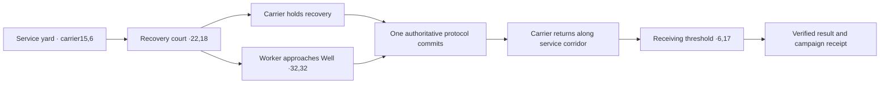

# Map Concepts, Narrative Lore & Environmental Architecture — Echoes of the Broken Sun

> **Design-reference boundary — audited 2026-09-04.** Follow [AGENTS.md](../AGENTS.md) and the
> [authority map](README.md). Environmental mood and dressing may guide authorized presentation work.
> Mission objectives, command roles, map scope, and consequences follow the master and creative canon.
> The obsolete competing mission studies and six-map skirmish proposals were removed on 2026-09-04.
> Current source contracts govern executable map structure; design intent is not implementation evidence.

**Author and owner:** Angelis Pseftis  
**Standing:** Design reference under the [authority map](README.md). Read with and subordinate to the requirements and creative sources in `Docs/Archive/DevelopmentBible.md`, `Docs/ArtDirection.md` (A4 Environment Completion), `Docs/AudioDirection.md` (B3 Ambience Site Families), and `Docs/Requirements.md`.
**Applies to:** Every session authoring map geometry, terrain source JSONs (`Content/World/Source/`), dressing packs (`Content/World/Generated/Dressing/`), lighting rigs, environmental VFX, and site audio beds.  

---

## Production planning standard

The owner requires **fifteen unique campaign maps, one for each mission M01–M15**, connected as one larger
Soryn journey. Use `SPEC-MAP-004`, `SPEC-CAM-041..042`, `SPEC-VISD-008`, and `SPEC-ART-004`. The skirmish set
is separate. Existing concept profiles are inputs to design review, not evidence that these criteria pass.

Before a mission's map enters production, complete its existing profile with the approved story point,
character stakes/backstory links, regional connection, what belongs/does not belong, distinct playable
layout, landmarks and routes, macro composition, meaningful fine detail, material history/use, ambient and
action sound, movement/interaction logic, accessibility, and verification views. Identify unresolved fields
explicitly. Do not fill a gap by inventing a canon event or an unapproved mechanic.

Review a location as a place people could inhabit and a battlefield players can read. Unit/building detail,
regional architecture, terrain, props, wear, light, and sound must agree about where the player is and what
happened there. Shared kits may establish regional continuity; each mission still needs its own spatial
identity. Follow the art-direction brief and retain the mission-to-character/place trace in these existing
profiles. The mission contracts control every objective, command role, and consequence; presentation decisions cannot change them.

## Current production brief — fifteen places in one campaign

**Design revision:** 2026-09-04. **Author:** Angelis Pseftis. These are implementation decisions under the
owner's direction, grounded in the current mission contracts. They are not claims of finished maps,
approved new lore, or accepted gameplay. This section replaces conflicting location, character, mechanic, consequence, lighting, and sound
assertions in the retired concept studies. Their removal is recorded in RequirementsState.md; Git history
retains the former text. Invented routes and dramatic events from those studies are not canon.

### Story-to-place trace

Each row traces the same-numbered `SPEC-PLAN-001..015` and `SPEC-MSN-001..015` in
[Requirements.md](Requirements.md#19-mission-objective-and-failure-contracts), and the corresponding
[creative campaign outline](Archive/DevelopmentBible.md#campaign-outline). Character motivations follow
`SPEC-CANON-009..013`. Names for architectural features below are descriptive art decisions, not new
historical events. Every row needs its own compiled map binding under `SPEC-MAP-004`; this table does not
supply that binding or permit changing the current mission's objective coordinates.
Full place histories, visual descriptions of every site, the doctrine-echo naming rule for branch variants, and
the campaign told as one story are in the Development Bible's
[Places of Soryn](Archive/DevelopmentBible.md#places-of-soryn-described-for-production) and
[campaign](Archive/DevelopmentBible.md#the-campaign-as-one-story) sections (2026-09-05). Read them with this trace.

| Mission / distinct place | Story and character purpose | Spatial composition and functional landmark | Meaningful detail, motion, and sound | Connection and excluded implications |
|---|---|---|---|---|
| **M01 — What the Ledger Keeps / Glass Scar evacuation margin** | Mara's preparedness faces Talar's request to recover the displaced archive convoy; Oruun's objection concerns the cavern below. Make the evacuation and reserve pressure understandable before presenting the Well choice. | A distinct M01 evacuation layout with readable recovery, Well commitment and withdrawal routes; shared Glass Scar vocabulary must not duplicate the skirmish route graph. An archive loading bay and settlement threshold identify recovery and withdrawal at their authoritative sites. | Ceramic carrier cradles, retained cargo lashings, serviced conduit joints, and worn bridge approaches explain use. Wind crosses open glass; footsteps change on fitted paving. Reserve indicators follow modeled state, not invented civilian counts. | Introduces Lume's civic construction and Well doctrine that later missions revisit. No decorative bridge collapse, nursery death, or population rescue claim unless an authoritative event establishes it. |
| **M02 — Seven Accounts of Rain / Shivergrass migration basin** | Oruun's seven correcting memories make navigation and custodianship personal. The field should feel used by a mineral-organic ecology rather than an empty arena. | Broad migration lanes between stepped basalt scarps; recognizable observation sills, the contracted account site and Waystone anchor. Preserve room for the actual migration and scouting mechanics. | Pale bent grass ribbons, polished stone shoulders, compressed route margins and strata expose repeated passage. Layer wind and grass friction with spacious pauses. Any ambient Vaultback presentation remains non-interactable ecology and must not imply a new objective, cover or hidden actor. Movement evidence obeys the ecological signal boundary. | Expands the landscape beneath M01's resource dispute and leads into the infrastructure stories of M03/M04. No sacred/tribal props, unmodeled grazing herds, enemy identity through fog, or invented stealth bonus. |
| **M03 — A City on Reserve / Ark-city reserve service district** | Mara must hold a distributed system together. The player should see why one local repair cannot stabilize every site. | Three legible service branches connected by exposed reserve trunks: conduit-dense Life Support, elevated Transit infrastructure and protected Archive stacks. Major machinery sits outside movement lanes or on contracted blocked footprints. | Reachable maintenance galleries, detachable service panels, cable redundancy, replacement brackets and discharge grilles. Each branch has a distinct machine rhythm; powered/offline shapes and sound follow actual site state. | Introduces the three district identities reused at M09 without duplicating its map. Do not depict whole-city recovery, fabricated occupants, or an automatic consequence beyond the recorded operation. |
| **M04 — The Unburied Road / Kharuun subsurface transit artery** | Oruun recovers a missing memory shard while moving infrastructure. Custody and continuity are expressed through a maintained route inside living mineral architecture. | An asymmetric sequence of mineral vault chambers and narrow authoritative spans; deep side voids and ribbed walls frame the route. The shard recovery site is a distinct terminal chamber, not another starting base. | Grown ribs transfer load into strata; small mineral accretions surround maintained docking hollows. Rooting fixtures show where mobile infrastructure settles. Stone resonance, restrained amber cavity light, root-set friction and short cavern reflections carry the place. | Takes the surface ecology below ground and makes the cavern concern from M01 tangible. No false collision, decorative navigable bridge, unexplored mineral disclosure, or memory-restoration claim outside the mission result. |
| **M05 — Terms of Continuance / treaty corridor** | A fragile ceasefire needs observable commitments and protected witnesses. Meridian command and Kharuun presence must remain distinguishable. | A linear corridor between two separately constructed networks, with an offset treaty relay and clearly accessible witness stations. The contrast is engineered frames against maintained mineral spines, not mirrored enemy bases. | Repaired barriers set back from the route, paired but differently built observation fittings, visible cable termination and mineral junctions. Relay ticks and answering resonances are restrained; attack effects identify their actual sources. | Brings the infrastructure languages from M03/M04 into the same contested space. Do not imply mixed-faction command, Choir attribution, or a ceasefire violation that the simulation has not established. |
| **M06 — Names Without Births / census district with an edged absence** | Talar makes erased records a concrete civic problem. The absence should be disturbing because surrounding infrastructure shows what no longer aligns. | A sheared civic block: perimeter streets, archive interfaces and protected extraction routes surround a bounded void. Service lines terminate at its edge; the route to evidence differs from the route to withdrawal. | Numbered storage bays follow existing narrative labels; severed conduits have real wall thickness and supporting brackets. Clean unused foundations contrast with worn surrounding approaches. Local ventilation and relay noise fall away at the void. | Develops the omissions that M07 examines through another culture's records. Do not invent readable names, graves, deaths, census totals, or an explanation of who caused the absence. |
| **M07 — The Shape of Silence / Listening-Spine ridge** | Oruun and a separate witness establish correspondence, not causation. Architecture must make the two observations independently legible. | A stepped ridge with two separated witness approaches, a Waystone rooting place, the Listening-Spine setting and a distinct confluence. Place the constructions so the player can read their connection without merging their purposes. | Repeated resonant ribs have maintained connection sockets, differing fracture histories and clear access surfaces. Paired response tones follow verified interaction states. A held quiet interval separates observations. | Answers M06's civic omission with bounded Kharuun readback and opens the question leading to M08. No dead-Well story, hidden author, or proven Choir identity borrowed from incompatible older concepts. |
| **M08 — The Shape Beside Us / reciprocal-contact verge** | Talar’s Meridian proxies enter Neme’s repeatable reciprocal contact. The scene conveys uncertainty while the controllable proxy units remain tactically unambiguous. | Offset terraces and near-matching structural frames create two distinct approach readings around a public contact site. Contradiction is in non-colliding framing and alignment, never in invisible changes to the walkable route. | Duplicate joints stop short of meeting; one frame aligns only from an authored view. Slow offset edge motion and answering tonal fragments respond to contact state, with stable reduced-motion alternatives. | Converts the correspondence question into actionable contact and introduces forms revisited in M14. No fully commandable Choir faction here, time-reversal mechanic, identity conclusion, or causal revelation outside the current contract. |
| **M09 — Reserve Authority / ark-city allocation exchange** | Mara must choose exactly two of three districts. All three should look maintained and consequential, so the deferred one reads as a deliberate unresolved obligation. | A central authority exchange with three spatially separated branch interfaces. Life Support conduits, Transit spans and Archive stacks reuse M03's vocabulary in a larger allocation layout with distinct defense fronts. | Each interface has its own connection route, mechanical status position and branch mark. The deferred interface stays visibly intact; it is not dressed as rubble. The three machine voices change only with authoritative allocation. | Pays off M03 and supplies the exact district pair and liability carried into M10–M12. Exclude the incompatible resonator-ridge proposal, random ruined districts and unmodeled casualty or city-recovery claims. |
| **M10 — The Choir at Lume Reach / Lume contact and liability district** | Oruun returns to the civic world introduced at M01. Mara is an off-map liaison; contact, inherited liability and a new Well protocol must read as separate obligations. | A civic perimeter opens into a liability interface, two sequential spine sites and a separate Lume Well court. Familiar ceramic frames establish Lume; new public Choir infrastructure alters the composition. | Reused civic fittings carry the same proportions and repair language as M01/M03. Kharuun connections visibly meet rather than replace civic apparatus. Controlled civic hum, spine resonance and contact tones retain separate sources. | Makes the M09 deferred district recognizable and records a new Well decision. No playable three-faction battle, Mara-controlled hostile force, restored neighborhood, or surviving-population assertion. |
| **M11 — No Neutral Ledger / public coalition interface ground** | Oruun and a distinct witness assemble public evidence from the exact inherited route, powered pair and Lume protocol. Cooperation is physical work rather than an unexplained faction merger. | An inherited approach feeds two separated district interfaces and two public evidence stations, then a protocol rally site. Joining pieces use both civic and mineral construction while preserving each interface's identity. | Exposed adapters, paired witness positions, distinct public-record housings and serviced cable/mineral junctions. Interface acknowledgments differ by apparatus; readback pauses remain intelligible over battle audio. | Reuses earned route and district motifs without copying M09/M10 layouts. No invented toll war, mixed command, trust score or civilian coalition roster. |
| **M12 — The Future That Won / public readback demonstrator** | Oruun and a verifier test Rhyse's claim through independent public readback. The demonstration must appear persuasive yet visibly bounded by its instruments and observation sites. | A formal demonstrator spine separates Meridian and Kharuun readback stations, the exact paired district interfaces, and a distinct Future Well activation area. Observation approaches remain independent. | Redundant measurement frames, visible signal paths and replaceable instrument modules show designed precision. Rhyse's apparatus is neutral and attributable. Activation has anticipation, a stable hold and an authoritative receipt cue. | Tests the coalition's recorded facts from M11 and prepares the public-index work at M13. No literal restored city, energy waterfall implying population restoration, playable Rhyse, or permanent-outcome claim. |
| **M13 — Assembly of the Missing / Crownfall public index** | Oruun and the verifier bring separate records into one public observation without claiming who caused the omissions. | A tiered index precinct frames distinct Meridian and Kharuun record interfaces, the neutral index linkage and two separated witness sites. The landmark is an indexed structure with readable access, not a decorative graveyard. | Paired record housings retain different construction and access fittings; blank or unasserted record faces remain visibly unasserted. Layer measured interface tones against sparse Crownfall resonance, not voices claiming identities. | Collects the readback trail from M06–M12 and approaches the command crisis of M14. No invented names of the dead, culpability, consent, cryptographic authenticity or survivor count. |
| **M14 — Several Voices, One Command / Crownfall command-crisis basin** | Neme holds incompatible voices within one bounded command. Possible and Manifest must remain distinct rather than visually dissolving into one answer. | Separate inherited Possible and Manifest sites, a readable Neme command position and a crisis anchor site form a tense multi-site composition. Offset repeated structures establish the Choir's built language without obscuring force placement. | Phase-frame joins retain deliberate offsets; the research loom and anchor have distinct work surfaces and silhouettes. Actions show research, binding, sustained hold and failure through authoritative state. Layered voice/phase sound resolves enough for intelligibility. | Develops M08's contact vocabulary into playable Choir infrastructure and prepares M15's accord. No temporary repair masking an irreversible failed hold, permanent unified identity, or premature final resolution. |
| **M15 — The Broken Sun / Crownfall approach and witnessed accord dais** | Neme commands while Mara, Oruun and Talar remain protected neutral witnesses. The finale must show the journey's three construction languages together and preserve the cost of the chosen future. | A distinct approach anchor precedes three separated witnessed-accord sites and the selected ending's Resolution Conduit. The shattered star dominates cinematic framing; the gameplay view prioritizes protected sites, approaches and hold boundaries. | Civic joints, mineral strata and Choir offsets recur as recognizable crafted forms, joined at the accord without becoming generic mixed ornament. Each eligible conduit has a meaningful silhouette and action sequence. Music recalls established motifs; dialogue and state cues remain clear. | Resolves the recorded route, district and protocol axes into one earned ending. Show only the selected ending and recorded context; no universal good ending, all endings occurring together, or unmodeled social aftermath. |

### Construction and production decisions

**Macro first.** For each mission, block its actual objective sequence and camera-visible landmark masses
before fine props. Compare all fifteen plans side by side. Similar regional materials are welcome; identical
route graphs, landmark arrangements, starting compositions and objective staging are not. Current runtime
mission terrain and six biome families are a starting implementation, not evidence of fifteen finished maps.
Changes to authoritative layouts require source contracts and mission/save/replay verification; cosmetic
world work alone cannot discharge `SPEC-MAP-004.LAYOUT` or `.BINDING`.

**Three viewing distances.** At tactical zoom, prioritize route silhouette, objective identity, landmark
orientation, unit role and usable space. At close gameplay zoom, show assembly, load transfer, service
access, roots, joints, state mechanisms and material depth. Cinematic proximity adds restrained wear at
contacts, repaired seams, readable existing labels and surface grain. Detail that only creates flicker or
conceals combat is removed. No production object earns inclusion merely by increasing density.

**Role-readable units and buildings.** Compact workers expose tools, cargo handling and service reach;
line units expose weapon direction and recoil support; Bulwarks make shield facing and deployed footprint
obvious; scout/support units distinguish observation and relay equipment from weapons. Kharuun equivalents
express their corresponding roles through carried matter, grown load-bearing strata, rooted connections and
adaptation structures. Choir equivalents retain targetable silhouettes through controlled offset parts and
state-specific forms. Production buildings need readable intake/work/output paths; research buildings need
visible processing/observation functions; defense points need clear threat direction; logistics structures
need distinct connection and transfer elements. These are role briefs, not authorization to add abilities.
Each family's detailed art profile must name its actual roster record before remodeling.

**Actions have causes.** A moving machine transfers load through its supports; turning precedes or follows
weapon acquisition according to its real mechanism; recoil returns through the mount; cargo changes only
when gathering/delivery state changes; rooting has preparation, contact, settling and release. Building
activity follows actual production/research/power state. Footfalls, mechanisms, particle effects and sound
share the visible action's timing. Cosmetic interpolation cannot delay or invent the authoritative event.
Reduced motion removes decorative oscillation while retaining state changes; reduced flashing uses steady
shape/value cues. Off-screen/fogged events obey the same knowledge boundary as visible actors.

**Local dressing is accountable.** Put tall forms on authored blocked footprints or fixed public scenery
outside playable bounds. Known open tiles retain the required low-relief limit. Never decorate unexplored
terrain from hidden simulation facts. Scenery that indicates an operational machine, civilian, unit,
resource, threat or objective needs an authoritative binding; static wear and architecture must not imply
unrecorded deaths or outcomes. New named lore or disputed mechanical claims remain explicitly unresolved.

**Qualification sequence.** Complete the mission brief; compare the layout and story trace; implement
source/binding; render the whole map and normal starting/objective views; inspect routes and landmarks;
exercise the mission's actual interactions and states; inspect animation and sound together; check fog,
accessibility and performance; retain evidence for the final fifteen-map and full-presentation review.
The owner has delegated implementation decisions and will review the complete presentation rather than
intermediate passes. Internal QA continues throughout; no map is declared finished from a source test or
single selected screenshot.

## Campaign connection and scope

The sequence is three acts of five operations: Necessary Fires (M01–M05), The Cost of One Future
(M06–M10), and Crownfall (M11–M15). Geography supports the story-to-place trace above. A campaign-map
connection shows the next operation and known shared context; it does not prove a continuous walkable
road, a tunnel, an invasion, or a new historical event. Exact inter-regional distances and travel times are
not specified by these contracts. Do not invent them to fill the campaign map.

Keep repeated places recognizable through architectural proportions, materials, existing district marks,
and earned records. M03/M09 revisit the ark-city's three systems in different layouts. M01/M10 revisit
Lume's civic vocabulary under different command and obligations. M08/M14 develop Choir contact into
bounded command. M06–M13 assemble public evidence; M15 uses the recorded choices. Briefings and transitions
must explain the change of commander and purpose in approved narrative language. They must not turn
uncertain observations into proven causes or portray one faction as inherently evil.

## M01 representative production brief

**Controlling records:** `SPEC-PLAN-001`, `SPEC-MSN-001`, `SPEC-MAP-004`, `SPEC-CAM-041..042`,
`SPEC-VISD-008`, `SPEC-ART-004`, and the exact unit/building/action records referenced below.
**Purpose:** qualify the complete evacuation experience before extending the same production method across
the campaign. This is a production brief, not a completed qualification or new mission mechanic.

### Scene, stakes, and composition

Mara commands the Meridian evacuation. Talar's archive is at risk; Oruun objects to collapse propagation
into the birthing cavern. The scout carries the archive, not Mara. These motivations must be understood
through approved briefing and dialogue before the irreversible choice; scenery alone cannot carry them.
Do not place controllable Talar/Oruun characters or decorate a supposed casualty outcome into M01.

Design the view around three readable functions: the local Command Core and withdrawal direction, the
archive recovery site at **22,18**, and the Future Well. Extraction is **6,17**. The mission contract fixes
those objective sites; the selected source contract supplies the Well, terrain, starts, resources and
routes. The retired blueprint's extraction at 6,8, convoy at 18,12, and assumed Well at 32,32 are not this
mission's source authority. Dedicated M01 geometry must retain all mission and branch anchors until an
explicit contract migration updates the dependent simulation, narrative, save and replay checks.

Compose a long view of the fracture, a middle-distance working evacuation margin, and close-range evidence
of loading and maintenance. Ceramic loading fittings and lashings explain the archive carrier's use;
worked approach surfaces and repaired conduit joints explain repeated service. Keep non-interactive
loading props out of paths and give them no selectable/usable affordance. Any visible bridge deck must
agree with walkable terrain in each Well state. The carrier, worker and Well telegraph must remain readable
through effects, foliage and terrain silhouettes at the actual tactical camera.

### Units and structures in this slice

Art decisions below explain already specified functions. Actual deployment, unlocks and interactions follow
the mission capability manifest; a brief does not add a building, ability or enemy to the mission. Review
any hostile roster actually deployed against the same role and material standards.

| Record / object | Large form and meaningful detail | Motion, state, and sound to demonstrate |
|---|---|---|
| `SPEC-UNIT-001` Surveyor | Service tools and a compact cargo cradle distinguish economic work from weapons. Tool reach, joints and carried Matter have plausible attachment and clearance. | Travel, gather, deliver, construct, repair and Well interaction have distinct contact points and state-bound starts/stops. Tool/material sounds stop when work stops; no unarmed muzzle flash. |
| `SPEC-UNIT-002` Lancer | Forward weapon axis, recoil support and stable fighting stance read as ranged line fire; vents, fasteners and wear support the assembly. | Turning, halt, aim, fire, recoil and recovery agree with its attack state. Muzzle, projectile, hit and sound belong to the same action; movement cannot visually promise firing while the contract requires a halt. |
| `SPEC-UNIT-003` Bulwark Team | Shield face, flanking exposure, bracing and packing joints show directional protection rather than an omnidirectional bubble. | Setup, deployed movement, facing, impact and packing remain distinct and synchronized to the existing barrier timings. Mechanical engagement and release communicate state without hiding attacks. |
| `SPEC-UNIT-004` Relay Skiff / archive carrier | Observation/relay equipment remains distinct from its light weapon. Archive fittings identify the mission role without disguising the scout silhouette or implying a separate hero body. | Turning and travel preserve a clear route and cargo attachment; relay activity and weapon events remain distinguishable. Recovery, evacuation and destruction reflect authoritative mission state. |
| `SPEC-BLD-015.MC.ANCHOR` Anchor | Command/power root, worker emergence and Matter intake have distinct readable locations; service panels and supporting structure explain access and load. | Working, damaged and destroyed states communicate the Command Core's role. Production output must emerge through the actual legal route; no decorative door suggests a false passage. |
| `SPEC-BLD-015.MC.LINK` Power Link | Connection hardware and delivery fittings distinguish network/logistics support from a turret. Cable routes terminate coherently. | Connected/disconnected and damaged states correspond to network truth. Transfer and relay sounds never imply power while disconnected. |
| `SPEC-BLD-015.MC.FOUNDRY` Array Foundry | Intake, fabrication space, output opening and research apparatus explain unit production and research in one structure. | Construction, unit production, research, interruption and idle are distinguishable. Research does not visually show concurrent production when it occupies the active slot. |
| `SPEC-BLD-015.MC.AEGIS` Aegis Post | Weapon direction, mounting support and power connection make its defensive function legible at tactical zoom. | Powered/offline, target acquisition, discharge and recovery follow combat/network state; smoke and sound cannot imply a live defense after disconnection. |
| Future Well / `SPEC-WEL-*` | The basin, interaction approach and protocol telegraph remain a dominant readable landmark; small details reinforce its retained-future character. | Dormant, Harvest commitment/collapse, Preserve custody and Reshape commitment/expiry have coherent form and sound. Preserve all public warnings and fallback behavior. No cue labels one choice morally correct. |

M01 interaction-clearance correction (2026-09-05, internal source review): the legal
Surveyor stop is about200cm from the Well centre, while the reused basin extended to
about290cm. Fit the physical basin to the Well's existing100cm half-extent through a
M01-only planar pivot adjustment; retain its vertical construction and the elevated
core. Narrow orbit machinery and ground glyphs together while retaining each protocol's
height, tilt, count and timing. Selection, interaction/range cues and all simulation
positions remain authoritative and unchanged. Reinspect all four protocols, the actual
worker approach, reduced variants and tactical legibility before accepting the treatment.
This adjustment adds no terrain or interaction capability.

Surveyor work contact uses the registered rotary-drill tip and the accepted Gather
order's resource destination. It appears only during actual harvesting and stops on
travel/delivery/cancel. Reduced motion/flashing hold the same contact information without
pulsing. The one-frame work pose already follows a reset locomotion/idle pose and needs
no cumulative-rotation correction. Repair has no current authoritative command; it
remains a separately recorded capability dependency, not an authored animation state.

### Sound, accessibility, and review views

Glass wind and sparse shard resonance establish open terrain; loading and service fittings add attributable
local sound only when appropriate. Reserve strain communicates the authored place, without fabricating a
simulation variable. Material footsteps, tools, weapons and damage must agree with the visible source.
Narrative, alerts and protocol warnings remain intelligible over combat and ambience under the master's mix
requirements. Use the existing approved voices and scripts; do not improvise spoken history during asset production.

Review the opening tactical view, selection of each deployed role, every objective approach, any mission-critical crossing or route constraint defined by the selected source contract, each Well transition, evacuation and failure/retry. Include close gameplay views for attachment
and contact quality, maximum supported tactical zoom for recognition, and the required low/high-contrast,
reduced-motion/reduced-flash settings. Occlusion, hovering/sliding, false affordances, repetitive detail,
audio masking and state mismatch are defects, even when individual assets pass their source checks.
Capture audio as well as video where sound or synchronization is claimed. The exact execution/evidence
sequence is in [MapTechnicalBlueprint.md](MapTechnicalBlueprint.md#m01-end-to-end-qualification).

### Sequential production rule — owner direction, 2026-09-05

Finish the detailed plan for one map, then build and inspect that map through the bounded packets below
before starting another map. M01 is the only active map. Preserve the M02/M03 assets and source already
created, but park their production. Later mission rows above remain campaign context, not active work.
Planning and building are separate states: this baseline specifies the work; it does not certify its result.
All changes to this plan stay in this document. The technical qualification sequence stays in
[MapTechnicalBlueprint.md](MapTechnicalBlueprint.md#m01-end-to-end-qualification).

A map plan must resolve its story, mission sequence, geography, routes, sightlines, landmark composition,
asset list, construction/material language, actors, state changes, lighting, atmosphere, sound, UI,
accessibility, performance strategy, source ownership, implementation order and inspection views.
Unmeasured gameplay and performance remain explicit execution checks. Do not replace a missing design
with “add polish,” “improve atmosphere,” or an open-ended prop list. A new feature, source-terrain change
or canon claim is a separate change decision; it cannot quietly enter an art packet.

### M01 production baseline and fixed scope

**Plan author:** Angelis Pseftis. **Planning date:** 2026-09-05. **Active map:** M01 only.
**Target experience:** a functioning but strained civic evacuation margin built into dark fractured ground.
The player first recognizes the carrier and its route, then manages a separated carrier/worker obligation,
then returns along a now-familiar service corridor. The northern battlefield supplies pressure and scale;
it is not the primary mission destination. Completion depends on evacuation, not clearing the map.

Keep the current 64×64 mission layout and 200 cm presentation scale. At this scale the nominal field is
128×128 metres; this is an engine-space dimension, not a claim about travel time or world geography.
Use the registered campaign source
`Content/World/Source/Campaign/m01_glass-scar-evacuation-margin_v1.json`, SHA-256
`8ae50fa5adf740f0f7f0508c151e82c4e86b7f3a1e70cf323717ee536418669b`.
Its three initial doctrine masks each contain 306 blocked cells. These initial masks do not substitute
for testing terrain changes caused by a committed Well during play.

Keep objective sites at recovery22,18, Well32,32 and extraction6,17. Keep all eight source resource
clearances at16,16;21,13;25,28;33,22;31,43;43,36;47,50;52,45. Preserve the local deployment rectangle
x5–16/y5–17 and opponent deployment rectangle x47–59/y47–58. Do not add a civilian population, named
character body, rescue counter, secondary objective, production option or encounter to complete the art.
Current scenario starts include the local Core10,10, Foundry14,10, Dropoff6,17 and carrier15,6;
`EchoesSimulationSubsystem` remains their authority. Verify the live roster before placement; preserve
workers8,13/11,14/14,12, line units8,8/12,7/16,10, heavy7,6 and utility structure6,11.

The retained M01 loading-site screenshot is useful defect evidence, not the final composition target.
Existing apron/load-face geometry and service textures are retained. The outstanding scene problems are
large-form readability, loading-site occlusion, repetitive terrain, exposure clipping and an unreviewed
complete journey. Small material defects are addressed only when visible in a required gameplay view.

### Spatial plan and construction schedule

Coordinates below are inclusive tile coordinates. Listed scene regions are planning areas, not new
blocked polygons. Only the source mask and explicit landmark footprints authorize tall presentation.
A low surface treatment cannot imply a new ramp, bridge, doorway or gameplay connection.

| Area | Exact placement basis | Final composition and functional detail | Clearance and inspection condition |
|---|---|---|---|
| Arrival/service yard | Existing deployment x5–16/y5–17; Core10,10 and Foundry14,10 | Low, open foreground around the carrier. Civic service fittings on existing west outcrop x0–2/y10–13 and east outcrop x18–20/y9–12 frame the yard. Intake/output hardware stays attached to its actual building. Two flank masses, not a ring of repeated props. | No decorative intrusion into spawning, selection or economic movement. At opening zoom distinguish Core, worker, carrier and first departure direction. |
| Carrier approach | Planned clear centerline15,6→17,6→17,17→22,17→22,18 | Transition from open dark ground to fitted archive paving. Existing east outcrop forms an orientation edge; the loading bay becomes the first large destination as it is discovered. Wear follows travel and load contact, not arbitrary noise. | Preserve all existing road width and resource21,13 access. No new escort instruction or fixed path command; this is a composition/review route the player can deviate from. |
| Archive working court | Existing apron x18–22/y16–19; recovery22,18 | One pale loading apron, attached dark registration rails and repairs. The carrier stands visibly on the working surface. One load-bearing loading face x23–27/y19 supports its overhead rail, retained cassettes and attached lashings. The structure has a clear base/load path; no floating rail or free-hanging unsupported panel. | Apron stays ≤4 cm. Loading face stays inside its 5×1 blocked footprint and current ≤360 cm height limit. Foreground silhouettes cannot hide the carrier or recovery marker at normal camera angle. |
| Archive retaining edge | Existing north block x23–27/y18–22, east return x28–29/y14–22, south lip x23–26/y14–15 | Treat the blocks as one cut and maintained embankment around the loading court. Reuse charcoal strata and ceramic service insertions. Vary crest silhouette within blocked cells; keep the loading installation legible against the darker berm. | Do not delete adjacent blocked cells to expose the loading face. Correct occlusion by lowering or reshaping presentation within those cells while preserving a readable blocking edge. Inspect from carrier entry and departure. |
| Worker approach | Clear centerline22,18→22,23→32,23→32,32; shoulders x26–28/y24–27 and x36–38/y26–29 | Broad dark approach between asymmetrical scar shoulders. Resource25,28 and33,22 remain visible when known. Sparse service joints end at installed apparatus; the Well owns the destination silhouette and effects. | Preserve construction/path clearance and public Well telegraphs. No tall foreground prop on the approach. Carrier remains at recovery; camera/HUD must communicate the split task without suggesting that the carrier should follow. |
| Fracture and Well precinct | Source scar blocks occupy portions of y30–34; central opening x29–35 contains Well32,32 | Long, low-saturation lateral fracture masses give the map its largest shape. Central Well has a distinct approach and enough visual breathing room for worker, ownership and commitment cues. Existing passable gaps retain their true boundaries. | No continuous decorative abyss beneath open cells; no fake bridge spanning blocked ground. Keep bank geometry lower in the worker/telegraph sightline. Inspect dormant and all protocol states from south approach and both lateral views. |
| Withdrawal/settlement threshold | Clear centerline22,18→22,17→6,17; retaining bank x2–4/y18–22, edge x1–3/y13–17 and north bank x8–12/y20–21 | Reuse the fitted service surface as a recognizable return direction. Existing frames and conduit define a maintained receiving threshold beside the actual Dropoff at6,17. The destination remains open, with no animated gate or new interaction. | Destination ring and carrier remain visible on arrival. The threshold cannot look like a closed door. Preserve worker/dropoff access and avoid decorations overlapping the real structure. |
| Northern pressure field and perimeter | Existing scar openings and opponent clearance x47–59/y47–58 | Continue the same geological strata at lower detail. Use the existing opponent roster and structures as the source of threat; silhouette and discovered movement provide pressure. Distant shapes support the horizon, not a second set of mission landmarks. | No silhouettes, lights, sound events or construction details reveal unknown enemy state. Do not spend close-up prop effort where the mission camera does not benefit. |

The three centerlines above were checked against all current source doctrine masks on 2026-09-05:
19, 24 and 17 cardinal grid edges respectively. These are geometric inspection routes, not shortest-path
claims, collision-radius validation or travel-time measurements. Timing, congestion and enemy pressure
are measured through ordinary play before tuning any gameplay value.

### Asset and detail decisions

Reuse the six registered M01 meshes: ArchiveCradle, ArchiveFrame, RoutePaving, ServiceConduit,
ArchiveApron and ArchiveLoadingFace. The initial plan adds **no seventh bespoke prop family**.
Use the existing six roles differently by placement and surrounding terrain, rather than duplicating
whole installations. Retain the current 28-record presentation source (15 RoutePaving records) as the starting layout. Change a record
only to resolve a named scene defect and keep its full footprint valid under every doctrine.

| Component | Keep or revise | Detail and material decision | Finish condition |
|---|---|---|---|
| Continuous basalt banks | Revise whole-bank silhouette once in the composition packet | Broad strata, irregular crest and restrained grain. Avoid equal-height teeth, stacked little slabs and contour-line textures. Keep charcoal ground within the art-direction range and roughness floor. | Blocking boundary reads continuously at normal and maximum gameplay zoom; no holes, floating pieces or combat-scale glints. |
| Archive apron | Keep v9 footprint; revise only visible occlusion/contact defects | Continuous service ceramic, shallow pitting and contact wear. Registration rails and repair plates sit visibly on the panel tops. No general small-tile pattern. | Carrier silhouette, selection and load direction remain readable; no z-fighting or raised lip implying impassability. |
| Loading face and frames | Keep shared rail/cassette composition; revise supports or crest relationship if needed | Dark load hardware on subdued civic ceramic. Every cable ends at a fitting; every supported rail meets a support. Cargo remains static unless actual recovery state has an authored binding. | One recognizably functional installation at tactical view; close gameplay view exposes no disconnected support. |
| Route paving and conduit | Reuse the existing placements and family | Worn service seams follow the working corridor. Conduit ends terminate into a grounded fitting or disappear credibly into the bank. No powered pulse on unmodeled equipment. | Guidance comes from shape and continuity; it does not compete with order markers or imply a selectable object. |
| Existing units/buildings | Keep approved roster and role briefs above | Correct only defects visible in the M01 journey: facing, contact, cargo attachment, weapon axis, intake/output and actual state transitions. Do not redesign the whole faction roster during map production. | Selected/idle/moving/working/firing/damaged states retain clear role, faction and selection silhouette. |
| Well and effects | Reuse registered Well family; bind any missing required state cue | Dormant basin and one chosen protocol at a time. Preparation, commitment, ownership, warning and fallback remain attributable to authoritative state. Highest local effect priority belongs to the actionable warning, not scenery. | Worker, carrier status and warning shape remain legible through the heaviest legal effect state. |
| Horizon and sky | Reuse existing sky/light assets | Broken Sun motivates the warm/cool duality; no additional sun, skyline city or new inhabited district. Distant static atmosphere gives depth without unearned battlefield information. | Background recedes at tactical pitch and contains no dominant repeating pattern or false destination. |

M01 exterior-bank correction, 2026-09-05 (V042, in progress): the two rows of enlarged
BasaltFormation instances expose repeated fan-shaped crowns and a bare parallel strip. Replace
those M01 public backdrop instances with connected, irregular basalt shoulders generated by the
existing continuous-cliff source family. A low foot meets the outside of the playable boundary;
uneven strata rise into broader distant crests. Shared corners and joined slopes remove the
separate rows without filling any playable cell. Retain the four exterior ground strips and
registered matte cliff material. These static, intentionally silent formations establish the
evacuation margin's geology; they add no route, objective, settlement or hidden enemy information.
Review all four edges/corners at the actual tactical camera, plus the arrival, archive and Well
views. Check terrain/actor hierarchy, uninterrupted support, no fan-cap repetition or parallel
empty lane, and unchanged scoped fog, navigation, collision, input and mission source. This
bounded design has received internal source review; rendered qualification remains outstanding.

Material balance is judged in the scene. Keep the current original ServiceCeramic family for used loading
surfaces, civic material continuity for structures, and basalt v4 as the starting terrain surface.
The darker service palette is a used-surface treatment, not a replacement for the master civic identity.
Resolve a palette discrepancy against ArtDirection in the material packet and record the adopted values;
do not alternately brighten geometry and darken lighting to cancel each other. Fine wear belongs on
edges, fasteners, contact surfaces and repairs. It earns inclusion only if it helps close gameplay reading.

### Lighting, atmosphere, motion and sound plan

Use the existing Glass Scar rig as the baseline: warm key(1.0,0.82,0.62) at10 and indigo fill
(0.48,0.60,0.88) at1.6, authored exposure, existing platform rendering settings. Inspect three frames
(opening, archive court, Well) before changing global light or exposure. Adjust an offending material
first when clipping is local; change the shared rig only when the defect affects the whole scene.
Check the art-direction reference window, mean luma50–70 and clipping≤0.005%, using the actual capture.
The prior archive capture exceeded clipping; it is an unresolved defect, not an accepted baseline.

Keep ground matte and quiet. Reserve cyan for actual engineered/actor feedback, amber for the existing
scar and protocol vocabulary, and magenta only for its existing authorized phenomena. Static equipment
gets no flashing decoration. Reduced flashing uses the required steady shape/value alternative;
reduced motion removes decorative motion while retaining required command/state feedback.

Environmental motion is sparse: existing wind treatment and restrained environmental particles, with no
new animated evacuation population. Static cargo does not disappear on recovery unless a corresponding
authoritative visual binding is implemented. Carrier movement/cargo attachment, worker contact, recoil,
building activity and Well transitions are evaluated in motion, not accepted from a still.

| Sound layer | Source and location | Behavior and masking rule |
|---|---|---|
| Regional bed | Existing Glass Scar ambience family, wide open field | Wind across glass with sparse shard resonance. Loop transitions avoid a repeating dramatic event. Never use an alert-like envelope as ambience. |
| Loading/service detail | Existing material/mechanical palette at the working court and threshold | No invented powered machine cycle. Add only attributable contact/activity sound supported by the scene's actual action. Idle static fittings remain quiet. |
| Actors and economy | Existing local workers, carrier, weapons and structures | Start/stop with the authoritative action; footsteps/contact correspond to surface and unit type. No sound suggests production, power or combat while inactive. |
| Dialogue and mission messages | Existing M01 opening, recovery, withdrawal and result sequence IDs | Preserve approved wording and speaker identities. Subtitles and accessible text remain available; no new lore recording is commissioned as an art workaround. |
| Well warnings and combat alerts | Existing authoritative protocol/ownership/damage events | Preserve priority over ambience and intelligibility during combat. Verify the adopted master mix/ducking rule rather than introducing a new competing mix policy. |

A final audio review must include quiet travel, loading-site activity, combat plus dialogue, commitment,
warning/fallback, success and failure. Missing voice or event binding is a named integration task, not
permission to declare the experience complete from geometry alone.

### Mission, narrative and interaction plan

| Beat | Required scene/action | Narrative and UI binding | Failure or interruption behavior |
|---|---|---|---|
| Opening | Establish fracture, evacuation corridor, recovery court and Well concern, then hand off to the local force | Reuse `nar_m01_seq_opening` and the existing four-shot source storyboard (editorial targets5/4/6/3 seconds). Align shot duration to the approved delivery; these are not measured voice lengths. Do not expose unknown enemy assets in the overview. | Skip/return restores control and objective orientation according to the existing narrative contract; no stranded camera or hidden selection. |
| Recovery | Select and move the actual carrier to22,18 | Use `nar_m01_seq_archive_recovered`; objective changes only when the mission enters DecideFutureWell. | Carrier departure returns the player to the actual unmet hold condition. Carrier loss yields the correct terminal reason. |
| Split obligation | Keep carrier at recovery while worker discovers/approaches Well32,32 | Recovery status and worker/Well action are both understandable. Show the existing three protocol costs, public commitments and tradeoffs without moral labels. | Illegal, interrupted or unavailable interactions use existing refusal/state feedback; decoration cannot suggest a successful commitment. |
| Commitment | Render the selected protocol only, with its required timeline and ownership cues | Harvest and Reshape preserve the public180-tick commitment; Preserve custody/cadence and Reshape pre-expiry/fallback remain explicit. Reuse branch-specific narrative and alert records. | Losing the committed Well or any terminal objective condition produces the bound failure; no celebratory effect overrides that state. |
| Withdrawal | Carrier returns to6,17 after commitment | Use `nar_m01_seq_withdrawal`; keep the return corridor and actual receiving site identifiable. | Core/carrier loss or terminal underlying engagement still fails while the operation remains active. |
| Receipt and continuation | Show authoritative completion, then the actual campaign-save outcome | Use existing result variants for Added, AlreadyRecorded, ReplayConflict and StorageFailure. M02 connection describes the recorded founding decision only. | Save failure/conflict must not look like a successful new campaign write. Retry and exit preserve the stated outcome. |

The narrative JSON has historical status fields that do not by themselves prove present runtime delivery.
During the integration packet compare the actual consumer against its trigger/line IDs and update only
verified bindings. The birthing-cavern concern is presented as Oruun's stated concern, not a measured
propagation event or a depicted casualty outcome. Do not invent a cavern coordinate to complete a shot.
Use an explanatory treatment grounded in the authored concern rather than pretending a missing geographic
fact has been established.

### Whole-map inspection and performance plan

Review using the **normal gameplay camera**, including its ordinary pitch, field of view, zoom bounds,
HUD and fog. The constructor currently sets pitch−48°, yaw−45°, FOV55 and arm3800; inspect the live
non-review configuration before captures. Special art-review framing is diagnostic and does not establish
normal-camera readability. Use at least default zoom, closest supported gameplay zoom and maximum zoom.

| View / journey | Location or trigger | Reject the packet when |
|---|---|---|
| V1 opening | Core10,10 with carrier/departure direction in context | The carrier role, safe local space or first route is unclear; HUD covers critical units. |
| V2 archive arrival | Recovery22,18, framed from the carrier approach | Carrier/marker is hidden by berm or rail; court reads as loose blocks rather than a working installation. |
| V3 archive hold | Recovery22,18 with worker task active | The split obligation is unclear or effects falsely show recovered cargo/committed protocol. |
| V4 Well approach/state |32,32 from south and both lateral approaches | Terrain implies a false crossing, telegraph is hidden, or protocol presentation reveals unknown state. |
| V5 return and threshold | Corridor y17 and extraction6,17 | Paving looks impassable, destination appears closed, or carrier arrival is occluded. |
| V6 pressure/fog edge | Discovered scar openings and observed opponent approach | Unknown terrain/actors/sounds leak through fog, or decorative masses hide a legitimate threat. |
| V7 motion/close detail | Moving carrier, working worker, active combat, installation supports | Sliding, hovering, disconnected fittings, unsynchronized effects/sounds or flickering seams remain. |
| V8 failure/retry/result | Each objective failure and save/result variant | Visual celebration contradicts failure, cause is unclear, retry state is misleading, or UI claims an unwritten record. |

Use instancing and the existing two-LOD mesh pipeline. Decorative meshes have no collision/navigation
or input-trace role. Keep the current M1 Pro platform choices, including Nanite/VSM off, unless a separate
approved platform decision changes them. Add no new per-prop light or independently ticking prop actor.
Remove invisible and redundant details before increasing draw/triangle cost. Measure baseline versus
changed M01 under the same normal-camera workload; apply the master's existing frame-time, memory and
stability requirements without inventing a map-specific passing threshold. Capture and review the full
route with fog/units active, then batch performance measurement once the composition/material pass is stable.

### Bounded M01 build packets and stop conditions

One packet is active at a time. Each packet starts from this plan and the previous packet's retained
result, ends with an inspectable scene or behavior, and records actual remaining defects in the existing
work log. Run checks appropriate to what changed. Do not launch a broad regression after each prop edit.

| Order | Packet and allowed work | Deliverable and exit condition |
|---|---|---|
| B1 | **Whole-map composition.** Edit M01 terrain presentation and existing placement records only. Keep simulation masks/sites/spawns/resources fixed. Establish yard, loading court, Well approach, fracture and withdrawal threshold as one coherent scene. | Retained V1/V2/V4/V5 normal-camera views plus a traversed route. Blocking boundaries, carrier, Well and receiving site read clearly. List any gameplay obstruction separately; no fine texture or voice work in this packet. |
| B2 | **Construction and surface finish.** Correct named supports/contact defects in the six M01 recipes; finish the existing ceramic/basalt materials and scene exposure. | Close V2/V7 plus the same four tactical views. No unsupported assembly, z-fighting, small-grid repetition or out-of-window exposure; generated assets match their source and remain collision-free. |
| B3 | **Actor and protocol integration.** Correct M01-visible role/facing/contact/state defects and required Well telegraphs; retain gameplay authority. | Motion evidence for carrier/worker/combat and all three Well branches, including ownership and fallback. Every reported defect is reproduced then checked once after its correction. |
| B4 | **Story, sound and interaction.** Bind the existing M01 script/sequence IDs where missing, complete attributable audio/subtitles, and review opening/skip, split task, warnings and result surfaces. | One coherent audiovisual M01 journey, intelligible under combat and applicable accessibility settings; no source-only text or silent placeholder counted as delivered voice. |
| B5 | **Map closure.** Run the technical blueprint's focused mission/fog/save/branch checks and the complete ordinary packaged journey; measure required performance and collect required human/owner evidence. | Exact map/build identity, all required views/routes/branches, closed blocking defects and explicit acceptance state. Release-wide gates remain separate; report any required human/owner action honestly. |

Before B1, restore the ordinary M01 preview configuration and fresh isolated M01 save context, preserving
the labeled M02 art fixture separately. Complete or park the partially edited live-preview helper as one
bounded prerequisite, not a new tooling workstream. Allow one setup attempt; if it fails, record the exact
failure and choose the existing supported workflow before doing further art work. Do not restart the editor
routinely. One source/asset generation batch and one focused review per packet is the default; a second
iteration must name the visible or behavioral defect it is fixing. No third speculative polish cycle:
reassess the packet against this plan and settle the blocking issue before further detail.

**Planning exit:** each area has a placement rule, visual purpose, source authority and inspection condition;
each asset has a keep/revise decision; every mission state has a presentation and failure treatment; each
build packet has a bounded deliverable. Unmeasured timing, final exposure, live narrative binding and
performance are execution results to obtain in their named packets, not facts assumed by this plan.
**Map exit:** finish the M01 packets and required acceptance steps before activating M02. An unresolved
external human/owner gate is reported as that exact dependency; do not quietly switch to another map.

## Separate skirmish map set

The current baseline is **three offline 1v1 PvAI maps**, under `SPEC-SKM-003` and `SPEC-SKM-011..013`.
Campaign M01 is a distinct operation even where it shares Glass Scar geography and art. Campaign maps are
not counted as additional skirmish presets; three skirmish maps are not fifteen campaign maps. Shared assets
do not remove either delivery obligation.

| Map | Strategic and visual identity | Controlling record |
|---|---|---|
| Glass Scar | Opposed basins; Ash Cut, Buried Causeway and Folded Verge; one central Well and explicit route commitment. | `SPEC-SKM-011` |
| Crownfall Basin | Twin ridges and three gates; gates frame economy, defense and flanking decisions; one offset Well. | `SPEC-SKM-012` |
| The Confluence Ring | Central walled ring with four cardinal entrances, distributed deposits and repeated Choir geometry; one Well within the ring. | `SPEC-SKM-013` |

The retired six-map lists disagreed even with each other. Their invented extra map names, Wells and
destructible barriers remain retired. On 2026-09-04 Angelis separately approved team/FFA multiplayer and
the 25-sector Conquest/roguelite. Build map-format/spawn bindings under `SPEC-SKM-014..018`; the two-spawn
offline maps do not automatically satisfy those formats. Conquest needs its own sector, seed, progression
and encounter contracts under `REL-CAM-033..038`; its sector count does not replace the fifteen unique
story maps. Shared world materials and canon remain coherent, but a procedural run cannot rewrite the
authored campaign ledger. No new fixed skirmish-map count is implied by the expansion.

## Implementation pipeline

Edit registered world/narrative source, validate it with the actual compiler/schema, regenerate its outputs,
and verify the runtime binding before production qualification. Follow
[MapTechnicalBlueprint.md](MapTechnicalBlueprint.md), [SetupAndBuild.md](Archive/SetupAndBuild.md), and the
applicable source/content, world-design, campaign, art/audio and evidence skills. Record source and output
identities, actual commands and results. A compiler pass or screenshot does not establish physical play,
balance, story comprehension or owner acceptance.

### M01 Surveyor articulation construction note — 2026-09-05

**Author and owner:** Angelis Pseftis

The existing Meridian maintenance exoframe retains its torso, tool arms, harvest canisters and optical mast. Separate hip/upper strut, armored shin and level ground clamp carry its working weight. Feet follow the displayed authoritative movement through planted support and lifted transfer, with a short settling sequence when movement ends. Tools keep their confirmed work destination; leg posing cannot issue commands or alter simulation position. Use M01-only derivative assets and the existing palette, joint dimensions and role silhouette. Inspect ordinary gathering round trips, turning, stopping, work contact, reduced motion, pool recovery and tactical zoom before accepting the rig. Other deployed legged roles remain on their recorded finish queue. The M01 torso heading follows SPEC-MOV-010 at 720°/s, with instantaneous reduced-motion facing. The leg-root yaw retains reach admission while supports exchange. Ordinary swing boundaries evaluate elapsed transfer within the display frame; explicit restart/reversal entries preserve continuous contact. Verify both actual angular progress and planted support on the ordinary gather/delivery route.

### M01 Bulwark deployment construction note — 2026-09-05

**Author and owner:** Angelis Pseftis

Retain the approved two-operator chassis, central emitter and six framed barrier cells. Separate the existing left and right wings at their emitter hinges so packed screens tuck beside the chassis and deployed screens unfold to the original assembled form. This gives the authoritative deployed state a geometric cue at tactical zoom. Keep the actual protection direction and movement rules unchanged; the visible screen follows deployment facing and cannot create collision, navigation or extra protection. Reinspect packed/unfolding/deployed/moving/packing states, hinge contact, lower LOD materials, reduced motion and pooled reuse before accepting this M01 derivative. The same-state baseline remains V032 evidence; the other walker motion queue remains open.
