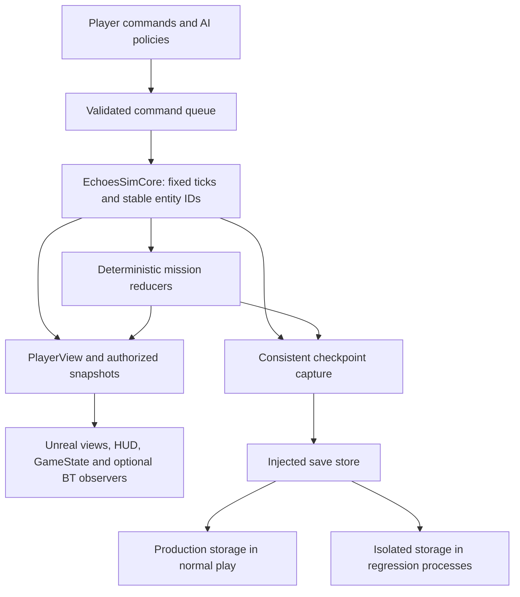

# RTS regression architecture and implementation plan

**Author and owner:** Angelis Pseftis
**Date:** 2026-09-05
**Status:** Implementation in progress; current source/evidence boundary is recorded below.

This is the authoritative file for this design deliverable. It is subordinate to
[Requirements.md](Requirements.md), [RequirementsState.md](RequirementsState.md), and the existing
[TechnicalArchitecture.md](Archive/TechnicalArchitecture.md). It does not create or accept game
requirements. Source was inspected on `release/world-map-concept-pass`, commit
`fc05cdf08191649363fb774ec88ad19d96c37a37`, with existing dirty work. The owner's nine passing
campaign-map source checks are the reported starting point; they were not rerun for this document.

## Architecture overview

Keep one deterministic gameplay authority, with narrow Unreal adapters and independently testable
storage. Reuse EchoesSimCore, the mission model reducers, and UEchoesSimulationSubsystem. Behavior
Trees submit or observe orders; GameMode hosts the session; GameState exposes authorized results;
Blueprints author presentation and connect events. Animation, physical actor overlaps, render frames,
and Unreal perception callbacks do not independently commit resources, objectives or visibility.



Production and test storage are mutually exclusive selections established before world/subsystem
initialization. The test process must never have a fallback to production storage.

| Layer | Existing foundation | Proposed extension |
|---|---|---|
| Gameplay | `echoes::sim::Simulation`, entities, fixed-point movement, commands and PlayerView | Explicit harvest state and node reservations; terrain occlusion/contact improvements |
| Mission rules | Fifteen `FEchoes*MissionModel` types, `FEchoesCampaignJourneyModel`, campaign ledger | Typed committed events and generic objective snapshots around the existing reducers |
| Unreal host | `AEchoesGameMode`, `UEchoesSimulationSubsystem`, entity/terrain/fog views | Read-only GameState projection and objective/presentation adapters |
| Persistence | `FEchoesCampaignProgressStore`, checkpoint envelopes and scoped test saves | Injected storage interface, fail-closed test routing and process isolation |
| Tests | Native SimCore tests and Unreal automation tests | Focused functional fixtures, access-denial tests and packaged orchestration |

Use C++ for state transitions, schemas, spatial queries and test seams. Use Blueprints for visual
variants, animation bindings, UI and functional-test assembly. New type names below are proposed,
not claims that those classes exist. Avoid creating one UObject or ticking component per rule.

## 1. Repeated gathering and delivery

**Controlling records:** SPEC-RES-003..006, REL-ECO-003..008, SPEC-MOV-008..009; open decisions
TBR-ECO-001 and the historical TBR-ECO-002 intake. The owner's Proceed and repeated explicit
single-extractor FSM supersede the older two-position baseline. The master now specifies one active
extractor, arrival-ordered parking, bounded worker phasing and completion-time extraction. Existing
capacity/rate source values remain unchanged; numeric reconciliation and balance remain open.

### Classes, components and assets

| Type | Responsibility and implementation |
|---|---|
| `WorkerHarvestState` in EchoesSimCore | Five-state enum; waiting as a Harvesting substate; node/depot IDs, cargo, progress, queue ticket and order generation. Extend existing entity fields rather than keeping duplicate state. |
| `HarvestingSystem` or an extracted Simulation helper | Own transitions, range/path validation, extraction and deposit transactions. Preserve current tick ordering. |
| `ResourceNodeState` / reservation table | Stock, configured extraction slots, active owners and arrival-ordered waiting tickets. Release on completion or interruption; entity IDs break same-tick ties. |
| `DepotIndex` | Registered operational, faction-valid friendly delivery sites. Query known reachable destinations and cache by navigation/depot revision. Respect explicit assignment rules. |
| Existing `AEchoesEntityView` plus proposed `UEchoesWorkerPresentationComponent` | Render the worker, work sequence and carried-resource marker from authoritative state. Update on changes. Animation notifies drive cosmetics only. |
| Optional `AEchoesWorkerAIController`, `BT_Worker`, `BB_Worker` | Command policy and debugging adapter for a deliberately introduced possessable pawn. The existing entity views are AActors; AIController cannot possess them. Keep the lightweight actor path for large worker populations. |
| Optional `BPI_ResourceNodeView`, `BPI_DepotView` | Expose stable entity ID, interaction anchors and authorized display data. No Blueprint-callable balance or stock setters. |

### Implementation sequence

1. Make the existing `ProcessGather` / `ProcessDeliver` state explicit. Preserve a generation token
   whenever an order is replaced so late path/task callbacks cannot affect a newer order.
2. Path to a reachable interaction position near the node. Acquire extraction ownership only on
   arrival. Waiting positions are distinct from active extraction positions and cannot block departures.
3. Advance work using simulation ticks only while the worker owns a slot and remains eligible.
   Settle the open partial-extraction/cadence rule before changing numeric behavior. For the proposed
   completion-time model, extract `min(load amount, free cargo capacity, remaining stock)` atomically.
4. Release the extraction position before returning. Choose the valid assigned depot or the permitted
   known reachable fallback by navigable cost, with stable ties. Euclidean distance alone is insufficient.
5. At actual depot arrival, revalidate ownership, operation and range; atomically transfer actual cargo
   into the owning player's Matter balance and clear cargo. A repeated delivery callback cannot pay twice.
6. Return to the same node if the assignment remains valid. Deliver retained cargo before becoming idle
   after depletion. On depot loss, reroute or retain cargo with the existing failure feedback.

Cancellation, death, reassignment and node removal release reservations and queue tickets. Cancelled
workers keep only cargo already extracted under the chosen accounting rule; death follows cargo-loss
rules. Use a centralized node queue and depot registry instead of repeatedly scanning every actor.
Never pay income from a timer that continues while navigation is blocked.

### Behavior Tree structure

An optional tree can use a priority selector: invalid/dead order cleanup; active explicit player order;
authorized autonomous policy; idle. The gather branch runs a long-lived C++ task,
`BTTask_SubmitGatherAndObserve`, which submits once (or attaches to an existing order), returns
`InProgress`, and listens to core order/state events. The core performs all five harvesting phases.
Mirror `WorkerEntityId`, `OrderGeneration`, `AssignedNodeId`, `DepotId`, `HarvestState`, `HasCargo`
and `FailureReason` in `BB_Worker` for debugging and decorators. Use a suitable custom key type for
IDs that exceed Blackboard int32; do not truncate identity.

Observer aborts unsubscribe and request cancellation only if the same order generation still owns
the task. Do not cancel a replacement player order. Clear subscriptions in abort, completion and
controller teardown. Store request/delegate handles in node memory or an explicitly instanced node;
ordinary shared task members cannot safely hold per-worker state. Unreal's event-driven trees and
shared-node defaults support this design. [Epic Behavior Tree overview](https://dev.epicgames.com/documentation/en-us/unreal-engine/behavior-tree-in-unreal-engine---overview),
[node instancing](https://dev.epicgames.com/documentation/en-us/unreal-engine/behavior-tree-node-reference-in-unreal-engine).

Avoid a second stock `MoveTo → Wait → Add Resource` implementation. For this project, use a custom
task that observes core path completion; the actor follows simulation positions. This preserves
determinism and prevents animation culling or frame rate from changing income.

### Regression assertions

Use small deterministic fixtures for repeated delivery, same-node return, simultaneous arrival,
queue order/starvation, cancellation in every state, partial final loads, inaccessible depots,
depletion during approach/work/return, and death with cargo. Assert capacity at every tick and
conservation of Matter across stock, worker cargo, player balance and explicitly recorded cargo loss.
With no spending or other resource sources, the total is constant.

For otherwise identical unobstructed short and long routes, compare first-delivery tick and several
complete cycles against route length and speed; the longer route must take longer. A blocked return
route must produce zero delivery credits. Resume a checkpoint mid-queue, mid-work and mid-return;
compare event sequence and final checksum to uninterrupted runs. In Unreal, separately test cargo
attachment/removal, work animation interruption and repeated gait under the actual gathering route.

The pre-implementation source automatically retargeted depleted deposits and admitted two in-range
workers by entity order. The current implementation slice replaces both behaviors; qualification
status is recorded in the implementation record below.

## 2. Mission progression

**Controlling records:** SPEC-MSN-001..015 and SPEC-SAV-001..003. Preserve mission-specific failure
rules, branch history and exact next-mission resolution rather than flattening them into a generic counter.

| Type | Responsibility and implementation |
|---|---|
| Existing `AEchoesGameMode` | Session admission, setup, start/end and level travel. Configure the GameState class here. It is currently final and NotBlueprintable; do not assume a BP subclass can be created unchanged. |
| Existing `UEchoesSimulationSubsystem` | Own the world session and the sole mission dispatch path: step the core, batch facts, invoke the reducer once per tick batch, commit results and publish snapshots. Reuse this host. |
| Existing `FEchoes*MissionModel` and journey/ledger types | Sole progression reducers and branch validation. They currently live in the Unreal runtime module; keep their rules independent of scene actors and move reusable value-only logic to a core-compatible module when warranted. |
| Proposed `FEchoesMissionEvent` | Mission/session ID, tick, phase, stable sequence, event kind, relevant entity IDs and payload. Events represent committed facts. |
| Proposed `UEchoesObjectiveManagerComponent` | Read-only projection/delegate adapter: subscribe to committed objective changes and expose queries/UI notifications. Never invoke reducers, increment counters or grant rewards. |
| Proposed `AEchoesMissionGameState : AGameStateBase` | Read-only projection of public mission phase/objectives. Keep player/team-private objectives in appropriately scoped views; do not replicate them indiscriminately. |
| Proposed `UEchoesCampaignSessionSubsystem : UGameInstanceSubsystem` | Carry validated campaign selection and injected persistence service across travel. Do not retain old-world actor pointers. |
| Proposed `BP_MissionPresentation` and `WBP_ObjectiveList` | Subscribe to objective changes to display localized text, cues and cinematics. Bind stable objective IDs. |

GameMode is server-side in a networked game; GameState supports client-visible shared state. This is
an Unreal responsibility split, not a request to add hosted multiplayer to the current work.
[Epic GameMode and GameState](https://dev.epicgames.com/documentation/en-us/unreal-engine/game-mode-and-game-state-in-unreal-engine).

Compile authored objective data through the existing source pipeline: stable ID, primary/secondary
category, prerequisites, activation rule, progress target and completion/failure conditions. A DataAsset
can be a generated editor view; avoid making it a second authoring authority. Validate missing IDs,
dependency cycles and unreachable terminal states before loading the mission.

Route committed events such as cargo delivered, entity destroyed, construction completed and region
entered through a stable end-of-tick sequence. UEchoesSimulationSubsystem is the only dispatcher:
it batches those facts, calls the mission reducer once, commits state/event cursor/rewards, then
publishes the result. Blueprint overlap triggers may submit a candidate; the reducer rechecks
authoritative position, actor role/ownership and active phase. Typed delegates fan out committed
results to the read-only ObjectiveManager and UI. Do not advance objectives directly from Level Blueprint.

Use states such as Inactive, Active, Completed and Failed, with locked/skipped states only where
authored. Counters consume each event identity once. Define whether pre-activation facts count per
objective; do not accidentally count or discard them. Batch a tick's relevant facts before terminal
evaluation so simultaneous success and protected-unit loss follow the mission contract consistently.
Persist irreversible failure latches, earned rewards and the event cursor. Commit rewards and mission
completion once, validate the campaign ledger, then let the journey model select the next briefing.

Test duplicate/out-of-order events, multiple consumers, inactive objectives, same-tick success/failure,
primary versus secondary outcomes, cancellation of travel on save failure, and stale callbacks from a
previous world. Test each branch with the exact prerequisite ledger and reject incompatible saves.
Repeat save/load at a phase transition and replay; confirm identical objective state and exactly-once
rewards. A fresh campaign, failure/retry, resume and M15 terminal journey require end-to-end tests in
addition to individual reducer tests.

## 3. Terrain, fog of war and contacts

**Controlling records:** SPEC-SIM-002..003, SPEC-MOV-001..013, SPEC-TER-001..006,
SPEC-FOG-001, SPEC-INFO-001..006, SPEC-CMB-004 and SPEC-CTL-019.

### Terrain and navigation

Reuse `ValidateMoveOrder`, `FindNextPathWaypoint`, `FindStringPulledTarget`, `MoveTowards` and
`ApplySoftSeparation`. The current reverse-BFS path field and fixed-point grid remain authoritative.
Maintain separate data for passability, terrain cost, sight occlusion and projectile blocking;
an impassable void is not necessarily an opaque wall.

The current terrain enum has Open, Blocked and Scarred; it has no consumed gameplay height field,
while §7.2 still calls elevation presentation-only. However, [RequirementsState.md](RequirementsState.md)
records owner ruling 25 on 2026-09-02: elevation shall affect vision and/or movement, with joint
Core/World/AI design after the demo's interaction/presentation work. Gameplay elevation is therefore
already owner-directed. Reconcile the stale master sentence and define the remaining vision versus
movement semantics and thresholds; do not treat the scope as optional or seek its approval again.
Inspect the existing unconsumed `height_band_ordinal` before extending authored data. Carry the
selected height/occluder model through compilation, core queries, snapshots, checksums, PlayerView
memory and AI evaluation. Do not invent a high-ground damage bonus. Ground ramps and step limits
must have matching path and collision semantics.

Proposed `TerrainQuery` and `VisibilitySystem` helpers should be value-only core modules. A proposed
`UEchoesNavigationDebugComponent` can display accepted paths and mismatches in the editor.
Retain `AEchoesTerrainView` as a renderer of authorized terrain. Author blocking proxies from the
same source masks; decorative meshes should not affect navigation, targeting or gameplay collision.

For a conventional Unreal pawn implementation or an editor parity fixture, configure:

* `NavMeshBoundsVolume` around playable navigation; agent radius/height, slope and step settings
  matched to movement profiles and map scale.
* `RecastNavMesh` with static generation for fixed topology; `NavModifierVolume` / components and
  Dynamic Modifiers Only for supported cost/blocked-area changes on prebuilt geometry; full dynamic
  generation where new navigable geometry actually requires it.
* Authored links for valid ramps/transitions only. Use complete path results and surface-specific
  acceptance checks; a partial path ending near an inaccessible target is not successful arrival.
* One avoidance system per conventional pawn movement path. Detour Crowd and CharacterMovement RVO
  are alternatives; do not stack them with each other or with the authoritative core steering.

Recast and AIPerception do not provide this project's deterministic simulation contract by themselves.
Their outputs must not replace core routes, unit positions or visibility. Unreal generates navigation
from collision geometry and offers the stated generation/avoidance modes.
[Epic navigation](https://dev.epicgames.com/documentation/en-us/unreal-engine/navigation-system-in-unreal-engine),
[avoidance](https://dev.epicgames.com/documentation/en-us/unreal-engine/using-avoidance-with-the-navigation-system-in-unreal-engine).

### Fog and contact structure

| Type | Responsibility and implementation |
|---|---|
| Existing core visibility arrays and PlayerView | Current visibility, explored history, remembered terrain/objects and allowed enemy observations. This is the gameplay information boundary. |
| Proposed core `VisibilitySystem` | Occlusion-aware deterministic grid visibility. Update changed revealers/affected cells; maintain coverage counts or equivalent correct union so one departing revealer cannot erase another's visibility. |
| Existing `AEchoesFogView` | Render the local visibility snapshot. A future texture/render-target upload or material transition remains cosmetic; the GPU does not decide targetability. |
| Proposed core `ContactQuery` / `ObservedContact` | Spatially shortlist enemies; apply hostility, live visibility, targetability, acquisition range, attack range, LOS and authored pursuit/leash rules. Last-known contacts carry observation time and cannot expose live hidden positions. |
| Optional `UEchoesPerceptionBridgeComponent` | Mirror already-authorized observations into AI/Blueprint debugging. Use `UAIPerceptionComponent` only for bounded adapter needs; raw engine stimuli cannot reveal hidden enemies or authorize attacks. |

Represent Unexplored, Explored-but-hidden and Visible independently from target acquisition. Use a
read-only snapshot for rendering and AI. A hidden moving unit, depleted node or terrain change must
not update remembered information until observed. UI tooltips, audio, minimap and selection must obey
the same information boundary. Read-only hidden-state invariance tests should compare PlayerViews
and resulting AI commands after changing information the player cannot know.

Separate acquire range, attack range and disengagement/leash range. Revalidate visibility and line
of fire when firing, not only when a contact is acquired; projectile travel then follows its own
collision rule. Current visibility remains circular/radius-based without terrain occlusion. The
initial source scan found no corresponding pre-fire LOS gate; this implementation adds the common
`TryFireAt` gate and native blocked-fire regressions. Terrain-occluded visibility and elevation still
require the separate data-contract and gameplay work described above.

For conventional AI actors outside that authority path, Unreal's Sight Radius, Lose Sight Radius,
affiliation and perception-update delegates are useful configuration points. Disable or constrain
automatic sight success and stale actor reuse where they would violate RTS fog. Built-in perception
is not a shared explored-map implementation. [Epic AI Perception](https://dev.epicgames.com/documentation/en-us/unreal-engine/ai-perception-in-unreal-engine).

Test opaque cliffs versus transparent impassable voids, approved height rules, diagonal/corner rays,
blocked destinations, dynamic terrain revisions, and reveal/re-shroud with multiple revealers.
Test exactly at range boundaries and one fixed unit inside/outside them. Verify stale contacts do
not chase hidden transforms. Run chokepoint, opposing-group and dense destination fixtures. Keep
the existing 400-unit movement/path budget of at most 3.0 ms per tick on the specified M1 Pro baseline;
over 3.0 ms fails that ceiling, even though the separate alert threshold names over 4.0 ms. Measure
visibility and rendering separately and record hardware/build identity rather than extrapolating
from another machine. Cache shared paths, use spatial indexing and deterministic work scheduling;
profile maximum and distribution, memory, replans and queue delay.

## 4. Isolated saves for regression tests

**Controlling records:** SPEC-SAV-001..003, current checkpoint/ledger contracts and the owner's
explicit no-touch requirement for real player files.

### Classes and routing

| Type | Responsibility and implementation |
|---|---|
| Existing `FEchoesCampaignProgressStore` and checkpoint codecs | Preserve binary schemas, branch binding, checksums, validated transactional writes and backup recovery. Reuse their semantics and fault tests. |
| Proposed `IEchoesSaveStore` | Storage capability exposing read/write/list/delete for validated logical keys, not arbitrary paths. Every campaign, quicksave, autosave, slot, backup, recovery scan and migration uses it. |
| Proposed `FProductionSaveStore`, `FDirectoryTestSaveStore`, `FMemorySaveStore` | Mutually exclusive backends chosen before initialization. The directory test store is restricted to an owned temporary root; the memory store supports pure tests. |
| Current `echoes_test_sandbox.py` launcher and `EchoesTestBootstrap` namespace | The macOS launcher establishes the OS deny boundary before starting Unreal. The early startup guard validates test mode, the manifest and canonical temporary save routes, and aborts before GameInstance creation if invalid. Backend capability injection remains proposed. |
| Proposed `UEchoesSaveSubsystem : UGameInstanceSubsystem` | Consume the already-selected backend capability and manage requests across world travel. It cannot select a default production backend in test mode. Inject it into world systems; flush/cancel before teardown. |
| Existing `FEchoesScopedTestSaveEnvironment` | Unique temporary test root, command-line override validation/restoration and cleanup. Retain it during migration to dependency injection. |
| Optional `UEchoesCampaignSaveGame`, `UEchoesCheckpointSaveGame : USaveGame` | Blueprint-compatible DTOs containing schema/rules identity, mission/branch metadata and existing encoded payload. Optional wrappers, not replacement persistence authority. |

The current implementation is custom binary persistence, not USaveGame. Adding USaveGame is unnecessary
for isolation. If wrappers are needed, use `SaveGameToMemory` / `LoadGameFromMemory` through the injected
store rather than assuming a new slot name chooses a safe directory. Preserve the existing encoded
payload and explicitly version any changed outer container. Serialize no actor pointers or test-root paths.

UE 5.8's local `GameplayStatics.h` explicitly states that `SaveGameToMemory` writes non-transient
properties without checking the SaveGame property flag. Use explicit DTO contents; mark caches and
service references Transient. `UPROPERTY(SaveGame)` is not a serialization allowlist or sandbox.
[Epic SaveGameToMemory API](https://dev.epicgames.com/documentation/unreal-engine/API/Runtime/Engine/UGameplayStatics/SaveGameToMemory?lang=en-US).

In the inspected generic engine save backend, SaveGameSystem.h derives slot paths under
`FPaths::ProjectSavedDir()/SaveGames`; UserIndex is not used to distinguish these paths. Platform
backends differ. A `Test_` slot prefix or different UserIndex is not portable directory isolation.
Do not use stock Blueprint SaveGame-to-slot nodes outside the designated production backend.

Conceptual API, not compiled implementation:

```cpp
class IEchoesSaveStore {
public:
    virtual ~IEchoesSaveStore() = default;
    virtual FSaveResult Read(FSaveKey Key, TArray<uint8>& OutBytes) = 0;
    virtual FSaveResult WriteAtomic(FSaveKey Key, TConstArrayView<uint8> Bytes) = 0;
    virtual FSaveResult Delete(FSaveKey Key) = 0;
};
```

### No-touch test process

1. Launch tests in an ephemeral OS user/VM/CI environment where real player save directories are
   not mounted or are inaccessible under an enforced OS policy. This protects against direct file
   APIs and accidental router bypass. A path helper alone cannot establish this guarantee.
2. Allocate a root under the OS temporary directory, partitioned by run ID, process/worker ID and
   test ID. Route engine user/config data and all application persistence before any GameInstance,
   world, startup recovery or autosave can access storage. Disable cloud synchronization/migration
   against real accounts in that environment. The external launcher enforces isolation from process
   start; FEchoesTestBootstrap validates its manifest and routes in an early loading phase before
   GameInstance creation. No production-save code may execute in static initialization. Any early
   engine/plugin access is still constrained by the launcher's OS boundary.
3. Reuse the current non-shipping `-EchoesSaveGameDirectory=` route. The existing test helper rejects
   conflicting exact-file overrides and creates a further unique root. Route `-UserDir` as well where
   supported, and verify resolved paths; the flag alone does not cover every application file path.
   Missing/invalid test routing must abort the test process, never select a production fallback.
4. Accept logical slot keys only. Reject absolute paths, traversal, separator injection and disallowed
   names. Enforce resolved descendant paths and protect against symlink/junction escape and path races
   with platform-safe operations inside an exclusively owned directory. Cover reads, exists/list,
   backups, temporary files, deletion and recovery, not just the main save write.
5. Use an instrumented backend or filesystem guard that records and rejects attempts outside the
   test root. Test denial against a sacrificial directory containing synthetic player saves. Never
   probe, enumerate, hash, rename or back up the actual player's save files for this test.
6. Await all asynchronous completions, restore scoped state and clean only the exact owned test root.
   Retain failure evidence separately before cleanup; preserve failed cleanup as a test failure.

Before/after hashes can detect some modifications; they neither prove absence of access nor detect
an overwrite subsequently restored. Hashing real saves itself reads them, which falls outside this
strict no-touch test design. Use OS isolation plus attempted-I/O evidence and synthetic sentinels.
The existing command-line override helper is process-global: keep scoped tests serial within a process,
or launch separate processes with unique roots. A test world created before injection is already too late.

### Save assertions and failure injection

Round-trip the validated ledger and simulation snapshot, checking mission, branch, tick, resources,
worker assignments/cargo, objective latches and resulting simulation checksum. Compare mid-transition
resume to an uninterrupted run. Test truncated/invalid payloads, unsupported versions, cross-mission
or branch substitution, missing primary, corrupt backup, disk-full/permission failures and failed
backup rotation. Validate size/schema/integrity before publishing loaded state.

Capture a consistent immutable snapshot at a tick boundary; serialize UObject data on the game thread
unless a documented thread-safe serializer applies. Write bytes off-thread, using the existing validated
temporary-write/replace/backup transaction. Serialize per-slot commits or use monotonic generations so
an older asynchronous save cannot replace a newer one. Test process termination during commit and keep
the last valid checkpoint readable. A CRC detects accidental corruption; it is not authentication.

Test every alternate API and startup recovery path with an intentionally unsafe synthetic target;
the request must fail before file I/O. Assert zero successful operations outside the test root and
that denied attempts are surfaced as test failures. Qualify the OS boundary on the actual CI platform.
Include a missing/invalid-root startup test: no GameInstance/world is created, no save-related file
operation occurs, and the process exits unsuccessfully. A successful engine bootstrap cannot mask
a failed persistence preflight.
No real-save access or new isolation execution occurred while preparing this document.

## Implementation and regression order

1. Establish the fail-closed test launch/storage boundary and validate it with synthetic data before
   adding gameplay scenarios. Preserve existing binary compatibility and isolation fixtures.
2. Add focused native tests reproducing current harvesting, fog and contact gaps. Reconcile open
   extraction/rate/drop-off rules and the owner-directed elevation semantics before changing those policies.
3. Extract explicit harvest state and queue ownership, then add committed mission events and objective
   projections around the current reducers. Keep changes small enough to compare old/new replays.
4. Extend terrain/occlusion data and queries through the source compiler and all persistence/view
   contracts. Add Unreal adapters and Blueprint presentation after authoritative behavior passes.
5. Add one compact functional-test map with node/depot route variants, occluders, a choke and objective
   triggers. Use `AFunctionalTest` subclasses and ordinary command entry points; test-only introspection
   may observe state but must not teleport through the behavior being qualified.
6. Run the targeted native suite, then Unreal component/world tests, then packaged integration and
   performance on a frozen candidate. Broaden only when dependency changes or failures warrant it.

| Gate | Harness | Required evidence |
|---|---|---|
| Source/compiler | Existing Python campaign/map checks | Exact test list, source identity and data-contract results |
| Deterministic rules | Existing native SimCore harness | Tick-bounded FSM, conservation, LOS/fog, mission and replay assertions |
| Unreal integration | Automation Spec/simple tests and `AFunctionalTest` | Adapter lifecycle, real route/gait, Blueprint delegates, save callbacks and no-state-mutation checks |
| Packaged journey | Gauntlet or existing packaged runner | Start → gather/deliver → objective completion → isolated save → exit/relaunch → correct resume |
| Render/performance | Rendered packaged run and profiling capture | Fog/contact/cargo readability and specified hardware budgets |

Unreal supplies C++ automation, Automation Spec, functional testing and screenshot comparison.
Gauntlet can orchestrate editor/packaged processes; it does not create the game-specific assertions.
[Epic automation](https://dev.epicgames.com/documentation/en-us/unreal-engine/automation-test-framework-in-unreal-engine),
[running Gauntlet tests](https://dev.epicgames.com/documentation/en-us/unreal-engine/running-gauntlet-tests-in-unreal-engine).

Prefer fixed seeds, stable IDs, bounded simulation ticks and explicit completion events. Wall-clock
timeouts detect hangs; they are not gameplay assertions. NullRHI runs cannot establish rendered fog,
cargo or animation quality. At different render rates, compare state after the same number of
simulation ticks. Fail on zero discovered tests, unexpected skips, missing reports or abnormal exits.
Archive exact test names, commands, commit/dirty hashes, map/rules identity, build/module hashes,
seed, tick/event trace, resolved sandbox paths, I/O violations, environment and reports. Passing the
source or native gate does not establish packaged, performance or human acceptance.

## Source inspection anchors

* [Simulation.cpp](../Source/EchoesSimCore/Private/Simulation.cpp): harvesting, movement, visibility,
  targeting and PlayerView construction.
* [Simulation.h](../Source/EchoesSimCore/Public/EchoesSimCore/Simulation.h): entity, order, terrain
  and snapshot interfaces.
* [EchoesSimulationSubsystem.h](../Source/EchoesOfTheBrokenSun/Public/EchoesSimulationSubsystem.h):
  world host, objective snapshots and mission model integration.
* [EchoesCampaignProgress.cpp](../Source/EchoesOfTheBrokenSun/Private/EchoesCampaignProgress.cpp):
  ledger validation, directory/slot routing and transactional persistence.
* [EchoesTestSaveEnvironment.h](../Source/EchoesOfTheBrokenSun/Private/Tests/EchoesTestSaveEnvironment.h):
  scoped test-directory setup and teardown.
* [SimCoreTests.cpp](../Tests/Native/SimCoreTests.cpp),
  [EchoesVisibilityLifecycleTest.cpp](../Source/EchoesOfTheBrokenSun/Private/Tests/EchoesVisibilityLifecycleTest.cpp)
  and [EchoesProductionFogTest.cpp](../Source/EchoesOfTheBrokenSun/Private/Tests/EchoesProductionFogTest.cpp):
  existing foundations for the proposed focused suite.


## Implementation record — 2026-09-05

The active source slice adds the worker FSM and one-owner queue to existing SimCore helpers,
completion-time extraction and exact cargo delivery, persistent exhausted nodes, known-grid depot
selection, and schema26 work/order/projectile persistence. Unreal work effects consume held-slot
state. Existing mission reducers remain authoritative; the campaign slot encoder now separates
spaces and underscores and refuses ambiguous legacy aliases without modifying them.

The isolated launcher and pre-GameInstance routing guard replace the prior real-save inventory/hash
check. All 100 native tests passed in each of optimized, debug and ASan/UBSan configurations. The
controlled Unreal build passed, including the corrected bootstrap path comparison. Ten synthetic
launcher tests passed for access denial, routing, startup settings and timeout cleanup. These tests
do not probe player files.

The first two launch attempts failed before automation. Attempt3 reached engine initialization under
the enforced deny policy, then blocked in the Home Screen installation-browser dialog. Its sampled
stack and controlled termination are retained; no Unreal test pass is inferred. The launcher now
uses a sandbox-owned early CVar file to disable that Home Screen, with another engine attempt pending.
Evidence: `BuildArtifacts/Evidence/rts-regression-implementation-20260905T112003Z/`.

This slice does not establish terrain-occluded fog, elevation effects, exact weighted route-cost
optimization, persistent depot-lock controls, a generic objective-manager adapter, packaged play,
rendered queue/cargo acceptance, performance budgets or game balance. Current depot selection runs
an uncached full-grid BFS and tests depot-center reachability, rather than all delivery-perimeter
anchors; those are explicit correctness/performance limits of the fallback query. Existing map bindings,
objective models and visibility-memory regressions remain part of the relevant suite.
