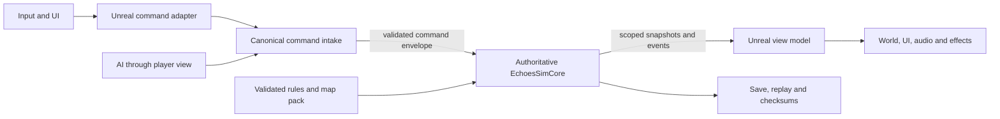

# Technical Architecture

This document defines the implementation architecture for *Echoes of the Broken Sun*. It is the single authoritative technical-architecture file and is edited in place. The [Development Bible](DevelopmentBible.md) owns game and creative requirements; the [Project Ledger](ProjectLedger.md) owns milestone status, measured results, risks, budgets, and acceptance evidence. A requirement in this document is not evidence that the capability exists.

## Architectural outcome

The game is a deterministic 20 Hz real-time strategy simulation hosted by Unreal Engine 5.8. The authoritative match state is implemented in pure standard C++20 and has no dependency on Unreal objects, floating-point simulation, physics, navigation, rendering, audio, wall-clock time, filesystem state, or network arrival order. Unreal translates player intent into commands and translates immutable simulation views into presentation. In network play, a listen server initially owns the authoritative simulation; clients submit commands and receive visibility-scoped snapshots. The same authority can later run in an Unreal dedicated-server target without rewriting game rules.

The primary design goals, in order, are:

1. reproducible outcomes, replayability, and recoverable saves;
2. fair command validation and strict fog-of-war boundaries;
3. responsive RTS controls and readable presentation;
4. bounded CPU, memory, and network cost on Apple Silicon;
5. data-driven content that fails closed when invalid;
6. a direct migration path from offline play to listen-server and dedicated-server operation.

## Decisions and invariants

| Area | Decision | Non-negotiable invariant |
|---|---|---|
| Engine | Unreal Engine 5.8 C++ project | UE may present or transport state; it may not decide authoritative outcomes. |
| Simulation | `EchoesSimCore`, standard C++20 | No Unreal headers/types, platform APIs, floating-point state, or wall-clock branching. |
| Time | Fixed 20 ticks per second | A frame-rate change may affect presentation smoothness, never match state or checksum. |
| Numeric model | Signed Q22.10 fixed point for sub-tile values; integers for discrete quantities | Every conversion, rounding rule, range, and overflow response is explicit and tested. |
| Authority | Offline local authority; online listen-server authority | Clients request actions. They never submit authoritative positions, resources, damage, vision, or Well outcomes. |
| Navigation | Deterministic grid, regional routing, and shared flow fields | UE NavMesh, crowd simulation, and physics are not authoritative. |
| Visibility | Per-player deterministic sight and exploration state | AI, clients, UI, audio, and spectators receive only their authorized view. |
| Content | Validated, canonical rules and map packs | Runtime rejects invalid or mismatched content before a match starts. |
| Persistence | Versioned canonical snapshots and command-stream replays | No raw object memory, UObject serialization, pointer values, or native struct layout enters the format. |
| Multiplayer | Reliable commands plus visibility-scoped snapshots | Exact protocol, rules, map, and content compatibility is established before joining. |
| AI | Server-side command producer using a player-view interface | Standard AI has no hidden vision, income, cooldown, placement, or pathing information. |

## Runtime topology



The dependency direction is always inward. `EchoesSimCore` knows nothing about Unreal. The Unreal game module depends on the core and provides adapters. Presentation systems consume simulation output but cannot call mutation methods directly.

### Source and ownership boundaries

The current two-module structure remains appropriate through the technical prototype:

- `Source/EchoesSimCore` owns deterministic types, content-pack decoding, rules, commands, systems, player views, canonical serialization, checksums, snapshots, and replay execution.
- `Source/EchoesOfTheBrokenSun` owns world lifecycle, input, camera, local selection, command translation, networking, view-model construction, visual proxies, animation, UI, effects, audio, settings, and macOS integration.
- `Tests/Native` links only `EchoesSimCore`. It must build and run without Unreal.
- Unreal automation tests exercise the adapter and presentation boundary after the editor toolchain is accepted.

Within `EchoesOfTheBrokenSun`, use `Private/Adapters`, `Input`, `Network`, `Presentation`, `UI`, and `Audio` folders before creating more Unreal modules. Split modules only when compile-time, ownership, or dedicated-server packaging evidence justifies the added boundaries. A future server target must exclude presentation, UI, editor, and audio dependencies.

The existing Unreal dependencies on `AIModule`, `NavigationSystem`, or `GameplayTasks` do not grant those systems authority. They may support editor tooling, non-authoritative previews, or cinematic actors only. Unused dependencies should be removed after the prototype is compiling.

## Deterministic simulation contract

### Public boundary

The core should converge on a narrow API equivalent to:

```cpp
class Simulation {
public:
    LoadResult LoadContent(std::span<const std::uint8_t> canonicalPack);
    QueueResult QueueCommand(const CommandEnvelope& command);
    StepResult StepOneTick();
    std::optional<PlayerView> CreatePlayerView(PlayerId player) const;
    CanonicalBytes SaveSnapshot() const;
    StateChecksum Checksum() const;
};
```

Only `QueueCommand`, scenario setup, and versioned snapshot loading may mutate externally visible state. Queries are const and cannot expose mutable component storage. The Unreal adapter owns one core instance for each active authoritative world. It must destroy that instance during deterministic match teardown rather than relying on process exit.

The exported core boundary does not throw exceptions or pass ownership implicitly. Factories and mutating calls return typed results containing stable reason codes; callers supply or receive RAII-owned standard containers. Assertions diagnose programmer errors in development builds but do not replace validation of content, saves, replays, or commands.

### Time

- `Tick` is an unsigned 64-bit integer. Tick zero is the scenario baseline after content and participants are loaded.
- One tick represents 50 ms. Durations are stored as tick counts, never seconds or frame counts.
- `StepOneTick` receives no delta time. Offline game speed changes how many complete ticks are requested per presentation frame. Pause requests zero ticks.
- The authority never drops a simulation tick to catch up. It may reduce snapshot frequency, lower presentation quality, or show a network-lag state. Sustained inability to advance is an explicit match fault, not silent time loss.
- Match timers, production, cooldowns, Future Well telegraphs, AI schedules, and victory checks derive only from `Tick`.
- The initial online input delay is three ticks and is identical for the listen-server's local player and remote players. It is a versioned lobby rule and replay field, not a hidden tuning constant.

The Development Bible values therefore resolve without unit conversion ambiguity: a 180-tick Well telegraph is 9 seconds, Preserve pays every 300 ticks, and a 1,800-tick Reshape lasts 90 seconds.

### Numeric representation

The prototype's Q22.10 representation is the baseline:

- one simulation tile equals 100 Unreal centimeters;
- one tile contains 1,024 fixed-point subunits;
- positions, movement per tick, range, and footprint extents use signed 32-bit raw Q22.10 values;
- map cells use signed 32-bit integer coordinates and maps occupy non-negative coordinates;
- resources, hit points, cargo, work, construction progress, armor, and damage use bounded integers;
- ratios use a named fixed-point or parts-per-million type, never `float`, `double`, or an implicit percentage;
- angles use unsigned 16-bit turns where 65,536 represents one revolution; any required direction lookup table is generated once, checked into source, hashed with the rules version, and covered by test vectors.

All fixed-point construction and arithmetic must go through checked helpers. The helpers define division as truncation toward zero and define any nearest-value conversion as round-to-nearest with ties away from zero. Content compilation rejects a value that cannot be represented exactly under its field's declared conversion rule. Signed overflow, division by zero, implementation-defined narrowing, and unchecked absolute value of the minimum integer are forbidden. Debug builds assert; all builds return a stable `SIM_ARITHMETIC_RANGE` or content-validation failure before invalid state can be committed.

Distance comparisons use squared integer distance and wide, range-checked intermediates. Authoritative code does not call trigonometric, square-root, interpolation, or random functions from the C or C++ runtime. Unreal may convert a core coordinate to `FVector` for display; that value cannot flow back except through a separately quantized command target.

### Entity and collection order

- `EntityId` is allocated monotonically from a fixed-width integer and is never reused during a match. Exhaustion ends scenario loading or the match with a stable fault; wraparound is forbidden.
- Player, team, content, ability, map-object, and transformation identifiers are explicit fixed-width values. Display names and localized text are not identifiers.
- Authoritative component arrays are iterated in ascending `EntityId`. Removal uses a deterministic end-of-phase tombstone and compaction pass.
- Hash maps may be used only for lookup if their iteration order cannot affect state, events, serialization, or timing. Sorted vectors or ordered maps are the default.
- A system that creates multiple entities first records spawn intents. The commit phase sorts them by `(SystemId, SourceEntityId, LocalOrdinal)` before assigning IDs.
- Damage, healing, status, resource transfer, terrain change, and objective changes are accumulated as intents and applied in their documented phase. Systems do not mutate a collection while iterating it.
- Every player-visible event has the stable key `(Tick, SystemId, LocalOrdinal)`. Unreal uses that key to prevent duplicate effects or audio after replay seek, reconnect, or snapshot replacement.

### Commands and stable ordering

Every command is wrapped in this logical envelope:

| Field | Rule |
|---|---|
| `ProtocolVersion` | Must equal the negotiated protocol. |
| `MatchId` | Must identify the current authority instance. |
| `ExecuteTick` | Stamped or accepted by the authority within the permitted input window. |
| `PlayerId` | Derived from the authenticated seat, never trusted from payload alone. |
| `Sequence` | Strictly increasing per player for the match. |
| `CommandType` | Closed, versioned enum. Unknown values are rejected. |
| `ActorIds` | Sorted, unique, owned by the issuing player, and capped per command. |
| `Payload` | Fixed-width, length-bounded, and validated for the command type. |

The authority rejects a duplicate `(PlayerId, Sequence)`. Accepted commands are sorted only by `(ExecuteTick, PlayerId, Sequence)`. Packet arrival order, thread scheduling, command type, actor address, and container layout are never tie-breakers. A group command retains sorted actor IDs. The accepted envelope—not the client's original packet—is appended to the replay.

Validation occurs twice: structural validation on receipt and gameplay validation at execution. Ownership, visibility rules, resource balance, cooldown, placement, capacity, target state, command rate, and tick window are rechecked at execution. A local offline player and the listen-server's local player traverse the same validator as a remote player.

The current patrol order stores two authoritative fixed-point endpoints. On arrival it swaps them and continues indefinitely. Enemy acquisition is limited to legitimate owner visibility and to the axis-aligned route bounds expanded by six tiles on each side. A tracked enemy is dropped immediately when it leaves that bounded envelope or visibility. The envelope is intentionally integer-only: it is somewhat broader than a geometric capsule for diagonal routes, but remains deterministic, serializable, platform-independent, and incapable of unbounded chase. A future formation/pathing upgrade may narrow that envelope only with a simulation-rules and replay-schema change.

Rejections use stable identifiers such as `CMD_NOT_OWNER`, `CMD_TARGET_NOT_VISIBLE`, `CMD_INSUFFICIENT_MATTER`, `CMD_PLACEMENT_OCCUPIED`, and `CMD_TOO_LATE`. Human-readable text is localized in Unreal. Logs, tests, replays, and UI automation assert the stable identifier, not prose.

### Tick phase order

Each tick executes these phases in this exact order:

1. accept the canonical batch for the current tick;
2. validate and apply player and AI commands;
3. resolve queues, research, logistics capacity, gathering, delivery, repair, and construction;
4. advance abilities, Future Well telegraphs, and committed terrain transformations;
5. service deterministic path work, assign formation slots, and resolve movement reservations;
6. resolve attacks, projectiles, effects, damage, healing, and status expiration;
7. commit deaths, spawns, ownership, objective, victory, and defeat transitions;
8. update navigation revisions and visibility resulting from committed state;
9. emit scoped events, record replay data, and compute scheduled checksums.

An entity destroyed in phase 6 remains addressable for the accumulated intents of that phase and is removed in phase 7. A terrain transformation committed in phase 4 changes movement through the phase-8 navigation revision; its effective tick is recorded. Any intentional exception requires a simulation-rules version change and a replay golden test.

### Randomness

Authoritative randomness uses a project-owned, fixed 64-bit algorithm with published test vectors. `std::random_device`, library distributions, Unreal random functions, timestamps, addresses, and platform entropy are forbidden in simulation.

The target model is keyed, counter-based generation:

`Random64(MatchSeed, StreamId, Tick, SubjectId, LocalOrdinal, RetryOrdinal)`

`StreamId` is a reviewed enum for combat, map hazard, AI choice, campaign variation, and other domains. `SubjectId` identifies the entity, decision, or map object. `LocalOrdinal` is explicit at the call site. Unbiased bounded values use rejection sampling and increment only `RetryOrdinal`. This prevents an added AI draw from perturbing combat and makes call-order mistakes visible. The mixing constants, byte order, bounded-range procedure, and reference outputs are part of `SimulationRulesVersion`.

Any interim stateful generator must have named, isolated streams; serialize and checksum every stream state; consume only in stable entity order; and be replaced or accepted by an explicit decision before multiplayer. Changing an algorithm, key composition, stream assignment, or draw count intentionally breaks replay compatibility unless a complete legacy runner is retained.

## Content pipeline and validation

The source-controlled JSON under `Content/Data/Source` is the human-editable balance source. It is not loaded directly into an authoritative match. Version 0.45.0 retains the bounded compiler, catalog, complete slice-roster simulation-consumption path, seven bounded faction mechanics, and four authored faction technologies. `Scripts/compile_content.py` accepts only the declared schema and exact fields, rejects malformed types and values, checks stable identifiers, display names, duplicates, references, numeric bounds, structure roles, Future Well rules, deterministic production/work/construction fields, complete four-unit/four-structure role coverage for each playable slice faction, the prior special profiles, vibration detection only on the two Kharuun detector roles, powered defense only on the Meridian defense role, and exactly two same-faction technologies per playable faction. Technology validation rejects unknown or cross-faction prerequisites, tiers deeper than the bounded one-prerequisite graph, invalid effect ranges, and no-op definitions. It atomically emits canonical UTF-8 JSON plus a bare SHA-256 sidecar. Twenty-seven adversarial tests exercise canonical stability, special-profile assignment, and technology graph/content rejection.

`UEchoesContentSubsystem` loads only the generated pack, recomputes SHA-256, validates it, and publishes an immutable catalog. Stable-ID bindings convert all eight named units, eight named structures, and four named technologies into deterministic rules. `UEchoesSimulationSubsystem` refuses scenario creation if any binding, role, digest, or conversion is invalid. Research definitions are copied into the versioned simulation rules and participate in validation, snapshots, replays, and checksums. A player's completed mask and active project contain only deterministic IDs, producer, progress, and required ticks. Research command validation returns explicit failures for invalid players, producers, technology IDs, faction mismatch, completion, prerequisite, occupancy, and resources. Production and research share the one-slot Barracks producer boundary. Completion rebuilds each surviving combat unit's authored/researched combat values before reapplying any current Kharuun adaptation, preventing modifier-order drift; future units derive the same completed-research state at creation. A destroyed producer cancels the project after costs have been paid. Only the owning `PlayerState` is present in a player's materialized view, allowing fair-view AI policy without exposing opponent research internals.

The selected local faction remains presentation/bootstrap state rather than a simulation rule: the subsystem instantiates player 0 with the chosen faction, derives the other playable faction for player 1, and binds the same role-based spawn layout to faction-specific archetypes. Title or briefing selection performs a fail-safe scenario rebuild and restores the prior faction if reconstruction fails. Restarts retain the selection. Snapshot loading requires the serialized player-0 faction to match the active choice; snapshot and replay version 20 include active, completed, and last-interrupted research state and rules. `lastInterruptedResearch` is owning-player state, enters the checksum, persists through snapshot/replay, rejects malformed faction/completion combinations on load, and clears when a new valid research command begins or completes. Command-line faction selection supplies a deterministic unattended/runtime test path without replacing the player-visible Tab flow. The HUD derives faction names, objective text, special-control guidance, research status, interruption status, and result language from active subsystem state. `Shift+R` queues the next incomplete faction technology from a selected local Barracks-role structure. The special profiles, anonymous vibration contacts, powered-Aegis graph, visibility/redaction rules, and simultaneous-damage behavior remain as recorded at 0.39.0. Map packs, a full technology browser, ability schemas, localization, final presentation references, and signed manifests remain open.

Version 0.45.0 retains the code-only technology archive without moving authority into the HUD. The controller owns modal lifecycle, selected-producer resolution, bounded tier focus, exact-tier command translation, rejection feedback, and pause restoration. The HUD reads only catalog definitions and authoritative simulation/player state. `FEchoesTechnologyPanelLayout` remains the shared pure screen-space calculation used by rendering and pointer hit-testing. F2 opens the archive; Up/Down moves a visible two-row focus; Enter requests the focused tier; Shift+R requests the next incomplete project; LMB synchronizes focus and requests the targeted tier or close region; F2/Escape/P closes. Opening focuses the first incomplete tier. A last-interrupted tier receives a distinct red treatment and explicit costs-lost/restart guidance while the field HUD presents a shorter no-refund warning. The UI path does not bypass `IssueResearchCommand` or deterministic validation. A larger tree will require scalable graph navigation, search/filter behavior, localization, and an accessibility review rather than extending the bounded two-row panel indefinitely.

The Development-only `-EchoesResearchPresentation` and `-EchoesResearchInterruptionPresentation` modes are mutually exclusive and compiled out of Shipping behavior. Both supply controlled local resources and queue the first faction technology through `Simulation::QueueCommand` after replay-baseline capture. The completion mode requires ready, active, and complete markers. The interruption mode adds a controlled third player with 32 authored combat units and schedules ordinary attack commands at tick 60; producer destruction must flow through ordinary damage, emit active/interrupted/no-refund markers, reject completion, and automatically open the archive. Neither mode writes completed/interrupted state directly, bypasses costs, or alters authored rules. These are integration and presentation evidence fixtures, not ordinary player paths, balance results, or release features.

The controller also exposes pointer-independent owned-entity traversal. Tab advances and Backspace reverses through a deterministic ID-sorted set of local, alive entities that have presentation views; dead entities, temporary mineral-cover proxies, hostile entities, and missing views are excluded. Selection remains singular and updates the existing ring and exact entity feedback. The original Shift+Tab proposal was rejected after live application delivery was interpreted as forward Tab by Unreal's legacy input path; the explicit Backspace mapping is the accepted reverse control. Version 0.46.0 adds F3–F6 aliases for Waystone migration, both Warform adaptations, and Cairnback cover without removing the punctuation bindings. These aliases translate to the same controller methods and deterministic validation; they introduce no second authority path. Versions 0.47.0 and 0.48.0 add a second fair presentation input method for tactical destinations. Home enables a screen reticle and resets its offset; the arrows move it in bounded 64-pixel steps with a 32-pixel viewport margin; Space issues a context order. Version 0.49.0 adds End for one selected owned presentation view. Version 0.50.0 adds F7, which replaces the current selection with the deterministic ID-sorted set of local alive Soldier, HeavyUnit, and ScoutUnit entities that have owned presentation views; dead entities, mineral-cover proxies, structures, workers, hostiles, and missing views remain excluded. End now accepts one or more selected owned presentation views, centers the RTS camera on their arithmetic world-position centroid, and resets the reticle to screen center. Both operations use only already materialized owned views and do not query hidden entities or authoritative terrain. Arrow steps then choose a nearby visible destination. While active, the existing attack-move, patrol, guard, building, Bulwark, and Cairnback-cover handlers trace the rendered visibility channel beneath the reticle rather than the pointer. G arms a five-second group-assignment window, the next 1–0 key stores the current valid local selection, and an unarmed 1–0 key prunes and recalls that group. F8 cycles the current Box, Line, or Wedge destination layout without entering authoritative state. Ordinary rendered input has accepted five-unit Hold, group-1 assignment and recall after an intervening single-entity selection, five Patrol routes, and separate five-unit Line and Wedge moves. Up/Down retain technology-tier focus while the archive is open and move the reticle only when the archive is closed. F1 was rejected after live testing because Unreal also changed the runtime view mode on this host; Home is the accepted collision-free toggle.

Version 0.51.0 adds a presentation-only environment composition inside `AEchoesGameMode`. Seven thin cube instances create the central fracture ribbon, twelve cone silhouettes create uneven glass splinters, and five movable point lights supply local magenta/copper separation. Every actor carries the existing cleanup tag plus a detail tag and has collision and overlap generation disabled. The bands cast no shadow, the shard silhouettes retain small grounding shadows, and the local lights have shadow casting disabled. The simulation, terrain grid, visibility grid, traces, navigation, placement, snapshots, replays, and checksums do not reference these actors. The fair-fog meshes remain above unrevealed presentation, so the composition is not a new information channel. Engine primitives and runtime dynamic materials make this a bounded composition prototype, not final asset or performance qualification.

Version 0.52.0 adds `SilhouetteAccent` as a second `UStaticMeshComponent` on each materialized entity view. It is attached to the disposable view root, never blocks the visibility trace, never overlaps, never enters authoritative state, and follows the same visibility lifecycle as its owning view. `ConfigureAppearance` chooses a faction/role-specific primitive, transform, and accent color while resource nodes, the Future Well, and temporary mineral cover remain unaccented. `SetSelected` applies the same custom-depth selection state to body and accent. Automation asserts that all five baseline combat-force views expose a visible accent; rendered comparison remains separate evidence. This improves recognition without changing entity type, footprint, click target, pathing, serialization, replay, or checksum behavior.

Version 0.53.0 adds `AEchoesCommandMarkerView` as a transient presentation actor created only after the controller receives one or more accepted command results. Five marker types map accepted Move/context, Attack-move, Patrol, Guard, and Build destinations to separate colors and glyph transforms. All three primitive components disable collision, overlap generation, navigation influence, decals, and shadows. The actor self-destructs after 2.4 seconds and has no reference from `EchoesSimCore`, snapshots, replays, checksums, fog, or authoritative entity views. Accessibility settings are sampled when the marker spawns: reduced motion disables scale animation and reduced flashing disables brightness modulation. Automation spawns every type, verifies the component boundary and reduced-presentation behavior, and proves the deterministic checksum is unchanged.

Version 0.54.0 adds the pure `FEchoesFormationLayout` presentation utility and one shared controller dispatch path for Move/context, Attack-move, and Patrol. It accepts an anchor, travel direction, unit count, formation type, and spacing, then emits stable destination slots. Box uses a centered rotated grid, Line uses a centered row perpendicular to travel, and Wedge puts slot zero at the anchor with symmetric ranks behind it. The controller derives its travel vector from the arithmetic centroid of currently selected local owned authoritative positions to the already traced destination. It then sends the normal validated command for each selected entity to its assigned destination. Only those ordinary destinations reach `EchoesSimCore`, replay capture, and checksums; the F8 selection itself is presentation state. Automation covers zero count, centroid preservation, perpendicular Line spacing, Wedge apex/rank symmetry, non-overlap, labels, and controller cycling. This is command fan-out geometry, not the planned authoritative assignment, reservation, local-avoidance, or cohesion system for large formations.

Version 0.55.0 adds the pure `FEchoesCommandDeckModel` and a HUD adapter that constructs its profile from the selected local authoritative entity types. The pure model maps that profile to exact configured action labels for combat units, Workers, Command Cores, Array Foundries, combined production selections, and generic entities. Combat takes precedence over Worker, which takes precedence over structures, preserving the most immediate mobile command context in mixed selections. The HUD separately derives the current-to-next formation label and appends the local faction's combat special only when combat is selected. Modal overlays suppress the deck. High contrast and HUD scale are read from existing user settings; the panel creates no input, command, simulation, serialization, replay, or checksum state. Automation validates the label model and precedence. This is a bounded code-only command hierarchy, not a remapping UI, localization system, final layout system, or broad usability/accessibility qualification.

Version 0.56.0 adds the pure `FEchoesContactIndicatorLayout` between world projection and HUD drawing. It accepts a projected point, viewport size, and HUD scale, then returns a marker position inside a conservative safe rectangle, a label anchor, label-side selection, and whether clamping occurred. The safe top clears the primary HUD and the safe bottom reserves the command-deck region. Projection failure uses a camera-yaw-relative ground direction to synthesize an offscreen point before the same clamping path; it does not query a hidden entity or replace the contact's quantized approximate position. The HUD draws a diamond, outward chevron when clamped, contrast plate, explicit anonymous/approximate/no-unit-ID text, and high-contrast colors. No pointer hit target is registered. Automation covers viewport bounds and labels, while the controlled Metal fixture proves one live edge indicator from a redacted player view. This is non-authoritative client presentation, not new sensing, targeting, serialization, replay, checksum, or AI state.

Version 0.65.0 moves the Glass Scar presentation adapter from Engine primitives to registered project-authored world candidates without changing authority. `AEchoesGameMode` loads six environment meshes and the shared `M_EchoesWorldSurface`, then composes four shelves, three geometrically distinct crossing treatments, seven ridge bands, twelve shard markers, and five local fracture lights as tagged, non-colliding, navigation-irrelevant actors. `AEchoesTerrainView` selects authored shelf or ridge meshes for visible terrain tiles; `AEchoesEntityView` selects the authored Matter-deposit mesh for resource nodes. Missing assets fail visibly back to the established development primitives. Neither adapter can write the deterministic grid, route openings, resource values, line of sight, commands, snapshots, replays, or checksums. The Development-only `-EchoesGlassScarArtReview` fixture selects an overview or one of three route cameras and is compiled out of Shipping behavior. The explicit `-EchoesGlassScarReview=<mode>` value is parsed before the optional bare overview flag, so combining them cannot erase the requested route. Automation verifies all seven meshes, two LODs, four material zones, authored terrain/resource selection, and unchanged authoritative counts/pathing. This is a one-way presentation integration, not collision, route, simulation, package, performance, or final-art authority.

Version 0.66.0 reuses `CommandType::Stop` for player-driven research cancellation rather than widening the serialized command vocabulary. During command application, Stop checks whether its owned actor is the player's authoritative `researchProducer`. A match copies `activeResearch` into `lastInterruptedResearch`, clears the active producer and progress counters, and leaves the committed resource pool unchanged before clearing the actor order. The controller derives cancellation messaging only from current simulation state and the selected producer, then queues the same Stop command through the normal subsystem boundary. The HUD and technology archive remain read-only views of `PlayerState`. Snapshot/replay schema stays at 20; native and Unreal tests require no-refund state and replay equivalence. `EEchoesCommandMarkerType::Interact` separately corrects the presentation label and glyph used by accepted Gather, Deliver, and Future Well context orders; it remains transient, collision-free, and non-authoritative.

Version 0.67.0 keeps campaign recovery above the deterministic match layer and does not change snapshot/replay schema 20 or campaign schema 1. `LoadGeneration` validates exactly one named ledger without fallback. The subsystem caches only a distinct valid `.bak` generation for title presentation. Confirmed restoration passes that validated value through the existing temporary-file validation and atomic commit path; a valid active primary becomes the new backup, while a corrupt primary is never promoted over an existing valid backup. Only after the storage commit succeeds does the subsystem replace in-memory campaign state and rebuild the paused default operation. Missing, corrupt, unsupported, and identical backup states fail closed. The controller owns the two-press confirmation and the HUD remains a read-only record-count view.

Version 0.68.0 narrows the production-art transition to one isolated route kit. The Ash Cut generator builds explicit high- and low-detail topology, uses box-authored UV0 and a second generated lightmap channel, assigns four instances of a route-specific UV-driven master material, and retains a simple collision primitive for asset QA. The runtime environment adapter recognizes the Ash Cut tag and preserves the mesh's assigned materials instead of replacing them with the shared prototype palette. It disables component collision, overlap generation, and navigation influence before presentation. No deterministic terrain, pathing, placement, visibility, route, snapshot, replay, or checksum input references the mesh or its materials. Asset revision metadata prevents an accepted rerun from re-saving identical material instances, and the wrapper fails unless the exact LOD/UV/material/collision audit marker is present.

Version 0.72.0 applies the same authority boundary to a distinct Buried Causeway production pipeline. The generator replaces the legacy mesh only when its revision differs, constructs explicit high- and low-detail civic-deck topology, authors UV0 plus a lightmap channel, assigns four instances of a dedicated route master, retains one simple collision primitive for asset QA, and then audits the exact result. The runtime environment adapter preserves the route's assigned stone, recess, ceramic, and conduit materials but disables component collision, overlap generation, and navigation influence before presentation. The non-shipping Buried Causeway review camera widens independently so the full route fits the evidence frame; it changes no gameplay camera default or route state. Deterministic terrain and the campaign consequence model remain the sole pathing/route authority.

Version 0.69.0 applies the same authority separation to selected-entity and accepted-order feedback. The asset generator creates one selection halo, six command sigils, one reusable orbit accent, and a shared parameterized emissive material. Each static mesh has two explicit LODs and no simple collision. Entity views attach the selection halo only to visibility-scoped actors; accepted orders spawn transient command-marker actors only after the authoritative controller reports at least one accepted local command. The standard branch updates presentation transforms and a low-frequency emission envelope from frame time, while the reduced-motion branch restores fixed transforms and the reduced-flashing branch uses constant lower emission. All mesh components disable collision, overlaps, navigation influence, decals, and shadowing as appropriate. None of these transforms, material parameters, review fixtures, or actor lifetimes feeds command validation, fog, pathing, save, replay, or checksum state. Automation verifies asset paths, component isolation, standard motion, steady reduced motion, lower reduced emission, and unchanged simulation checksum.

Version 0.70.0 adds `AEchoesDestructionView` as a disposable effect actor over the same one-way view boundary. During ordinary synchronization, `UEchoesSimulationSubsystem::SyncEntityViews` distinguishes a previously materialized entity that no longer exists in the simulation from one merely absent from the current fair view. Only the former may spawn the transient ring/core/shard presentation before its old entity view is destroyed. Teleport synchronization used by restart and load suppresses the effect; resource nodes, the Future Well, and temporary mineral-cover proxies are excluded. Entity type and faction are copied only from the disposable view to choose presentation scale and color. The effect actor owns no simulation identifier or authority, disables collision, overlaps, navigation, decals, and shadows, and self-destructs after its presentation lifetime. Standard frame-time animation expands the ring, collapses the core, moves and rotates shards, and decays one emission envelope. Reduced motion restores fixed transforms and reduced flashing uses constant lower emission. Automation proves that ordinary local commands can remove a visible hostile, clear the live view, spawn the effect, and leave `StateChecksum()` unchanged.

Version 0.71.0 adds `UEchoesPresentationAudioSubsystem` as a world-local consumer of existing presentation events. It owns strong references to three registered SoundWave assets and one runtime-only spherical attenuation profile. The controller requests a non-spatial confirmation only after one or more local commands have been accepted. The simulation adapter requests faction-distinct spatial sound only in the same fair authoritative-removal branch that creates destruction VFX. The audio subsystem never receives the simulation object, command queue, hidden entity registry, or mutable rules. Separate monotonic-time reservations cap command cues at one per 80 ms and all destruction cues at one per 140 ms; muted effects reserve no voice. Persistent effects volume clamps to `[0,1]`. Reduced dynamic range raises the command multiplier from 0.56 to 0.68 and lowers destruction from 0.96 to 0.74 before the effects-volume multiplier, narrowing level separation without touching event authority. Imported audio is forced into the cook through `/Game/Audio/Generated`. Automation loads every cue, verifies attenuation and rate-limit behavior, calls Unreal 2D and spatial playback, and keeps simulation checksums outside the subsystem.

Version 0.57.0 adds `EEchoesOperationMode` and the pure `FEchoesPrologueMissionModel` above the unchanged deterministic skirmish simulation. The reducer accepts only reconstructable facts—operation active, local Core and archive-carrier survival, carrier proximity to the authored archive/evacuation sites, local Well ownership/choice, opposing Well loss, and current simulation outcome—and returns one of six phases. The subsystem derives those facts from authoritative state; no HUD boolean advances the mission. The Future Well adapter rejects a prologue choice unless the explicit carrier holds the archive site, and the reducer treats a nonlocal Well claim as failure. Completion pauses the still-ongoing simulation and presents a campaign result; a terminal Command-Core outcome before withdrawal is failure even when player zero wins. The operation selector rebuilds at tick zero, forces Meridian only for the prologue, preserves the default two-faction skirmish behavior, and keeps operation quick saves in separate files. Title, brief, objective, minimap, and result layers consume the operation/phase snapshot but do not alter simulation authority. This reuses one authored map and opponent while establishing one mission contract; it is not a general campaign graph, dialogue/cinematic system, branching consequence store, or campaign-save schema.

Version 0.58.0 adds `FEchoesCampaignProgress` above both the deterministic match snapshot and Unreal presentation. Its first schema is a bounded append-only set of mission decisions. Each record identifies the mission and selected Future Well protocol, records which protocols were available, carries the four mechanically verified completion facts, and binds the decision to the simulation snapshot version, completion tick, and final state checksum. Encoding is explicit little-endian with a fixed magic, schema version, bounded record count, fixed record length, and whole-payload CRC. Decode rejects unknown missions, unsupported Well values, a choice absent from the available mask, incomplete or unknown fact bits, missing provenance, duplicate missions, invalid length/version, trailing data, and checksum mismatch. Persistence writes and reopens a temporary generation before atomically replacing the primary and retaining one backup. A missing primary and backup starts a new empty campaign; two corrupt generations leave progress unavailable rather than overwriting uncertain history. The subsystem appends only after `FEchoesPrologueMissionModel` reports complete. Same-choice replay is idempotent; a different replay remains visible as a replay result but cannot mutate the first stored decision. Development fixtures can override the ledger path so automated and rendered evidence cannot contaminate player progress. This is a factual decision store, not a campaign graph, save-slot manager, new-campaign/reset workflow, relationship model, mission-unlock evaluator, or ending resolver.

The Development-only `-EchoesKharuunSystemsPresentation` mode is mutually exclusive with the research fixtures and compiled out of Shipping behavior. It queues ordinary Waystone uproot, Warform carapace-molt, Cairnback mineral-cover, and hidden-hostile movement commands after replay-baseline capture. Acceptance requires all four resulting states, exactly one anonymous vibration contact, no source disclosure, and automatic pause. The field HUD renders an amber approximate-contact alert with explicit anonymity and no-direct-target language, while the tactical overview uses a distinct diamond. This fixture does not establish ordinary player execution, pointer use, balance, or release behavior.

The production content compiler must eventually:

1. parse each source file with strict duplicate-key and type checking;
2. normalize stable ASCII identifiers without deriving them from display text;
3. resolve all cross-references;
4. apply semantic and range validation;
5. sort records canonically by type and stable ID;
6. emit a fixed-width, little-endian canonical rules pack after the current canonical-JSON stage;
7. calculate the pack's SHA-256 digest and write a validation report;
8. fail the cook or build when any error exists.

The core independently validates the versioned deterministic rules, numeric bounds, foundational costs/statistics, Future Well timing, technology definitions, and snapshot integrity before constructing match state. Runtime never silently substitutes defaults for rejected authoritative content. The current adapter still performs stable-ID resolution from canonical JSON before copying the rules into the core; a fixed-width binary rules pack, map/ability sections, richer technology graphs, and a signed distribution manifest remain future hardening work.

Validation covers at least:

- missing or duplicate faction, unit, building, technology, ability, Well, map-object, and localization identifiers;
- negative costs or durations, zero production periods, impossible footprints, fixed-point overflow, and values outside declared balance bounds;
- build graphs with missing prerequisites or cycles, unreachable technologies, invalid producers, and logistics dead ends;
- attacks with invalid ranges/periods, abilities without deterministic target rules, and modifiers whose operation order is unspecified;
- maps with out-of-bounds spawns, overlapping mandatory structures, disconnected required objectives, invalid movement masks, or insufficient deterministic Reshape fallback locations;
- Future Well transformations without telegraph, duration, navigation delta, visibility delta, expiration behavior, or opponent-readable presentation metadata;
- assets without provenance status and gameplay records that reference missing presentation assets.

Map compilation rasterizes authoritative terrain, height bands, occluders, movement classes, resource locations, Well transformations, emergence zones, and fallback cells. Unreal landscape collision and visible meshes are checked against this grid for authoring errors, but they do not replace it. The exact rules-pack and map-pack digests are included in saves, replays, network handshakes, crash context, and test evidence.

Hot reload of authoritative content is disabled during a match. An editor change requires a new compiled pack and a new match. Official release packs eventually require a signed manifest; a hash alone detects mismatch but does not prove publisher authenticity.

## Deterministic world systems

### Grid and flow-field navigation

The authoritative navigation cell is the one-meter simulation tile. Sub-tile position remains Q22.10. A map pack supplies passability, integer base cost, height band, movement-class mask, transformation membership, and region ID per cell.

The current schema-9 technical spike uses a shared reverse breadth-first distance field keyed by destination cell. A field stores shortest cardinal distance for every reachable tile; each unit then selects its next tile in the original north, east, south, west order, preserving prior equal-cost route semantics. Up to 128 derived fields are retained. Eviction is deterministic by `(LastUsedTick, DestinationCell)`, and any authoritative terrain change clears the cache. Active Reshape openings are included when a field is constructed. The cache is derived acceleration state: it is neither serialized nor checksummed, and loading or replaying reconstructs the same field from authoritative terrain and entities.

The production design extends routing to two levels:

1. a static region/portal graph provides the corridor across large maps;
2. a Dijkstra integration field and direction field guide units within the active corridor or bounded destination area.

The planned production flow-field key is `(NavigationRevision, MovementClass, DestinationCell, GoalRadius, CorridorId)`. Cardinal edge cost is 1,000 and diagonal cost is 1,414 before integer terrain modifiers. Diagonal movement cannot cut a blocked corner. Cell index is `Y * Width + X`. The fixed neighbor order is north, east, south, west, northeast, southeast, southwest, northwest. The integration queue orders by `(AccumulatedCost, CellIndex)`, and equal-cost direction choice uses the neighbor order. Unreachable cost is an explicit sentinel; arithmetic saturates before that sentinel rather than wrapping. Region corridors, movement classes, weighted/diagonal costs, incremental work budgets, dynamic reservations, local avoidance, and formation slots remain production requirements rather than current implementation claims.

Path requests are ordered by `(RequestTick, PlayerId, CommandSequence, EntityId)`. Authoritative work is budgeted by a fixed number of queue expansions per simulation tick, never elapsed milliseconds. A field becomes usable only after deterministic completion. Cache eviction is ordered by `(LastUsedTick, FlowFieldKey)` and never by allocator or memory-pressure timing.

Dynamic occupancy is not baked into shared integration cost. Each moving unit proposes a sub-tile step and cell reservation. Proposals resolve in a deterministic rotating priority derived from tick and `EntityId`, with blocked age as a bounded fairness input. Units then use integer local avoidance and formation slots. Formation anchors, slot shapes, and assignment order are deterministic; slot assignment starts with ascending `EntityId`. Hidden enemy occupancy is not included in a player's or AI's planning view. Physical encounter may block or reveal according to game rules, preventing route choice from becoming an information leak.

Terrain transformations increment `NavigationRevision` for affected regions. Reshape expiration first warns at authored ticks, then resolves occupants against authored fallback groups in ascending `EntityId` and fallback-cell order. Validation must prove adequate legal fallbacks for the declared occupancy bound. If that invariant is violated at runtime, expiration uses the map's deterministic emergency fallback and emits `MAP_FALLBACK_INVARIANT`; it never delegates displacement to Unreal collision or kills a unit merely because a mesh reappeared.

UE navigation may draw debug paths or provide non-authoritative cinematic movement. It cannot select an RTS route, alter a command result, or feed AI knowledge.

### Visibility, detection, and fog

The core owns a per-player cell grid with `Unexplored`, `Explored`, and `Visible` state. A separate reference count permits overlapping sight sources. Each source has an integer radius, height band, detection channels, and occlusion rules. Preserve's 1,400 cm intelligence radius is represented as 14 navigation tiles before faction-specific filtering.

Line of sight uses integer symmetric shadowcasting with rational slopes, fixed octant order, and fixed cell order. Dynamic occluders and terrain transformations update a `VisibilityRevision`. Moving and changed sources remove their prior cell contribution and add their new contribution in ascending `EntityId`; a periodic full recomputation test must produce the same grid.

`CreatePlayerView(PlayerId)` is the only interface available to standard AI and is the intended source for network snapshot filtering. The completed form contains:

- owned state the rules permit the player to know;
- currently visible enemy entities and effects;
- explicit last-known contacts with observed tick and uncertainty state;
- explored terrain and currently visible terrain changes;
- public telegraphs, objectives, timers, and score information;
- no hidden entity ID, order, production queue, resource balance, cooldown, path request, or exact position.

The Unreal fog renderer uploads the scoped grid to a texture and smooths edges for display. It may interpolate or retain cosmetic shroud, but the core state decides selection, targeting, detection, minimap contacts, AI knowledge, alerts, and network disclosure. Audio for an unseen source is emitted only when the scoped event policy authorizes it; positional audio may not reveal a hidden exact location accidentally.

### Future Wells and map transformation

Each Well is a data-driven state machine with explicit ownership, contest state, choice, telegraph start, commit tick, recurring-payment tick, active transformation, expiration tick, interruption rule, and public events.

- **Harvest:** a 180-tick interruptible telegraph, then 500 Dawn and the authored irreversible terrain state.
- **Preserve:** retains the Well and awards 15 Dawn every 300 controlled ticks, with a faction-specific 14-tile intelligence effect.
- **Reshape:** validates and spends 120 Dawn, telegraphs for 180 ticks, activates an authored possibility for 1,800 ticks, warns before expiration, and uses authored fallback displacement.

Control, interruption, payment, and transformation commit are simulation phases, not animation callbacks. VFX completion never advances a Well. Campaign consequences append factual decision records containing mission, Well, choice, informed-state flags, beneficiaries, costs, and remaining alternatives; no hidden moral score is inferred.

### Non-cheating AI

AI runs on the authority and implements the same `ICommandProducer` boundary as a human input adapter. Its only world input is `PlayerView` plus its own declared memory. It cannot hold a `Simulation&`, enumerate authoritative entities, inspect Unreal actors, query UE navigation, or read opponent content state.

The AI is scheduled deterministically:

- economy and strategic goal review at a fixed tick cadence;
- scouting belief updates only from new scoped observations;
- production counters based on observed composition and confidence decay;
- tactical group evaluation and retreat using known terrain and contacts;
- command generation through the standard queue, costs, cooldowns, placement rules, and input delay;
- a fixed work-item budget per decision tick, never a wall-clock cutoff.

Personality changes weights and goals, not information access. Standard difficulty has no hidden income, construction speed, damage, cooldown, or vision. Any assisted difficulty stores exact modifiers in lobby settings and replay metadata. A debug omniscient agent is test-only and cannot be selectable in a shipping menu.

AI randomness uses the AI stream and keyed decision identifiers. Tests must prove that hiding an enemy removes it from AI input, that only observations change beliefs, and that AI commands receive the same rejection codes as human commands.

The current 0.50.0 implementation retains the 0.28.0 boundary for the existing AI command producer. `CreatePlayerView` materializes a value snapshot whose fields are private and exposed through const accessors. It includes the AI player's complete owned state, currently visible non-owned observations, known terrain, and the versioned deterministic rules; omits hidden entities; redacts visible-opponent orders, cooldowns, exact combat/economy statistics, production state, and transformation duration; represents unexplored terrain as blocked; and does not expose hidden temporary passability changes in explored shroud. The Unreal adapter explicitly obtains that snapshot and calls the static pure `GenerateAiCommands(const PlayerView&, ...)` producer, which has no `Simulation` or authoritative entity-container reference. The older player-ID overload remains only as a compatibility wrapper that immediately materializes the same view. Expansionist and Adaptive personalities remain implemented alongside Balanced, Defensive, Raider, and Economic modes, with visible-terrain expansion and personality-specific withdrawal thresholds. Standard Adaptive now applies a deterministic opening posture through tick 5,999 when its own command core exists: visible-threat defense, economy, construction, production, and research remain enabled; anonymous vibration contacts cannot trigger pursuit; combat units within nine tiles hold; and more distant combat units move toward the owned core. Tick 6,000 restores the prior Adaptive behavior. Native coverage proves that a hidden moving opponent may generate a vibration signature without causing an opening attack-move, alongside the existing construction restrictions, invalid-personality rejection, hidden-entity exclusion, opponent-internal redaction, unavailable-player rejection, command equivalence through the pure boundary, low-health retreat overriding a visible attack, and authored cost/population consumption. The successful rendered opening is bounded operational evidence, not broad balance qualification. Last-known contact memory, scoped public-event/telegraph publication, a general `ICommandProducer` interface shared with human/network adapters, coordinated tactics, and balance qualification remain open.

## Unreal Engine integration

### Match lifecycle and adapters

An Unreal world subsystem owns adapter lifecycle. On an authority world it creates the core, loads the validated content/map packs, installs participants, captures the replay baseline, and advances complete ticks. On a remote client it owns only the scoped view buffer and command sender.

Recommended adapter responsibilities are:

- `UEchoSimulationSubsystem`: authority lifecycle, tick accumulator, immutable view publication, pause/offline-speed policy, and teardown;
- `AEchoMatchAuthority`: listen/dedicated-server match rules, seats, command admission, victory transition, and snapshot scheduling;
- `UEchoCommandAdapter`: quantizes input targets, resolves context intent, canonicalizes selected entity IDs, and submits envelopes;
- `UEchoViewSubsystem`: applies keyframes/deltas and exposes immutable, Blueprint-readable view models;
- `UEchoPresentationRegistry`: maps `EntityId` to pooled visual proxies and destroys or reuses them only from view state;
- `UEchoSaveReplaySubsystem`: atomic platform I/O around core serialization;
- `UEchoContentSubsystem`: loads the validated pack and exposes presentation references by stable content ID.

Exact Unreal class names may change during implementation, but these responsibilities and dependency directions may not be merged across the authority boundary. The core initially runs on the Unreal game thread to keep ordering inspectable. It may move to one dedicated simulation thread only after profiling. If moved, commands cross a single-producer queue, the core publishes immutable tick snapshots through a double buffer, no UObject is touched on the simulation thread, and tick completion remains a deterministic barrier.

### Presentation

Unreal coordinates are derived as `(SimRaw / 1024) * 100 cm`. A visual proxy interpolates between confirmed simulation snapshots, but its transform, collision response, root motion, ragdoll, or animation notify never updates core position or damage. Selected units and hero-scale objects can use pooled actors; large homogeneous groups should use instancing, animation sharing, significance management, and conservative effects where profiling supports them.

The renderer owns camera, landscape, static meshes, materials, animation, Niagara, weather, lighting, post-processing, and cinematics. Gameplay telegraphs use simulation tick and event IDs so their displayed duration remains correct under pause, speed change, hitch, replay seek, and reconnect. Cosmetic randomness uses a separate Unreal seed and is excluded from simulation and replay checksums.

Nanite and Virtual Shadow Maps remain disabled on the inspected M1 Pro baseline. Lumen software lighting is an optional profiled preset, with a conventional lighting fallback. Mac does not receive a gameplay rule, visibility advantage, or targetability difference from a graphics preset.

### Input and camera

Enhanced Input owns remappable desktop actions. Selection, selection boxes, control groups, camera bookmarks, subgroup focus, edge pan, and camera motion are local client state. A pointer ray hit is converted to the map plane, clamped, and quantized into core coordinates before it becomes a command.

Context orders follow this path:

1. local scoped view resolves the intended action and displays immediate cursor/order feedback;
2. the core query API provides a non-authoritative preview reason where possible;
3. the command adapter submits the canonical command;
4. the authority returns accepted or a stable rejection code;
5. presentation corrects provisional feedback without inventing state.

Building ghosts, range rings, formation previews, and path previews are advisory. Host validation remains final. Every command has visible accepted, pending, or rejected feedback.

### UI and accessibility

UMG/CommonUI and an MVVM-style view model consume only the local `PlayerView`, settings, and presentation state. Widgets never scan world actors to infer resources, selection eligibility, targets, or enemy state. Stable core reason codes map to localized messages and accessible announcements.

The settings model contains versioned values for remapping, UI scale, subtitle size/background, non-color ownership marks, color-vision palette, reduced flashing, reduced shake, camera speed, edge pan, audio buses, and reduced dynamic range. An option is not exposed until an automated or manual test proves behavior. Menus are feature-gated by implemented capability so campaign, multiplayer, replay, or accessibility labels cannot imply completion.

The present code-only interface implements and persists HUD scale, high-contrast HUD, reduced motion, reduced flashing, edge pan, pan-speed scale, and zoom-step scale. Interactive launch presents a feature-gated title state with the Glass Scar skirmish and seven campaign missions through **The Shape of Silence**; F9 rebuilds the selected operation at tick zero, while Tab changes faction only for skirmish. Enter advances through an operation-specific brief and deployment. The authoritative tick remains paused and battlefield/camera commands blocked until deployment. Unattended and profiled runs may explicitly bypass those states. Escape or P opens the existing modal field menu; R rebuilds the selected operation. The local objective snapshot retains the fair skirmish Core/visible-Well/visible-hostile/public-outcome fields and adds operation-specific campaign phase, protected-entity state, local-Core survival, prior-ledger consumption, and the locally authored Well consequence. The HUD converts those facts into operation-specific trackers without advancing the mission. Skirmish terminal state presents victory/draw/defeat; campaign missions present success/failure only after their subsystem reducers determine the outcome. The tactical overview remains fog-respecting for entities/terrain and adds only authored public sites for the selected operation. Version 0.65.0 includes the Kharuun Waystone, Listening Spine, two distinct memory witnesses, and Oruun confluence markers for Mission 07; its result boundary records observed correspondence only and does not establish cause, hidden authorship, or a Choir identity. These are prototype boundaries; a production UMG/CommonUI shell, broad skirmish setup, complete settings/remapping, and a general campaign presentation/store have not been built.

### Audio

Audio consumes scoped, deduplicated simulation events and local UI events. MetaSounds or Sound Cues may vary cosmetic layers, but gameplay timing and information disclosure come from the event. Unit acknowledgements use per-category cooldowns and priority so repeated orders remain intelligible. Separate music, effects, dialogue, interface, ambience, and alert buses support reduced dynamic range and subtitle/caption policy. No source asset is distributable until its provenance entry is accepted.

## Networking

### Initial listen-server model

Unreal's client/server transport carries three logical channels:

- a reliable ordered control channel for handshake, lobby state, commands, acknowledgements, rejections, surrender, draw, and reconnect control;
- an unreliable sequenced state channel for view deltas;
- a reliable segmented channel for scoped keyframes and recovery snapshots.

The host owns the only authoritative core. Remote clients do not require hidden state to reproduce the match. They interpolate visibility-scoped snapshots and may predict cursor feedback, selection, and order markers, but the first multiplayer implementation does not predict resources, combat, visibility, or enemy movement.

Provisional cadence, centralized in versioned network settings, is:

- simulation: 20 Hz;
- view delta: every two ticks, or 10 Hz;
- full scoped keyframe: every 40 ticks and on recovery request;
- authoritative state checksum: every 20 ticks, matching the Project Ledger budget;
- command acknowledgement: immediately after admission, with execution result after the target tick.

Snapshot fields include `ProtocolVersion`, `MatchId`, `SnapshotId`, `BaseSnapshotId`, `SimulationTick`, `PlayerViewSchema`, `RulesetHash`, `MapHash`, `LastAcceptedSequence`, `EventCursor`, scoped state, and scoped digest. Deltas are usable only with their named base. Missing bases trigger a rate-limited keyframe request; they are never applied speculatively.

The server records a canonical full-state checksum. Each client checks its decoded scoped-view digest and acknowledges the snapshot. A mismatch discards deltas and requests one keyframe. A repeated mismatch produces a diagnostic bundle and a controlled disconnect/reconnect attempt. Developer full-mirror tests may compare complete deterministic checksums, but shipping clients are not given full hidden state merely to enable that test.

### Admission and compatibility

Before a seat becomes active, both sides must agree on:

- network protocol version;
- simulation rules and snapshot schema versions;
- engine-facing build ID;
- exact rules-pack and map-pack SHA-256 digests;
- platform feature flags that affect serialization;
- match settings, input delay, teams, and disclosed AI modifiers.

Any mismatch fails before scenario setup with a stable reason. Network play never runs a save migration or substitutes local content. Mods, if added, require an identical manifest for every participant and an explicit unranked policy.

### Command validation and reconnect

Network identity maps an authenticated connection to one player seat. The server derives `PlayerId`, enforces monotonic sequences, caps actor lists and payload size, rate-limits requests, and rejects commands outside the permitted tick window. A client cannot command allies unless the match mode explicitly grants shared control.

A reconnectable seat uses a high-entropy, short-lived resume token carried through the authenticated transport; only its verifier is retained server-side. The initial reservation target is 120 seconds and is a lobby rule. Recovery sends a current scoped keyframe, last accepted sequence, pending owned commands, objective/timer state, event cursor, and match result state. The replay continues uninterrupted on the authority. AI takeover during absence is off by default and, if added, must be declared before the match.

A peer host departure ends the initial online match with a clear result or no-contest policy; transparent host migration is not claimed. Safe migration would require transferring hidden authoritative state and trust to another player's machine. Dedicated-server deployment is the preferred correction.

### Dedicated-server evolution

The next network topology adds `EchoesOfTheBrokenSunServer.Target.cs`, starts the same core and `AEchoMatchAuthority` without renderer/audio/UI, and moves session authentication, lobby allocation, and persistence behind interfaces. Command and snapshot formats remain unchanged. Bot players continue to run server-side through `PlayerView`.

Peer-hosted matches cannot provide strong protection from a malicious host because the host machine contains full state and authority. They must not be represented as ranked or cheat-resistant. Competitive service requires dedicated authority, authenticated sessions, server-retained replays, operational monitoring, and a defined dispute policy. No kernel anti-cheat or invasive client telemetry is assumed.

Spectators receive a server-created scope. Competitive live spectators are delayed or restricted; omniscient state is available only when match rules authorize it. Replays expose full information only after the match and under the product's replay policy.

## Save, checkpoint, and replay formats

The core writes canonical uncompressed bytes. Unreal performs bounded file I/O and optional compression. Every container starts with a fixed header containing:

- magic and container type;
- container, simulation schema, and simulation rules versions;
- build ID, rules-pack hash, and map-pack hash;
- match or campaign ID, mode, tick, and match seed;
- uncompressed and stored lengths with hard maximums;
- canonical payload checksum and whole-container integrity digest.

Integers use fixed-width little-endian encoding. Booleans and enums occupy declared byte widths. Vectors write a count followed by canonically ordered elements. Strings are UTF-8 with byte limits and are never used as runtime identity. Padding, native struct dumps, RTTI names, pointers, UObject paths, locale formatting, and compiler-dependent container layout are forbidden.

Schema 9 traverses the same canonical state fields used by snapshot serialization through a non-allocating versioned 64-bit hash writer. The fixed player capacity is four; snapshots serialize each slot's active state, faction, resources, executed-command sequence state, and explored grid. Visible grids remain derived and are recomputed after load. Schema 8 development snapshots/replays are intentionally rejected because their two-slot layout is not silently compatible. This checksum is a fast replay/desync signal, not a security primitive. Snapshot bytes retain their independently verified appended FNV-1a integrity field. The production container still requires SHA-256 over the canonical uncompressed payload; authenticity, when required for official or competitive records, depends on an authenticated server or signed manifest rather than a bare hash.

Offline save content includes the complete core snapshot, pending commands, AI memory, scenario objectives, campaign fact ledger, and presentation-independent checkpoint metadata. Online clients do not save authoritative matches; the server retains reconnect state and replay. Unreal writes a temporary file, flushes it, validates it by reopening, then atomically replaces the target while retaining the prior autosave generation. A corrupt newest autosave falls back only after the user is told which generation failed.

A replay contains the canonical scenario baseline, negotiated versions and hashes, match settings, accepted command stream, results, and scheduled checksum records. Periodic optional keyframes accelerate seeking but are not evidence; seeking from the baseline and commands must reach the same checksum. Replay playback halts at the first mismatch and reports tick, expected hash, actual hash, and compatible build guidance.

Offline save migrations are explicit, one schema step at a time, tested with retained fixtures, and never overwrite the source file before validation. Unsupported versions, content mismatch, excessive counts, truncated sections, or unknown required fields fail closed with stable reasons. Replays normally require the exact simulation-rules and content hash; a legacy runner is a deliberate product feature, not an automatic best-effort conversion.

## Security and trust boundaries

| Boundary | Threat | Required control and residual limitation |
|---|---|---|
| Client to host | Forged ownership, impossible commands, spam, malformed payloads | Seat-derived identity, two-stage validation, sequence/tick windows, size/count caps, rate limits, checked parser. A malicious peer host remains outside this protection. |
| Host to client | Hidden-state disclosure through snapshots, events, audio, errors, or telemetry | Build every outgoing artifact from `PlayerView`; test absence of hidden IDs and precise positions. Peer host memory still contains all state. |
| Save/replay to process | Corruption, oversized allocation, parser abuse, unsupported schema | Length-before-allocation checks, hard maxima, checked arithmetic, fuzzing, integrity digest, explicit migration, fail closed. |
| Source data to runtime | Invalid references, overflow, balance typo, tampering | Strict commandlet, core revalidation, exact hash negotiation, build failure. Hashes do not provide publisher authenticity without a signed manifest. |
| Unreal to core | Frame time, physics, actor order, Blueprint, or asset state changes an outcome | One-way immutable views and canonical commands; determinism and adapter tests. |
| AI to authority | Omniscience or rules bypass | `PlayerView` only, same command validator/input delay, disclosed modifiers, source review and adversarial tests. |
| Spectator/replay | Live strategic information leakage | Server-defined scope, delay policy, post-match full-information policy. |
| Build and service configuration | Embedded secrets or developer credentials | Environment/keychain/service configuration only; secret scanning; never commit credentials or resume tokens. |

Network encryption and account authentication are delegated to the selected supported online service or transport and must be evaluated before internet testing. No claim of secure internet play follows from local RPC functionality. Logs sent to clients omit hidden state. Server diagnostics identify match, build, tick, hashes, rejection code, and bounded command metadata without credentials or chat content.

## Performance, profiling, and Apple Silicon

The Project Ledger is the authority for budgets and measured results. The architecture is designed around its 20 Hz, 400-unit slice budget: 4.0 ms p95 game-thread simulation, 1.5 ms p95 fog, 6.0 ms path burst, a checksum every 20 ticks within 0.25 ms p95, and 60 FPS at 2560×1440 medium on the inspected M1 Pro. PERF-003 is the current native observation: in an isolated optimized four-team harness with 100 units per team, visibility refresh measured 0.088500 ms p95, 100 cold path requests 0.411375 ms p95, simulation ticks with 100 moving units 0.133583 ms p95, and schema-9 state checksum 0.034102 ms p95. The exact 0.23.1 package's 25-entity presentation baseline measured 10.9075 ms frame, 10.8941 ms render-thread, 10.3518 ms GPU, and 0.9148 ms game-thread p95 across 480 post-warm-up frames, with 613.922 MiB peak sampled process RSS. Its separate 400-unit/four-team/401-visible-view active-combat fixture measured 10.9612 ms frame, 10.9498 ms render-thread, 10.4105 ms GPU, and 1.0914 ms game-thread p95, with 647.031 MiB peak sampled process RSS. The stress fixture queued 396 broad attack-move orders, entered actual combat, drove placeholder health feedback, and ran lightweight reduced-motion-aware atmosphere; it still omits final effects and formations. Both short captures passed their applied budgets. A separate 60-minute 0.15.0 stationary proxy soak survived and passed its process-memory bounds, but it predates broad orders and atmosphere; its CPU samples were contaminated by concurrent builds and are not accepted. None of these observations constitutes clean-machine or release qualification.

The measurement scene must record map, rules/map hashes, active and visible unit counts, team count, path requests, sight sources, effects, weather, resolution, preset, build configuration, hardware, macOS, engine hotfix, and sample duration. Required tools are Unreal Insights, `stat unit`, `stat game`, `stat gpu`, `stat rhi`, memory reports, Xcode Instruments Time Profiler/Allocations/Leaks, and Metal capture where useful. Measurements from the editor are recorded separately from native packaged development builds.

Scaling controls are architectural, not emergency cheats:

- fixed work units for path and AI planning;
- region-scoped navigation and visibility invalidation;
- cached shared flow fields with deterministic eviction;
- immutable compact view snapshots and interest filtering;
- pooled proxies, animation sharing, instancing, effect significance, and audio voice limits;
- scalable shadow, post-process, foliage, weather, Lumen, and effects presets;
- no reduction of authoritative sight, command rate, collision, combat, or AI rules by graphics preset.

The first accepted Mac build is native `arm64`. A universal build is a later distribution decision and must not force x86 behavior into the simulation. A clean build uses only project-relative paths and the documented automation; the resulting executable architecture is verified explicitly. Address/undefined-behavior sanitizer native-core jobs run separately from optimized determinism jobs.

Current toolchain evidence requires care. Epic's UE 5.8 table recommends Xcode 26.1.1 and explicitly lists Xcode 26.4 as incompatible. The installed Xcode 26.6 is unverified by that table; it is not proven incompatible. The project must either validate 26.6 against the installed UE 5.8 hotfix or select the pinned 26.1.1 installation, activate full Xcode rather than Command Line Tools, and install the required Metal Toolchain. Builds must record the exact selected Xcode path and version.

Build stages are: native core tests; content validation; Unreal C++ compile; automation; cook; stage; package; smoke launch; artifact hash and manifest. A later dedicated-server job uses the same validated content and native-core tests. Code signing, notarization, App Store eligibility, and compatibility with untested Macs are separate release gates and are never inferred from a successful local package.

## Verification and automation

### Native core gate

Every change to `EchoesSimCore` must pass, without Unreal:

- fixed-point boundary, rounding, range, and overflow tests;
- stable command ordering, duplicate sequence, late command, and shuffled-input property tests;
- RNG reference vectors, stream isolation, and unbiased-range edge cases;
- entity allocation, tombstone, intent ordering, and serialization-order tests;
- economy, construction, logistics, combat, terrain, objective, victory, and all Future Well state transitions;
- navigation golden fields, equal-cost ties, corner rules, dynamic revision, cache eviction, group reservations, and Reshape displacement;
- visibility golden maps, overlapping sources, occlusion/height, terrain change, exploration persistence, and full-versus-incremental equivalence;
- AI view-boundary and equal-validator tests;
- snapshot round trip, malformed input, version rejection, migration fixtures, replay checksum, and random replay generation;
- deterministic replay across repeated processes, debug and optimized builds, and every supported CPU architecture available to CI;
- long-running simulation soak plus AddressSanitizer and UndefinedBehaviorSanitizer jobs.

Golden snapshots and replays are fixtures with documented schema and rules versions. A deliberate rules change updates them only with a reviewed explanation of the first changed tick.

### Unreal adapter gate

Unreal automation and functional tests must cover:

- content commandlet success and each validation failure class;
- frame-rate independence by executing one command stream under different render rates and comparing core hashes;
- coordinate quantization, context command mapping, box selection, control groups, building preview versus host validation, pause, and game speed;
- proxy create/update/destroy, event deduplication, fog texture, minimap scope, hidden audio, and stable failure messaging;
- save/checkpoint atomic recovery and replay seek;
- settings persistence and behavior for each exposed accessibility control;
- headless authority startup and deterministic map setup.

A green native test suite does not prove Unreal integration, playability, visuals, controls, accessibility, or performance.

### Network gate

Network acceptance requires separate game processes and later separate machines. Automation must inject latency, loss, duplication, reordering, stale deltas, disconnects, malformed commands, hash mismatch, reconnect, surrender, draw, and version/content mismatch. Tests verify that:

- the host and replay reach the same full-state checksum;
- each client view digest matches its server-generated scope;
- hidden state never appears in packets, events, errors, logs, or spectator views;
- reconnect restores the correct seat, view, event cursor, and pending owned commands;
- host departure follows the declared no-migration result;
- 1v1 and 2v2 complete at the accepted scale without unresolved desync.

Multiplayer is not complete based on a lobby, one process, loopback-only unit tests, or code inspection.

### Continuous build evidence

Automation emits machine-readable test results and a human-readable evidence summary containing commit, dirty-tree state, toolchain, build configuration, content hashes, command line, hardware/runner, counts, duration, and failures. Generated binaries, coverage, profiles, and packaged builds go to ignored artifact directories. Only reviewed source, authoritative data, fixtures, and documentation enter Git.

## Failure and degraded-state policy

- Invalid or mismatched authoritative content prevents match creation.
- A rejected command leaves state unchanged and returns one stable reason.
- A late network command is rejected or rescheduled under the negotiated rule; it is never inserted into an already completed tick.
- A missing snapshot base requests a keyframe. Repeated digest failure triggers controlled recovery or disconnect.
- Slow presentation may skip interpolation, effects, or snapshot deltas. It may not skip authoritative ticks.
- A deterministic core invariant violation ends the match with a diagnostic rather than continuing corrupted state.
- A failed save retains the prior generation and reports that the new checkpoint was not committed.
- A replay mismatch stops at the first failing tick.
- A missing visual/audio asset uses a registered, visibly labeled placeholder; it does not change the core content record.
- A peer host loss follows the declared result; it does not pretend host migration occurred.
- A renderer or optional lighting feature failure falls back to a supported preset without changing gameplay visibility.

## Implementation sequence and gates

1. **Harden the native contract.** Complete checked Q22.10 arithmetic, canonical command keys, stable reasons, keyed RNG, phase intents, serialization limits, and golden checksums.
2. **Compile authoritative content.** Implement strict JSON and map validation, the canonical rules/map packs, digests, and build failure integration.
3. **Prove scale-critical systems natively.** Implement regional/flow-field navigation, reservations, visibility, Well transformation, player views, and standard AI with fixed work budgets.
4. **Complete persistence.** Add versioned save/checkpoint containers, campaign fact records, replay seeking, corruption handling, and retained fixtures.
5. **Connect Unreal as a view/controller.** Build the subsystem, command adapter, camera/input, proxy registry, fog/minimap, UI failures, audio events, prototype map, and automation without moving authority into actors or Blueprints.
6. **Profile the Apple Silicon spike.** Measure the exact Ledger scenarios; correct navigation, visibility, proxy, effect, and memory bottlenecks before multiplying content.
7. **Add listen-server multiplayer.** Implement handshake, command admission, scoped deltas/keyframes, checksums, reconnect, spectator scope, and separate-process tests.
8. **Add dedicated authority before competitive claims.** Produce the headless server target, service interfaces, server-retained replays, authentication, monitoring, and separate-machine evidence.

No later step weakens an earlier gate. In particular, presentation quality cannot excuse nondeterminism, and a deterministic native replay cannot substitute for observed Unreal, networking, usability, or performance evidence.

## Current evidence boundary

As recorded on 2026-08-30, the repository contains a UE 5.8 project, Mac configuration, source JSON for both complete named slice-roster definitions and four faction technologies, a strict canonical content compiler, an immutable digest-verified Unreal catalog, versioned deterministic rules, design records, a tested four-player-capable engine-independent simulation, seven bounded campaign missions, and a runtime Unreal view/controller adapter. Current version 0.72.0 at exact source commit `943d281b0a1506795dee7bab1ebcb1f9774c27a0` retains **The Shape of Silence**, prior-generation campaign restoration, deterministic research cancellation, the accepted input boundaries, registered presentation audio, authored VFX, and Ash Cut route kit while adding the dedicated Buried Causeway route pipeline. The new project-owned mesh has 1,200/600 LOD triangles, two UV channels per LOD, four route-specific materials, one asset collision primitive, and disabled runtime collision/navigation/authority. Exact-source regeneration was byte-idempotent. The exact source passes 27/27 compiler tests, 27/27 native suites in optimized, debug, and AddressSanitizer/UndefinedBehaviorSanitizer configurations, an arm64 Development Editor build, 36/36 Unreal automation tests without warning or error, a normal Meridian null-RHI bootstrap, and one complete exact-commit isolated Metal review. Earlier exact-source evidence retains its recorded boundaries. Physical-human pointer usability, pointer combat/Guard coverage, adverse camera/UI-scale cases, broad simultaneous-combat/camera/audio readability, subjective listening and final mix/master quality, music, voice, ambience, complete alerts, final Niagara debris/smoke, transparency/dissolve, production textures and surface response, the Folded Verge and remaining world kits, current package performance, named or multiple campaign slots, arbitrary campaign history, the remaining campaign, networked multiplayer, and game completion remain open. Version 0.72.0 has not been packaged or profiled; the latest accepted package remains 0.23.1. The Project Ledger remains authoritative as evidence changes.

This architecture does not establish that:

- the installed Unreal/Xcode/Metal combination is supported beyond the exact local generation, build, automation, runtime, and rendering observations recorded in the Project Ledger;
- the current native core satisfies every numeric, RNG, production-navigation, four-team visibility, AI, serialization, replay, or security rule in this document;
- a complete playable map, release Unreal performance qualification, manually accepted end-to-end construction/production/combat match, final fog art, audio, save/settings UI, complete accessibility behavior, or final asset exists;
- host-authoritative transport, reconnect, spectators, desync recovery, separate-process play, or dedicated-server operation exists;
- any unrecorded frame-time, GPU, memory, rendered four-team behavior, traffic, save, replay-seek, compatibility, signing, notarization, distribution, or commercial-readiness target has been measured or met.

Evidence is promoted only by updating the Project Ledger with the exact build, scenario, toolchain, hardware, command, result, and remaining claim limit.
